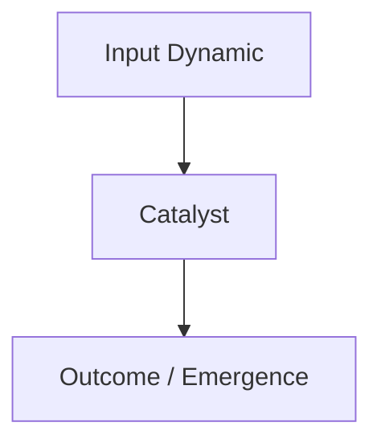

# Long-Form Media & Podcast Distillation Engine

## Purpose
Process long-form audio/video content (1–4+ hour podcasts, interviews, lectures) and convert them into durable, interconnected nodes of a growing **Knowledge Tree** (Roots $\rightarrow$ Trunk $\rightarrow$ Branches $\rightarrow$ Leaves), completely de-noised of conversational filler and fortified by expert auditing.

---

## The 4-Stage Processing Pipeline

```
[YouTube / Podcast Link]
           │
           ▼
[Stage 1: Ingestion & Transcript Deconstruction]
   • Extract full transcript / audio metadata
   • Clean conversational noise, tangents, and sponsor breaks
   • Isolate: Core claims, First-principles, Personal anecdotes, Novel mental models
           │
           ▼
[Stage 2: Expert Audit & Gap Fulfillment Panel]
   • First-Principles Epistemic Auditor: Reconstructs foundational proofs
   • Senior Subject Specialist: Adds missing scientific/historical context & citations
   • Deduplication & Conflict Auditor: Checks existing Tree notes for overlaps
           │
           ▼
[Stage 3: Tree Mapping & "Merge vs. Branch" Algorithm]
   • Does concept exist? -> UPDATE existing node with new perspective & evidence
   • Is concept new?     -> CREATE new node branching from appropriate root/trunk
           │
           ▼
[Stage 4: Markdown Node Generation & Master Tree Update]
   • Store in `knowledge-tree/` with full wikilinks and Mermaid schematics
   • Update `knowledge-tree/INDEX.md`
```

---

## Node Structure Standard (The 4-Tier Beginner-Transformed Pedagogical Engine)

Every distilled piece of media or masterclass must serve the perspective of an educated adult graduate beginner (good English, general literacy, but zero prior background in esoteric or abstract philosophy). Every generated note must incorporate the **4-Tier Cognitive Structure**:

```markdown
# [Tree Node ID]: [Concept / Thesis Title]

> **First-Principles Kernel**: [Single fundamental truth or causal mechanism]
> **Source**: [Podcast Name / Guest / Timestamp Range]
> **Tree Coordinates**: `Roots > [Parent Domain] > [Sub-branch]`

---

## 🏛️ Tier 1: The Jargon-Free Reality Bridge (Plain English Hook)
*Target: An intelligent 25-year-old educated graduate who has never read this author.*
- **The Core Translation**: [Explain the essence in everyday modern English, stripping out all historical, mystical, or technical jargon.]
- **Everyday Analogy**: [A familiar real-world comparison explicitly labeled as an analogy.]
- **Why This Matters Today**: [Concrete relevance to modern careers, relationships, or mental focus.]

## 🔬 Tier 2: Modern Cognitive Science & Neurobiology Correlate
*Target: Bridging historical intuition with contemporary empirical science.*
- **Neurological / Psychological Mechanism**: [Map ancient intuition to Reticular Activating System (RAS), memory reconsolidation, Cognitive Behavioral Therapy (CBT), predictive processing, or neuroplasticity.]
- **Empirical Corroboration**: [How modern research explains why this intuitive method actually works in the brain.]
- **Distinction**: [What is empirical neurobiology vs. what is subjective philosophical framing.]

## ⚖️ Tier 3: The Skeptic’s Razor & Failure Mode Guardrails
*Target: Inoculating against magical passivity, solipsism, and self-delusion.*
- **The Magical Passivity Trap**: [Direct warning against sitting passively wishing without taking physical action.]
- **Ego-Inflation & Solipsism Warning**: [Guardrail against grandiose self-deception and narcissistic detachment.]
- **Boundary Conditions & Physics**: [Where this philosophy stops working; physical constraints, economic reality, and real-world friction.]

## ⚡ Tier 4: The 24-Hour Behavioral Protocol ("The Homework")
*Target: Immediate somatic and behavioral translation into daily life within 24 hours.*
- **Protocol 1 (Morning Pivot — 5 Mins)**: [Exact somatic/mental calibration upon waking.]
- **Protocol 2 (Daytime Audit — In-the-Moment Catch)**: [Real-time micro-intervention during daily stress or social friction.]
- **Protocol 3 (Evening Review / Revision — 10 Mins)**: [Pre-sleep neural rewiring or cognitive reframing drill.]

---

## 1. The Expert Perspective & Lived Experience
- **Speaker's Core Thesis**: [What the guest/speaker is uniquely asserting]
- **Personal Anecdote / Real-World Crucible**: [The story, experiment, or empirical situation that forged this insight]
- **Unique Framing / Intuitive Analogy**: [How they make it click]

## 2. First-Principles Deconstruction
- **Axiomatic Foundation**: [What must be true for this to work]
- **Step-by-Step Mechanics**: [Causal sequence]
- **Counter-Intuitive Truths**: [Where conventional wisdom fails]

## 3. Senior Auditor Annotations & Gap-Fulfillment
> [!NOTE]
> **Auditor Commentary**: [Context, academic nuance, or missing caveats not stated in the audio]
- **Scientific / Historical Reference**: [Supporting literature or historical parallels]
- **Blind Spots & Caveats**: [Where the speaker's claim has boundaries]

## 4. Visual Concept Map (Mermaid)


## 5. Actionable Heuristics & Mental Models
- **Decision Rule**: [If X situation occurs, apply Y heuristic]
- **Metacognitive Check**: [Self-diagnostic question]

## 6. Tree Linkages & Cross-Domain Bridges
- **Roots To**: [[Parent Axiom]]
- **Branches Into**: [[Downstream Application]]
- **Lateral Bridge**: [[Related Concept in Another Discipline]]
```
