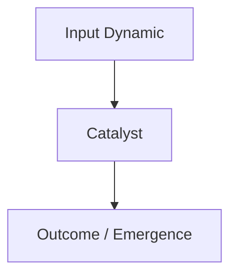

# Long-Form Media & Podcast Distillation Engine

## Purpose
Process long-form audio/video content (1–4+ hour podcasts, interviews, lectures) and convert them into durable, interconnected nodes of a growing **Knowledge Tree** (Roots $\rightarrow$ Trunk $\rightarrow$ Branches $\rightarrow$ Leaves), completely de-noised of conversational filler and fortified by expert auditing.

---

## The 4-Stage Processing Pipeline

```
[YouTube / Podcast Link]
           │
           ▼
[Stage 1: Ingestion & Transcript Deconstruction]
   • Extract full transcript / audio metadata
   • Clean conversational noise, tangents, and sponsor breaks
   • Isolate: Core claims, First-principles, Personal anecdotes, Novel mental models
           │
           ▼
[Stage 2: Expert Audit & Gap Fulfillment Panel]
   • First-Principles Epistemic Auditor: Reconstructs foundational proofs
   • Senior Subject Specialist: Adds missing scientific/historical context & citations
   • Deduplication & Conflict Auditor: Checks existing Tree notes for overlaps
           │
           ▼
[Stage 3: Tree Mapping & "Merge vs. Branch" Algorithm]
   • Does concept exist? -> UPDATE existing node with new perspective & evidence
   • Is concept new?     -> CREATE new node branching from appropriate root/trunk
           │
           ▼
[Stage 4: Markdown Node Generation & Master Tree Update]
   • Store in `knowledge-tree/` with full wikilinks and Mermaid schematics
   • Update `knowledge-tree/INDEX.md`
```

---

## Node Structure Standard

Every distilled piece of media is filed under:
```markdown
# [Tree Node ID]: [Concept / Thesis Title]

> **First-Principles Kernel**: [Single fundamental truth or causal mechanism]
> **Source**: [Podcast Name / Guest / Timestamp Range]
> **Tree Coordinates**: `Roots > [Parent Domain] > [Sub-branch]`

---

## 1. The Expert Perspective & Lived Experience
- **Speaker's Core Thesis**: [What the guest/speaker is uniquely asserting]
- **Personal Anecdote / Real-World Crucible**: [The story, experiment, or empirical situation that forged this insight]
- **Unique Framing / Intuitive Analogy**: [How they make it click]

## 2. First-Principles Deconstruction
- **Axiomatic Foundation**: [What must be true for this to work]
- **Step-by-Step Mechanics**: [Causal sequence]
- **Counter-Intuitive Truths**: [Where conventional wisdom fails]

## 3. Senior Auditor Annotations & Gap-Fulfillment
> [!NOTE]
> **Auditor Commentary**: [Context, academic nuance, or missing caveats not stated in the audio]
- **Scientific / Historical Reference**: [Supporting literature or historical parallels]
- **Blind Spots & Caveats**: [Where the speaker's claim has boundaries]

## 4. Visual Concept Map (Mermaid)


## 5. Actionable Heuristics & Mental Models
- **Decision Rule**: [If X situation occurs, apply Y heuristic]
- **Metacognitive Check**: [Self-diagnostic question]

## 6. Tree Linkages & Cross-Domain Bridges
- **Roots To**: [[Parent Axiom]]
- **Branches Into**: [[Downstream Application]]
- **Lateral Bridge**: [[Related Concept in Another Discipline]]
```
