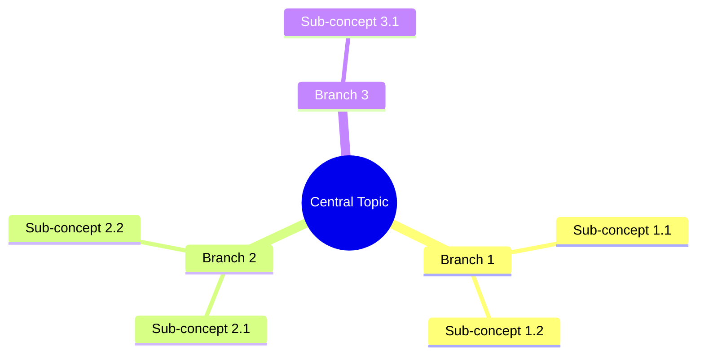
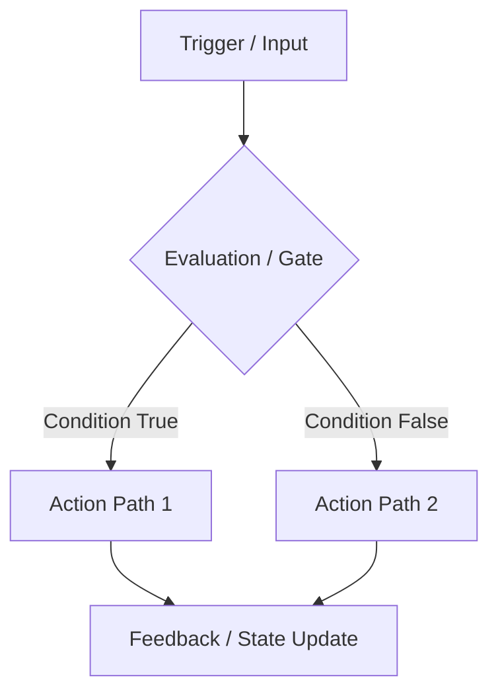
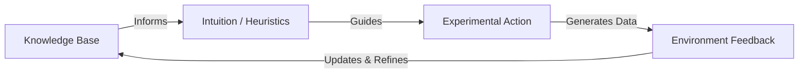

# Visual Learning Architect Skill

## Purpose
Optimize learning velocity and conceptual clarity by transforming abstract textual information into structured visual maps, hierarchy trees, and causal diagrams.

---

## Supported Visual Formats

### 1. Mind Maps (Mermaid `mindmap`)
Best for: Exploring broad topics, breaking down subjects into sub-branches, organizing associative brainstorms.

### 2. Flowcharts & Process Chains (Mermaid `graph TD` / `graph LR`)
Best for: Step-by-step algorithms, historical causality, cognitive decision-making, biological/physical mechanisms.

### 3. Concept / Relational Maps (Mermaid `graph LR`)
Best for: Showing bidirectional relationships, feedback loops, and multi-node interconnections.

### 4. Causal Loop Diagrams (Mermaid / ASCII)
Best for: Systems thinking, reinforcing feedback, balancing feedback, vicious/virtuous cycles.

---

## Guidelines for Visual Schemas
1. **Node Brevity**: Keep node labels concise (1-5 words). Detailed explanations belong in accompanying text.
2. **Visual Hierarchy**: Clearly distinguish parent categories from leaf attributes.
3. **Causal Directionality**: Always ensure arrows represent genuine causality, dependency, or temporal progression.
4. **Cognitive Chunking**: Group related nodes into subgraphs when a map exceeds 8-10 elements.
