```mermaid
graph TD
    RootNode["🌳 Aravalli Knowledge Tree"] --> Roots["🌱 Roots: First Principles & Axioms"]
    RootNode --> Trunk["🪵 Trunk: Core Systems & Mental Models"]
    RootNode --> Branches["🌿 Branches: Domains & Taxonomies"]
    RootNode --> Leaves["🍃 Leaves: Lived Experiences & Media Distillations"]

    %% Roots
    Roots --> R1["Electrochemical Energy Storage Axioms"]
    Roots --> R2["Thermodynamics, Entropy & Schrödinger's Negentropy"]
    Roots --> R3["Atomic Hypothesis & Quantum Fields Scale"]
    Roots --> R4["Signal Detection Theory & The Haystack Fallacy"]
    Roots --> R5["Mendelian vs Super-Mendelian Gene Drive Mechanics"]
    Roots --> R6["Demographic Transition & Logistic Population Dynamics"]
    Roots --> R7["Agricultural Energetics & Land Sparing Invariants"]
    Roots --> R8["Square-Cube Law & Allometric Scaling Invariants"]
    Roots --> R9["Quantum Unitarity & Information Conservation"]

    %% Trunk
    Trunk --> T1["Battery Quadrilemma & Thermal Runaway Dynamics"]
    Trunk --> T2["Three Super Cycles: Energy, Mfg & AI"]
    Trunk --> T3["Emergence, Reductionism & Informational Biology"]
    Trunk --> T4["Degenerate Matter & Extreme Cosmic Density"]
    Trunk --> T5["Surveillance Function Creep & The Ratchet Effect"]
    Trunk --> T6["Ecological Engineering & Irreversibility Invariants"]
    Trunk --> T7["Demographic Momentum & Fertility Collapse"]
    Trunk --> T8["Selective Toxicity & The Appeal-to-Nature Fallacy"]
    Trunk --> T9["Physical Regimes Across Scales: Viscosity to Gravity"]
    Trunk --> T10["Black Hole Information Paradox & Bekenstein Entropy"]

    %% Branches
    Branches --> B1["Comparative Chemistries: LFP, Sodium, Ni-H2, Solid-State"]
    Branches --> B2["Epistemology of Life & Artificial Silicon Life"]
    Branches --> B3["Standard Model & Fundamental Particle Taxonomy"]
    Branches --> B4["Cryptographic Asymmetry & Systemic Backdoors"]
    Branches --> B5["CRISPR-Cas9 Gene Drives & Vector Parasitology"]
    Branches --> B6["Development Economics & Peak Humanity Dynamics"]
    Branches --> B7["Crop Bioengineering & Synthetic Biofortification"]
    Branches --> B8["Allometric Biomechanics: Reynolds Numbers & Plastrons"]
    Branches --> B9["The Holographic Principle & Quantum Gravity"]

    %% Leaves
    Leaves --> L1["WTF are Batteries? — EnerVenue x HiNa with Nikhil Kamath"]
    Leaves --> L2["What Is Life? Is Death Real? — Kurzgesagt & Schrödinger"]
    Leaves --> L3["How Small Is An Atom? — Kurzgesagt & Feynman"]
    Leaves --> L4["Safe and Sorry: Mass Surveillance — Kurzgesagt & Liberties"]
    Leaves --> L5["Gene Drives & Malaria — Kurzgesagt & CRISPR"]
    Leaves --> L6["Overpopulation: The Human Explosion — Kurzgesagt & Roser"]
    Leaves --> L7["Are GMOs Good or Bad? — Kurzgesagt & Food Genetics"]
    Leaves --> L8["What Happens If We Throw an Elephant? — Kurzgesagt & Haldane"]
    Leaves --> L9["Why Black Holes Delete the Universe — Kurzgesagt & Hawking"]

    %% Cross-Tier Connections
    R1 --> T1
    R2 --> T3
    R3 --> T4
    R4 --> T5
    R5 --> T6
    R6 --> T7
    R7 --> T8
    R8 --> T9
    R9 --> T10
    T1 --> B1
    T3 --> B2
    T4 --> B3
    T5 --> B4
    T6 --> B5
    T7 --> B6
    T8 --> B7
    T9 --> B8
    T10 --> B9
    B1 --> L1
    B2 --> L2
    B3 --> L3
    B4 --> L4
    B5 --> L5
    B6 --> L6
    B7 --> L7
    B8 --> L8
    B9 --> L9
    T2 --> L1
```

# Mind of Aravalli 🌳

> An interconnected, first-principles Personal Knowledge System (PKM) and epistemic laboratory. Knowledge grows systematically from **Roots** (irreducible axioms) through the **Trunk** (universal mental models) into **Branches** (specialized domains) and **Leaves** (lived experiences, long-form podcast crucibles, and case studies).

---

---

## 📚 The Knowledge Tree Structure

### 1. 🌱 Roots (Axioms & Physical Invariants)
* [**Electrochemical Energy Storage Axioms**](./knowledge-tree/roots/electrochemical-energy-storage-axioms.md) — Fundamental physics of charge separation, potential wells, Faraday/Nernst limits, and Gibbs free energy.
* [**Thermodynamics, Entropy & Schrödinger's Negentropy**](./knowledge-tree/roots/thermodynamics-entropy-and-schrodinger-negentropy.md) — Physical definition of life as open non-equilibrium thermodynamic systems resisting entropy ($\frac{dS_{\text{int}}}{dt} < 0$).
* [**The Atomic Hypothesis & Quantum Field Foundations**](./knowledge-tree/roots/atomic-hypothesis-quantum-fields-scale.md) — Feynman's atomic invariant, $10^5:1$ nuclear scale ratio, QED zero-point vacuum fluctuations, and probability density clouds.
* [**Signal Detection Theory, Base Rate Fallacy & The Haystack Invariant**](./knowledge-tree/roots/signal-detection-theory-and-haystack-fallacy.md) — Bayesian rare event detection, base rate fallacy in intelligence dragnets, and the mathematical limits of bulk data ingestion.
* [**Mendelian Inheritance vs. Super-Mendelian Gene Drive Mechanics**](./knowledge-tree/roots/mendelian-inheritance-and-super-mendelian-gene-drives.md) — Population genetics mathematics, Mendelian $50\%$ segregation vs. CRISPR active Homology-Directed Repair ($>99.5\%$ super-inheritance).
* [**Demographic Transition Invariants & Logistic Population Dynamics**](./knowledge-tree/roots/demographic-transition-and-logistic-population-dynamics.md) — Verhulst logistic population curve, dynamic carrying capacity, and endogenous convergence to replacement fertility ($TFR \approx 2.1$).
* [**Agricultural Energetics & The Land-Sparing Invariant**](./knowledge-tree/roots/agricultural-energetics-and-land-sparing-invariants.md) — Photosynthetic conversion limits, Haber-Bosch nitrogen bottlenecks, and the Land-Sparing vs. Land-Sharing ecological paradigm.
* [**The Square-Cube Law & Allometric Dimensional Scaling**](./knowledge-tree/roots/square-cube-law-and-dimensional-scaling-invariants.md) — The Square-Cube Law ($\frac{A}{V} \propto \frac{1}{L}$), impact stress scaling ($\sigma \propto L^2$), and the mathematical transition of physical forces across scales.
* [**Quantum Unitarity & Information Conservation Invariants**](./knowledge-tree/roots/quantum-unitarity-and-information-conservation.md) — Unitary time-evolution ($U^\dagger U = I$), pure vs. mixed quantum states ($\text{Tr}(\rho^2)=1$), and the strict physical conservation of quantum information.

### 2. 🪵 Trunk (Core Mental Models & Systems)
* [**The Battery Quadrilemma & Thermal Runaway Dynamics**](./knowledge-tree/trunk/battery-tradeoff-trilemma-and-thermal-runaway.md) — 4-way optimization trade-off space and positive-feedback exothermic chain reaction mechanics.
* [**The Three Converging Super-Cycles: Energy, Manufacturing & AI**](./knowledge-tree/trunk/three-super-cycles-energy-manufacturing-ai.md) — Electrification + Automated Manufacturing + Exponential AI Compute, 98% idle vehicle V2G buffers, and local-for-local supply chain sovereignty.
* [**Emergence, Reductionism & Informational Biology**](./knowledge-tree/trunk/emergence-reductionism-and-informational-biology.md) — The Reductionist Paradox: zero living molecules in a cell, life as an emergent catalytic orchestra, informational code (DNA as software), and the boundary spectrum.
* [**Degenerate Matter, Extreme Cosmic Density & Quantum Indistinguishability**](./knowledge-tree/trunk/degenerate-matter-and-extreme-cosmic-density.md) — Pauli Exclusion breakdown, degenerate electron/neutron pressures, the Teaspoon of Humanity Gedankenexperiment, and universal quantum indistinguishability.
* [**Surveillance Function Creep, The Ratchet Effect & The "Nothing to Hide" Fallacy**](./knowledge-tree/trunk/surveillance-function-creep-and-ratchet-effect.md) — The Institutional Ratchet Effect, mission creep from counter-terrorism into civil protest suppression, and deconstruction of the "Nothing to Hide" fallacy.
* [**Ecological Engineering, Biocatalytic Cascades & The Irreversibility Invariant**](./knowledge-tree/trunk/ecological-engineering-biocatalytic-cascades-and-irreversibility.md) — The Irreversibility Invariant in synthetic biology, omission bias in bioethics, and immunizing reversal drive counter-measures.
* [**Demographic Momentum, Fertility Collapse & The 4-Stage Transition Model**](./knowledge-tree/trunk/demographic-momentum-and-fertility-transition.md) — Demographic Momentum lag dynamics, the 4 stages of the Demographic Transition Model (DTM), and the Beckerian human capital shift.
* [**Selective Toxicity Invariants & The "Appeal to Nature" Fallacy**](./knowledge-tree/trunk/selective-toxicity-and-appeal-to-nature-fallacy.md) — Receptor-specific toxicity (Bt Cry proteins vs. caffeine vs. theobromine), and dismantling the "natural equals safe" bias.
* [**Physical Regimes Across Scales: From Viscous Air to Gravitational Rupture**](./knowledge-tree/trunk/physical-regimes-across-scales-viscosity-to-gravity.md) — The 7-order scale continuum: from micro-wasp Stokes flow viscosity ($Re \ll 1$) to insect surface tension traps and elephant gravitational rupture.
* [**The Black Hole Information Paradox & Bekenstein-Hawking Entropy**](./knowledge-tree/trunk/black-hole-information-paradox-and-bekenstein-entropy.md) — The Relativity vs. Quantum Mechanics crisis, Hawking evaporation, and Bekenstein-Hawking horizon surface area entropy scaling ($S_{BH} \propto \frac{A}{4\ell_P^2}$).

### 3. 🌿 Branches (Disciplines & Applied Physics/Quantum Gravity Paradigms)
* [**Comparative Battery Chemistries Matrix**](./knowledge-tree/branches/energy-storage-chemistries-lfp-sodium-nickel-hydrogen.md) — Direct benchmark: LFP vs. Sodium-Ion ($\text{Na-ion}$) vs. Nickel-Hydrogen ($\text{Ni-H}_2$) vs. Solid-State (TRL 4).
* [**Epistemology of Life: Definitions & Artificial Silicon Life**](./knowledge-tree/branches/definition-of-life-and-artificial-life.md) — Astrobiology, NASA/Thermodynamic/Cybernetic operational definitions, substrate neutrality, and artificial silicon life.
* [**Standard Model of Particle Physics: The Taxonomy of Fundamental Matter**](./knowledge-tree/branches/standard-model-and-particle-physics-taxonomy.md) — Taxonomy of matter: Quarks, Leptons, Gauge Bosons (Gluons, Photons, W/Z), Higgs mechanism, and the 4 Fundamental Forces.
* [**Cryptographic Asymmetry & The Backdoor Fallacy**](./knowledge-tree/branches/cryptographic-asymmetry-and-systemic-backdoors.md) — Mathematical asymmetry in public-key cryptography, Kerckhoffs's principle, and why "law-enforcement-only" golden keys create universal vulnerabilities.
* [**CRISPR-Cas9 Gene Drives & Vector-Borne Parasitology**](./knowledge-tree/branches/crispr-cas9-gene-drives-and-vector-parasitology.md) — Pathogenic life cycle of Plasmodium, population modification vs. suppression strategies, and gene drive applications across vector diseases.
* [**Development Economics: TFR Compression, Leapfrogging & Peak Humanity**](./knowledge-tree/branches/development-economics-tfr-and-peak-humanity.md) — TFR leapfrogging trajectories (UK vs. Bangladesh vs. Iran), human intelligence density, and the 12th billion human invariant.
* [**Crop Bioengineering: Bt Endotoxins, Viral Immunization & Biofortification**](./knowledge-tree/branches/crop-bioengineering-bt-endotoxins-and-biofortification.md) — Applied agricultural transgenics: Bt Brinjal, Hawaiian Rainbow Papaya, Golden Rice, and climate-resilient Sub1 rice.
* [**Allometric Biomechanics: Reynolds Numbers, Surface Tension & Plastron Respiration**](./knowledge-tree/branches/allometric-biomechanics-reynolds-numbers-plastrons.md) — Fluid mechanics scaling: Reynolds numbers, fairyfly comb flight, superhydrophobic micro-hair meshes, and continuous plastron gills.
* [**The Holographic Principle, AdS/CFT Duality & Quantum Gravity**](./knowledge-tree/branches/holographic-principle-and-quantum-gravity.md) — Maldacena AdS/CFT duality (3D Bulk Gravity $\leftrightarrow$ 2D Boundary CFT), the Page curve, and spacetime geometry as emergent quantum entanglement.

### 4. 🍃 Leaves (Podcasts, Essays & Empirical Crucibles)
* [**Podcast: WTF are Batteries?**](./knowledge-tree/leaves/podcast-enervenue-hina-nikhil-kamath-batteries.md) — EnerVenue (Henning Rath) x HiNa Battery (Dr. Kun Tang) hosted by Nikhil Kamath.
* [**Visual Essay: What Is Life? Is Death Real?**](./knowledge-tree/leaves/kurzgesagt-schrodinger-what-is-life-death.md) — Kurzgesagt & Schrödinger: negentropy, protein nanomachines, viruses, and the dissolution of the life/death binary.
* [**Visual Essay: How Small Is An Atom?**](./knowledge-tree/leaves/kurzgesagt-quantum-atomic-scale-feynman.md) — Kurzgesagt & Feynman: Spatial scale progression, the Empire State grain of rice, and Feynman's atomic legacy.
* [**Visual Essay: Safe and Sorry — Terrorism & Mass Surveillance**](./knowledge-tree/leaves/kurzgesagt-surveillance-terrorism-civil-liberties.md) — Kurzgesagt & Liberties: Mass surveillance failures, the Apple vs. FBI encryption battle, and the preservation of democratic institutions.
* [**Visual Essay: Genetic Engineering & Diseases — Gene Drive & Malaria**](./knowledge-tree/leaves/kurzgesagt-crispr-gene-drives-malaria.md) — Kurzgesagt & CRISPR: Plasmodium biology, CRISPR super-Mendelian sweeps, and the bioethics of ecological editing.
* [**Visual Essay: Overpopulation — The Human Explosion Explained**](./knowledge-tree/leaves/kurzgesagt-overpopulation-demographic-transition.md) — Kurzgesagt & Roser: The 4 stages of the DTM, compressed leapfrogging, and the 12th billion human barrier.
* [**Visual Essay: Are GMOs Good or Bad? — Genetic Engineering & Our Food**](./knowledge-tree/leaves/kurzgesagt-gmo-food-genetic-engineering.md) — Kurzgesagt & Food Genetics: 30-year safety consensus, selective toxicity, and Land Sparing vs. Extensification.
* [**Visual Essay: What Happens If We Throw an Elephant From a Skyscraper?**](./knowledge-tree/leaves/kurzgesagt-size-square-cube-law-elephant.md) — Kurzgesagt & Haldane: The Skyscraper fall thought experiment, surface tension adhesive traps, and Haldane's scaling law.
* [**Visual Essay: Why Black Holes Could Delete The Universe**](./knowledge-tree/leaves/kurzgesagt-black-hole-information-paradox.md) — Kurzgesagt & Hawking: Quantum unitarity, Hawking radiation, and the 2D Holographic Principle.

---

## 🛠️ Specialized Research & Synthesis Engines (`.agents/skills/`)
1. [`podcast-and-video-distiller`](./.agents/skills/podcast-and-video-distiller/SKILL.md): Long-form media ingestion into first-principles tree nodes with multi-persona expert auditing.
2. [`knowledge-synthesis`](./.agents/skills/knowledge-synthesis/SKILL.md): Progressive summarization (L1–L4), Feynman technique, Zettelkasten atomic notes.
3. [`cross-domain-connector`](./.agents/skills/cross-domain-connector/SKILL.md): Structural isomorphisms and lateral mental model transfers.
4. [`visual-learning-architect`](./.agents/skills/visual-learning-architect/SKILL.md): Visual Mermaid schemas, flowcharts, and causal loop models.
5. [`book-distiller-and-analyzer`](./.agents/skills/book-distiller-and-analyzer/SKILL.md): Mortimer Adler analytical and syntopical reading deconstruction.
6. [`cognitive-philosophy-and-mind`](./.agents/skills/cognitive-philosophy-and-mind/SKILL.md): Epistemology, cognitive psychology, and Charlie Munger mental model lattices.
