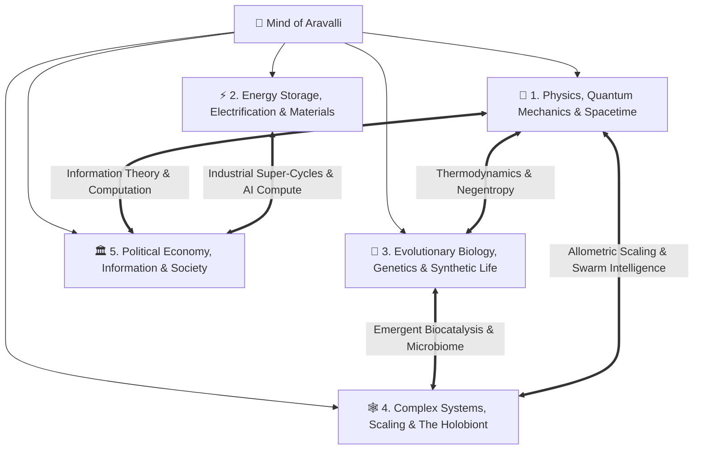

# Mind of Aravalli 🌳

> An interconnected, first-principles Personal Knowledge System (PKM) and epistemic laboratory. Knowledge is unified into **5 Master Knowledge Domains**, connecting fundamental physical axioms, core mental models, and empirical crucibles into an integrated, PhD-grade living treatise.

---

---

## 📚 Master Knowledge Domains

| Domain | File Path | Focus & Integrated Systems |
| :--- | :--- | :--- |
| **🌌 Domain 1** | [**Physics, Quantum Mechanics & The Fabric of Spacetime**](./knowledge-tree/domains/01-physics-quantum-and-spacetime.md) | The subatomic scale, Standard Model, degenerate cosmic density, Hawking evaporation, the Black Hole Information Paradox ($U^\dagger U = I$), and the 2D Holographic Principle ($S_{BH} \propto A$). |
| **⚡ Domain 2** | [**Energy Storage, Electrification & Material Super-Cycles**](./knowledge-tree/domains/02-energy-electrification-and-materials.md) | Electrochemical thermodynamics ($\Delta G = -nFE$), the battery quadrilemma & thermal runaway, comparative chemistry matrix (LFP, Na-ion, Ni-H2, Solid-State), and the 3 converging industrial super-cycles. |
| **🧬 Domain 3** | [**Evolutionary Biology, Genetics & Synthetic Biospheres**](./knowledge-tree/domains/03-biology-genetics-and-synthetic-life.md) | Physical definition of life (Schrödinger's negentropy), molecular reductionism vs. informational software, super-Mendelian CRISPR gene drives ($>99.5\%$ inheritance), vector parasitology, and agricultural land sparing. |
| **🕸️ Domain 4** | [**Complex Adaptive Systems, Dimensional Scaling & The Holobiont**](./knowledge-tree/domains/04-complex-systems-scale-and-holobionts.md) | The axiom of emergence ("More is Different"), ant superorganism stigmergy, Kuramoto biological pacemakers, the Square-Cube Law ($\sigma \propto L$), the human microbiome metagenome, and 90% colonic serotonin synthesis. |
| **🏛️ Domain 5** | [**Political Economy, Information Security & Human Flourishing**](./knowledge-tree/domains/05-political-economy-technology-and-society.md) | The 4-stage demographic transition & peak humanity ($10.5-11\text{B}$ cap), Bayesian base rate fallacy in mass surveillance dragnets, cryptographic asymmetry, and Universal Basic Income ($\text{EMTR} > 100\%$ cliff removal). |

---

## 🛠️ Specialized Research & Synthesis Engines (`.agents/skills/`)
1. [`podcast-and-video-distiller`](./.agents/skills/podcast-and-video-distiller/SKILL.md): Long-form media ingestion into first-principles tree nodes with multi-persona expert auditing.
2. [`knowledge-synthesis`](./.agents/skills/knowledge-synthesis/SKILL.md): Progressive summarization (L1–L4), Feynman technique, Zettelkasten atomic notes.
3. [`cross-domain-connector`](./.agents/skills/cross-domain-connector/SKILL.md): Structural isomorphisms and lateral mental model transfers.
4. [`visual-learning-architect`](./.agents/skills/visual-learning-architect/SKILL.md): Visual Mermaid schemas, flowcharts, and causal loop models.
5. [`book-distiller-and-analyzer`](./.agents/skills/book-distiller-and-analyzer/SKILL.md): Mortimer Adler analytical and syntopical reading deconstruction.
6. [`cognitive-philosophy-and-mind`](./.agents/skills/cognitive-philosophy-and-mind/SKILL.md): Epistemology, cognitive psychology, and Charlie Munger mental model lattices.
