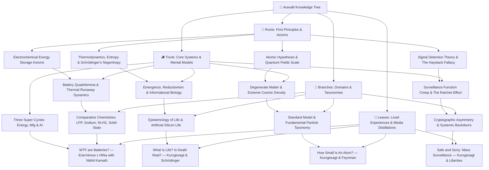

# Mind of Aravalli 🌳

> An interconnected, first-principles Personal Knowledge System (PKM) and epistemic laboratory. Knowledge grows systematically from **Roots** (irreducible axioms) through the **Trunk** (universal mental models) into **Branches** (specialized domains) and **Leaves** (lived experiences, long-form podcast crucibles, and case studies).

---

---

## 📚 The Knowledge Tree Structure

### 1. 🌱 Roots (Axioms & Physical Invariants)
* [**Electrochemical Energy Storage Axioms**](./knowledge-tree/roots/electrochemical-energy-storage-axioms.md) — Fundamental physics of charge separation, potential wells, Faraday/Nernst limits, and Gibbs free energy.
* [**Thermodynamics, Entropy & Schrödinger's Negentropy**](./knowledge-tree/roots/thermodynamics-entropy-and-schrodinger-negentropy.md) — Physical definition of life as open non-equilibrium thermodynamic systems resisting entropy ($\frac{dS_{\text{int}}}{dt} < 0$).
* [**The Atomic Hypothesis & Quantum Field Foundations**](./knowledge-tree/roots/atomic-hypothesis-quantum-fields-scale.md) — Feynman's atomic invariant, $10^5:1$ nuclear scale ratio, QED zero-point vacuum fluctuations, and probability density clouds.
* [**Signal Detection Theory, Base Rate Fallacy & The Haystack Invariant**](./knowledge-tree/roots/signal-detection-theory-and-haystack-fallacy.md) — Bayesian rare event detection, base rate fallacy in intelligence dragnets, and the mathematical limits of bulk data ingestion.

### 2. 🪵 Trunk (Core Mental Models & Systems)
* [**The Battery Quadrilemma & Thermal Runaway Dynamics**](./knowledge-tree/trunk/battery-tradeoff-trilemma-and-thermal-runaway.md) — 4-way optimization trade-off space and positive-feedback exothermic chain reaction mechanics.
* [**The Three Converging Super-Cycles: Energy, Manufacturing & AI**](./knowledge-tree/trunk/three-super-cycles-energy-manufacturing-ai.md) — Electrification + Automated Manufacturing + Exponential AI Compute, 98% idle vehicle V2G buffers, and local-for-local supply chain sovereignty.
* [**Emergence, Reductionism & Informational Biology**](./knowledge-tree/trunk/emergence-reductionism-and-informational-biology.md) — The Reductionist Paradox: zero living molecules in a cell, life as an emergent catalytic orchestra, informational code (DNA as software), and the boundary spectrum.
* [**Degenerate Matter, Extreme Cosmic Density & Quantum Indistinguishability**](./knowledge-tree/trunk/degenerate-matter-and-extreme-cosmic-density.md) — Pauli Exclusion breakdown, degenerate electron/neutron pressures, the Teaspoon of Humanity Gedankenexperiment, and universal quantum indistinguishability.
* [**Surveillance Function Creep, The Ratchet Effect & The "Nothing to Hide" Fallacy**](./knowledge-tree/trunk/surveillance-function-creep-and-ratchet-effect.md) — The Institutional Ratchet Effect, mission creep from counter-terrorism into civil protest suppression, and deconstruction of the "Nothing to Hide" fallacy.

### 3. 🌿 Branches (Disciplines & Chemistry/Physics/Cybernetics Paradigms)
* [**Comparative Battery Chemistries Matrix**](./knowledge-tree/branches/energy-storage-chemistries-lfp-sodium-nickel-hydrogen.md) — Direct benchmark: LFP vs. Sodium-Ion ($\text{Na-ion}$) vs. Nickel-Hydrogen ($\text{Ni-H}_2$) vs. Solid-State (TRL 4).
* [**Epistemology of Life: Definitions & Artificial Silicon Life**](./knowledge-tree/branches/definition-of-life-and-artificial-life.md) — Astrobiology, NASA/Thermodynamic/Cybernetic operational definitions, substrate neutrality, and artificial silicon life.
* [**Standard Model of Particle Physics: The Taxonomy of Fundamental Matter**](./knowledge-tree/branches/standard-model-and-particle-physics-taxonomy.md) — Taxonomy of matter: Quarks, Leptons, Gauge Bosons (Gluons, Photons, W/Z), Higgs mechanism, and the 4 Fundamental Forces.
* [**Cryptographic Asymmetry & The Backdoor Fallacy**](./knowledge-tree/branches/cryptographic-asymmetry-and-systemic-backdoors.md) — Mathematical asymmetry in public-key cryptography, Kerckhoffs's principle, and why "law-enforcement-only" golden keys create universal vulnerabilities.

### 4. 🍃 Leaves (Podcasts, Essays & Empirical Crucibles)
* [**Podcast: WTF are Batteries?**](./knowledge-tree/leaves/podcast-enervenue-hina-nikhil-kamath-batteries.md) — EnerVenue (Henning Rath) x HiNa Battery (Dr. Kun Tang) hosted by Nikhil Kamath.
* [**Visual Essay: What Is Life? Is Death Real?**](./knowledge-tree/leaves/kurzgesagt-schrodinger-what-is-life-death.md) — Kurzgesagt & Schrödinger: negentropy, protein nanomachines, viruses, and the dissolution of the life/death binary.
* [**Visual Essay: How Small Is An Atom?**](./knowledge-tree/leaves/kurzgesagt-quantum-atomic-scale-feynman.md) — Kurzgesagt & Feynman: Spatial scale progression, the Empire State grain of rice, and Feynman's atomic legacy.
* [**Visual Essay: Safe and Sorry — Terrorism & Mass Surveillance**](./knowledge-tree/leaves/kurzgesagt-surveillance-terrorism-civil-liberties.md) — Kurzgesagt & Liberties: Mass surveillance failures, the Apple vs. FBI encryption battle, and the preservation of democratic institutions.

---

## 🛠️ Specialized Research & Synthesis Engines (`.agents/skills/`)
1. [`podcast-and-video-distiller`](./.agents/skills/podcast-and-video-distiller/SKILL.md): Long-form media ingestion into first-principles tree nodes with multi-persona expert auditing.
2. [`knowledge-synthesis`](./.agents/skills/knowledge-synthesis/SKILL.md): Progressive summarization (L1–L4), Feynman technique, Zettelkasten atomic notes.
3. [`cross-domain-connector`](./.agents/skills/cross-domain-connector/SKILL.md): Structural isomorphisms and lateral mental model transfers.
4. [`visual-learning-architect`](./.agents/skills/visual-learning-architect/SKILL.md): Visual Mermaid schemas, flowcharts, and causal loop models.
5. [`book-distiller-and-analyzer`](./.agents/skills/book-distiller-and-analyzer/SKILL.md): Mortimer Adler analytical and syntopical reading deconstruction.
6. [`cognitive-philosophy-and-mind`](./.agents/skills/cognitive-philosophy-and-mind/SKILL.md): Epistemology, cognitive psychology, and Charlie Munger mental model lattices.
