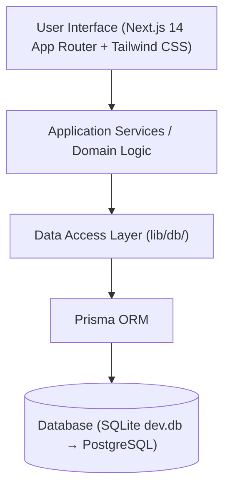

# Mind of Aravalli — Technical Architecture

This document describes the software architecture, data design, and boundaries for **Mind of Aravalli**.

---

## 1. System Architecture



### Architectural Principles:
1. **Separation of Concerns**: The UI components never communicate directly with raw database files or queries. All operations pass through typed Data Access Layer (DAL) functions in `lib/db/`.
2. **Database Portability**: The system utilizes Prisma ORM with SQLite (`file:./dev.db`) in local development. When scaling or migrating to PostgreSQL, only `datasource db` in `schema.prisma` is changed—zero application logic rewrites are required.
3. **Modular Future Boundaries**: Dedicated directory boundaries exist for future phases:
   - `lib/ai/`: Future LLM abstraction providers.
   - `lib/ingestion/`: Future media transcript extraction and noise-filtering pipelines.
   - `lib/search/`: Search indexing and retrieval engines.

---

## 2. Directory Layout

```text
mind-of-aravalli/
├── app/                          # Next.js App Router (Pages, Layouts, API routes)
│   ├── layout.tsx                # Root HTML shell & global layout
│   ├── page.tsx                  # Home screen placeholder
│   └── globals.css               # Global Tailwind CSS and variables
│
├── components/                   # Reusable UI & domain components
│   ├── ui/                       # Buttons, Badges, Modals, Cards
│   └── layout/                   # Header, Navigation, Sidebar, Footer
│
├── lib/                          # Application core & utilities
│   ├── db/                       # Data Access Layer & Prisma client
│   │   ├── prisma.ts             # Prisma client singleton
│   │   ├── chapters.ts           # Chapter repository
│   │   └── concepts.ts           # Concept repository
│   ├── types/                    # TypeScript interfaces & domain models
│   └── utils/                    # Utility functions (cn, slugify)
│
├── prisma/                       # Database schema & migrations
│   └── schema.prisma             # Relational data models
│
├── docs/                         # Architecture & operational documentation
│   └── ARCHITECTURE.md
│
├── public/                       # Static public assets
├── .env.example                  # Environment configuration template
├── MIND_OF_ARAVALLI_MASTER_SPEC.md # Master Product Specification
├── README.md                     # Repository landing documentation
├── GEMINI.md                     # Repository isolation invariants
└── package.json                  # Dependencies & scripts
```

---

## 3. Relational Data Model

* **`Chapter`**: High-level knowledge domains (*Universe & Physics*, *Energy & Technology*, etc.).
* **`Concept`**: Fundamental unit of understanding with 6-layer progressive disclosure (One-liner, Intuition, Mechanics, First Principles, Math, Misconceptions, Why it matters).
* **`Source`**: First-class citation object for videos, podcasts, papers, and books.
* **`SourceConcept`**: Join model linking sources to concepts with contextual notes.
* **`Connection`**: Explicit typed cross-domain relationships (*depends_on, causes, enables, analogous_to, mathematically_related_to, emerges_from*).
