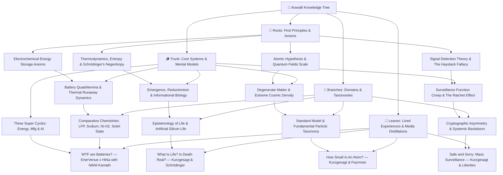

# The Aravalli Knowledge Tree — Master Index

---

## Active Knowledge Tree Hierarchy & File Links

### 1. 🌱 Roots (Foundations & Axioms)
* [**`roots/electrochemical-energy-storage-axioms.md`**](./roots/electrochemical-energy-storage-axioms.md)  
  *First-principles charge separation, potential wells, Faraday/Nernst limits, and Gibbs free energy.*
* [**`roots/thermodynamics-entropy-and-schrodinger-negentropy.md`**](./roots/thermodynamics-entropy-and-schrodinger-negentropy.md)  
  *The physical definition of life: open non-equilibrium thermodynamic systems dissipating entropy to maintain localized order ($dS_{\text{int}} < 0$).*
* [**`roots/atomic-hypothesis-quantum-fields-scale.md`**](./roots/atomic-hypothesis-quantum-fields-scale.md)  
  *Feynman's atomic invariant, $10^5:1$ nuclear scale ratio, QED zero-point vacuum fluctuations, and probability density clouds.*
* [**`roots/signal-detection-theory-and-haystack-fallacy.md`**](./roots/signal-detection-theory-and-haystack-fallacy.md)  
  *Bayesian rare event detection, base rate fallacy in intelligence dragnets, and the mathematical limits of bulk data ingestion.*

---

### 2. 🪵 Trunk (Core Mental Models & Systems)
* [**`trunk/battery-tradeoff-trilemma-and-thermal-runaway.md`**](./trunk/battery-tradeoff-trilemma-and-thermal-runaway.md)  
  *The 4-way optimization space (Energy Density vs. Cycle Life vs. Safety vs. Cost) and self-accelerating thermal runaway cascades.*
* [**`trunk/three-super-cycles-energy-manufacturing-ai.md`**](./trunk/three-super-cycles-energy-manufacturing-ai.md)  
  *Abundant Electrification + Precision Automated Manufacturing + Exponential AI Compute, 98% idle vehicle V2G buffers, and local-for-local supply chain sovereignty.*
* [**`trunk/emergence-reductionism-and-informational-biology.md`**](./trunk/emergence-reductionism-and-informational-biology.md)  
  *The Reductionist Paradox: zero living molecules in a cell, life as an emergent catalytic orchestra, informational code (DNA as software), and the boundary spectrum.*
* [**`trunk/degenerate-matter-and-extreme-cosmic-density.md`**](./trunk/degenerate-matter-and-extreme-cosmic-density.md)  
  *Pauli Exclusion breakdown, degenerate electron/neutron pressures, the Teaspoon of Humanity Gedankenexperiment, and universal quantum indistinguishability.*
* [**`trunk/surveillance-function-creep-and-ratchet-effect.md`**](./trunk/surveillance-function-creep-and-ratchet-effect.md)  
  *The Institutional Ratchet Effect, mission creep from counter-terrorism into civil protest suppression, and deconstruction of the "Nothing to Hide" fallacy.*

---

### 3. 🌿 Branches (Disciplines & Chemistry/Physics/Cybernetics Paradigms)
* [**`branches/energy-storage-chemistries-lfp-sodium-nickel-hydrogen.md`**](./branches/energy-storage-chemistries-lfp-sodium-nickel-hydrogen.md)  
  *Comparative benchmark matrix: LFP vs. Sodium-Ion (HiNa) vs. Nickel-Hydrogen (EnerVenue) vs. Solid-State (TRL 4).*
* [**`branches/definition-of-life-and-artificial-life.md`**](./branches/definition-of-life-and-artificial-life.md)  
  *Astrobiology, NASA/Thermodynamic/Cybernetic operational definitions, substrate neutrality, and artificial silicon life.*
* [**`branches/standard-model-and-particle-physics-taxonomy.md`**](./branches/standard-model-and-particle-physics-taxonomy.md)  
  *Taxonomy of matter: Quarks, Leptons, Gauge Bosons (Gluons, Photons, W/Z), Higgs mechanism, and the 4 Fundamental Forces.*
* [**`branches/cryptographic-asymmetry-and-systemic-backdoors.md`**](./branches/cryptographic-asymmetry-and-systemic-backdoors.md)  
  *Mathematical asymmetry in public-key cryptography, Kerckhoffs's principle, and why "law-enforcement-only" golden keys create universal vulnerabilities.*

---

### 4. 🍃 Leaves (Podcasts, Essays & Empirical Crucibles)
* [**`leaves/podcast-enervenue-hina-nikhil-kamath-batteries.md`**](./leaves/podcast-enervenue-hina-nikhil-kamath-batteries.md)  
  *Deconstruction of "WTF are Batteries?" featuring Henning Rath (CEO, EnerVenue) and Dr. Kun Tang (Chairman, HiNa Battery) hosted by Nikhil Kamath.*
* [**`leaves/kurzgesagt-schrodinger-what-is-life-death.md`**](./leaves/kurzgesagt-schrodinger-what-is-life-death.md)  
  *Deconstruction of Kurzgesagt's "What Is Life? Is Death Real?": Schrödinger's negentropy, protein nanomachines, and the dissolution of the life/death binary.*
* [**`leaves/kurzgesagt-quantum-atomic-scale-feynman.md`**](./leaves/kurzgesagt-quantum-atomic-scale-feynman.md)  
  *Deconstruction of Kurzgesagt's "How Small Is An Atom?": Spatial scale progression, the Empire State grain of rice, and Feynman's atomic legacy.*
* [**`leaves/kurzgesagt-surveillance-terrorism-civil-liberties.md`**](./leaves/kurzgesagt-surveillance-terrorism-civil-liberties.md)  
  *Deconstruction of Kurzgesagt's "Safe and Sorry": Mass surveillance failures, the Apple vs. FBI encryption battle, and the preservation of democratic institutions.*
