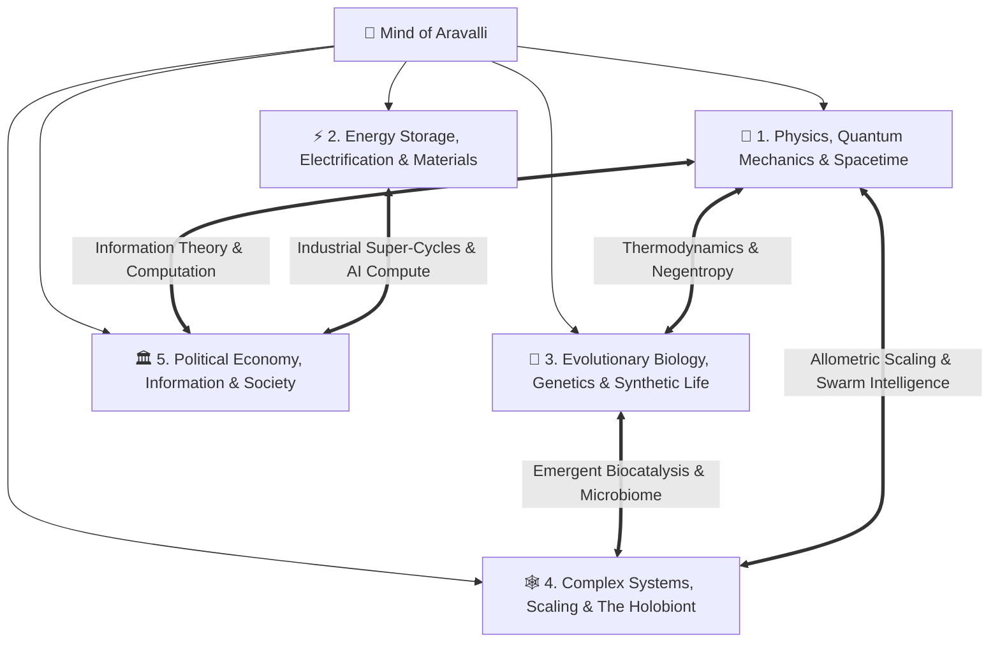

# The Aravalli Knowledge Tree — Master Index

> **Institutional Knowledge Architecture**: The Aravalli Laboratory organizes universal knowledge into **5 Comprehensive Master Domains**. Each domain connects fundamental physical axioms, core mental models, and empirical crucibles into an integrated, PhD-grade living treatise.

---

---

## 📚 Master Knowledge Domains

### 🌌 [Domain 1: Physics, Quantum Mechanics & The Fabric of Spacetime](./domains/01-physics-quantum-and-spacetime.md)
* **The Subatomic Scale & Standard Model**: Feynman's atomic invariant, the $10^5:1$ nuclear spatial ratio, quantum electrodynamic zero-point vacuum fluctuations, and the 3 stable fermions ($u, d, e^-$).
* **Degenerate Matter & Cosmic Densities**: Pauli exclusion limits, the Empire State rice grain, and the Teaspoon of Humanity Gedankenexperiment ($10^{17}\text{ kg/m}^3$).
* **Black Hole Thermodynamics & The Information Paradox**: Hawking radiation ($T_H \propto 1/M$), quantum unitarity ($U^\dagger U = I$), and the mathematical indestructibility of physical information.
* **Bekenstein Entropy & The Holographic Principle**: Area-law entropy ($S_{BH} = \frac{k_B A}{4\ell_P^2}$), Maldacena AdS/CFT correspondence, and the Page curve.
* *Synthesized Media Ingested*: Kurzgesagt *How Small Is An Atom?*, Kurzgesagt *Why Black Holes Could Delete The Universe*.

---

### ⚡ [Domain 2: Energy Storage, Electrification & Material Super-Cycles](./domains/02-energy-electrification-and-materials.md)
* **Electrochemical Thermodynamics**: Gibbs free energy ($\Delta G = -nFE$), Nernst potential equations, and concentration overpotentials.
* **The Battery Optimization Quadrilemma**: Multi-dimensional trade-offs between Energy Density, Cycle Life, Thermal Safety, and Levelized Cost ($/kWh/cycle).
* **Comparative Chemistries Matrix**: LFP vs. Sodium-Ion ($\text{Na-ion}$) vs. Nickel-Hydrogen ($\text{Ni-H}_2$) vs. Solid-State (TRL 4).
* **The 3 Converging Industrial Super-Cycles**: Abundant Clean Energy + Precision Automated Manufacturing + Exponential AI Compute, and the 98% idle Vehicle-to-Grid (V2G) distributed battery arbitrage.
* *Synthesized Media Ingested*: Nikhil Kamath Podcast *WTF are Batteries?* (EnerVenue x HiNa Battery).

---

### 🧬 [Domain 3: Evolutionary Biology, Genetics & Synthetic Biospheres](./domains/03-biology-genetics-and-synthetic-life.md)
* **Thermodynamics of Life & Schrödinger's Negentropy**: Open non-equilibrium dissipative systems sustaining internal order ($\frac{dS_{\text{int}}}{dt} < 0$) by exporting entropy.
* **The Reductionist Paradox & Molecular Machinery**: DNA as digital software ($2.15 \times 10^{17}\text{ bytes/g}$), kinesin motor proteins, and substrate neutrality.
* **CRISPR-Cas9 Super-Mendelian Gene Drives**: Overriding $50\%$ Mendelian segregation via Homology-Directed Repair ($>99.5\%$ inheritance) for vector eradication (*Plasmodium falciparum*).
* **Agricultural Bioengineering & Land Sparing**: Bt endotoxin selective toxicity vs. the naturalistic fallacy, Golden Rice biofortification, and the Land-Sparing ecological paradigm.
* *Synthesized Media Ingested*: Kurzgesagt *What Is Life? Is Death Real?*, Kurzgesagt *Gene Drives & Malaria*, Kurzgesagt *Are GMOs Good or Bad?*.

---

### 🕸️ [Domain 4: Complex Adaptive Systems, Dimensional Scaling & The Holobiont](./domains/04-complex-systems-scale-and-holobionts.md)
* **The Axiom of Emergence**: Philip Anderson's *"More is Different"*, the emergent wetness of water, and Conway's Game of Life edge-of-chaos computation.
* **Decentralized Swarm Intelligence**: Ant colony stigmergic olfactory encounter task switching, Kuramoto biological pacemaker phase synchronization, and national superorganisms.
* **The Square-Cube Law & Allometric Biomechanics**: Haldane's scaling law ($\sigma \propto L$), the skyscraper elephant drop, Stokes flow viscosity ($Re \ll 1$) for fairyflies, and plastron gills.
* **The Human Holobiont Superorganism & The Gut-Brain Axis**: $\approx 38\text{ trillion}$ microbial cells ($>2\text{M}$ genes), $90\%$ bodily serotonin synthesis in the colon, the vagus information highway, and Fecal Microbiota Transplants ($>90\%$ cure for *C. difficile*).
* *Synthesized Media Ingested*: Kurzgesagt *Emergence*, Kurzgesagt *What Happens If We Throw an Elephant?*, Kurzgesagt *How Bacteria Rule Your Body*.

---

### 🏛️ [Domain 5: Political Economy, Information Security & Human Flourishing](./domains/05-political-economy-technology-and-society.md)
* **The Demographic Transition Model (DTM) & Peak Humanity**: 4-stage logistic population dynamics, TFR leapfrogging trajectories, and the 12th billion human invariant ($10.5-11\text{B}$ ceiling).
* **Signal Detection Theory & The Haystack Fallacy**: The Bayesian base rate fallacy in bulk mass surveillance, cryptographic asymmetry (RSA/ECC), and institutional function creep.
* **Universal Basic Income (UBI) & Welfare Cliffs**: Eliminating $\text{EMTR} > 100\%$ poverty traps, the high MPC Keynesian multiplier ($+\$1.21$ GDP per $\$1.00$ low-income transfer), and non-distortive financing (Land Value Tax / Georgism, Carbon Dividends, AI Automation Levies).
* *Synthesized Media Ingested*: Kurzgesagt *Safe and Sorry: Mass Surveillance*, Kurzgesagt *Overpopulation Explained*, Kurzgesagt *Universal Basic Income Explained*.
