# The Aravalli Knowledge Tree — Master Index

```mermaid
graph TD
    RootNode["🌳 Aravalli Knowledge Tree"] --> Roots["🌱 Roots: First Principles & Axioms"]
    RootNode --> Trunk["🪵 Trunk: Core Systems & Mental Models"]
    RootNode --> Branches["🌿 Branches: Domains & Taxonomies"]
    RootNode --> Leaves["🍃 Leaves: Lived Experiences & Media Distillations"]

    %% Roots
    Roots --> R1["Electrochemical Energy Storage Axioms"]
    Roots --> R2["Thermodynamics, Entropy & Schrödinger's Negentropy"]
    Roots --> R3["Atomic Hypothesis & Quantum Fields Scale"]
    Roots --> R4["Signal Detection Theory & The Haystack Fallacy"]
    Roots --> R5["Mendelian vs Super-Mendelian Gene Drive Mechanics"]
    Roots --> R6["Demographic Transition & Logistic Population Dynamics"]
    Roots --> R7["Agricultural Energetics & Land Sparing Invariants"]
    Roots --> R8["Square-Cube Law & Allometric Scaling Invariants"]
    Roots --> R9["Quantum Unitarity & Information Conservation"]

    %% Trunk
    Trunk --> T1["Battery Quadrilemma & Thermal Runaway Dynamics"]
    Trunk --> T2["Three Super Cycles: Energy, Mfg & AI"]
    Trunk --> T3["Emergence, Reductionism & Informational Biology"]
    Trunk --> T4["Degenerate Matter & Extreme Cosmic Density"]
    Trunk --> T5["Surveillance Function Creep & The Ratchet Effect"]
    Trunk --> T6["Ecological Engineering & Irreversibility Invariants"]
    Trunk --> T7["Demographic Momentum & Fertility Collapse"]
    Trunk --> T8["Selective Toxicity & The Appeal-to-Nature Fallacy"]
    Trunk --> T9["Physical Regimes Across Scales: Viscosity to Gravity"]
    Trunk --> T10["Black Hole Information Paradox & Bekenstein Entropy"]

    %% Branches
    Branches --> B1["Comparative Chemistries: LFP, Sodium, Ni-H2, Solid-State"]
    Branches --> B2["Epistemology of Life & Artificial Silicon Life"]
    Branches --> B3["Standard Model & Fundamental Particle Taxonomy"]
    Branches --> B4["Cryptographic Asymmetry & Systemic Backdoors"]
    Branches --> B5["CRISPR-Cas9 Gene Drives & Vector Parasitology"]
    Branches --> B6["Development Economics & Peak Humanity Dynamics"]
    Branches --> B7["Crop Bioengineering & Synthetic Biofortification"]
    Branches --> B8["Allometric Biomechanics: Reynolds Numbers & Plastrons"]
    Branches --> B9["The Holographic Principle & Quantum Gravity"]

    %% Leaves
    Leaves --> L1["WTF are Batteries? — EnerVenue x HiNa with Nikhil Kamath"]
    Leaves --> L2["What Is Life? Is Death Real? — Kurzgesagt & Schrödinger"]
    Leaves --> L3["How Small Is An Atom? — Kurzgesagt & Feynman"]
    Leaves --> L4["Safe and Sorry: Mass Surveillance — Kurzgesagt & Liberties"]
    Leaves --> L5["Gene Drives & Malaria — Kurzgesagt & CRISPR"]
    Leaves --> L6["Overpopulation: The Human Explosion — Kurzgesagt & Roser"]
    Leaves --> L7["Are GMOs Good or Bad? — Kurzgesagt & Food Genetics"]
    Leaves --> L8["What Happens If We Throw an Elephant? — Kurzgesagt & Haldane"]
    Leaves --> L9["Why Black Holes Delete the Universe — Kurzgesagt & Hawking"]

    %% Cross-Tier Connections
    R1 --> T1
    R2 --> T3
    R3 --> T4
    R4 --> T5
    R5 --> T6
    R6 --> T7
    R7 --> T8
    R8 --> T9
    R9 --> T10
    T1 --> B1
    T3 --> B2
    T4 --> B3
    T5 --> B4
    T6 --> B5
    T7 --> B6
    T8 --> B7
    T9 --> B8
    T10 --> B9
    B1 --> L1
    B2 --> L2
    B3 --> L3
    B4 --> L4
    B5 --> L5
    B6 --> L6
    B7 --> L7
    B8 --> L8
    B9 --> L9
    T2 --> L1
```

---

## Active Knowledge Tree Hierarchy & File Links

### 1. 🌱 Roots (Foundations & Axioms)
* [**`roots/electrochemical-energy-storage-axioms.md`**](./roots/electrochemical-energy-storage-axioms.md)  
  *First-principles charge separation, potential wells, Faraday/Nernst limits, and Gibbs free energy.*
* [**`roots/thermodynamics-entropy-and-schrodinger-negentropy.md`**](./roots/thermodynamics-entropy-and-schrodinger-negentropy.md)  
  *The physical definition of life: open non-equilibrium thermodynamic systems dissipating entropy to maintain localized order ($dS_{\text{int}} < 0$).*
* [**`roots/atomic-hypothesis-quantum-fields-scale.md`**](./roots/atomic-hypothesis-quantum-fields-scale.md)  
  *Feynman's atomic invariant, $10^5:1$ nuclear scale ratio, QED zero-point vacuum fluctuations, and probability density clouds.*
* [**`roots/signal-detection-theory-and-haystack-fallacy.md`**](./roots/signal-detection-theory-and-haystack-fallacy.md)  
  *Bayesian rare event detection, base rate fallacy in intelligence dragnets, and the mathematical limits of bulk data ingestion.*
* [**`roots/mendelian-inheritance-and-super-mendelian-gene-drives.md`**](./roots/mendelian-inheritance-and-super-mendelian-gene-drives.md)  
  *Population genetics mathematics, Mendelian $50\%$ segregation vs. CRISPR active Homology-Directed Repair ($>99.5\%$ super-inheritance).*
* [**`roots/demographic-transition-and-logistic-population-dynamics.md`**](./roots/demographic-transition-and-logistic-population-dynamics.md)  
  *Verhulst logistic population curve, dynamic carrying capacity, and endogenous convergence to replacement fertility ($TFR \approx 2.1$).*
* [**`roots/agricultural-energetics-and-land-sparing-invariants.md`**](./roots/agricultural-energetics-and-land-sparing-invariants.md)  
  *Photosynthetic conversion limits, Haber-Bosch nitrogen bottlenecks, and the Land-Sparing vs. Land-Sharing ecological paradigm.*
* [**`roots/square-cube-law-and-dimensional-scaling-invariants.md`**](./roots/square-cube-law-and-dimensional-scaling-invariants.md)  
  *The Square-Cube Law ($\frac{A}{V} \propto \frac{1}{L}$), impact stress scaling ($\sigma \propto L^2$), and the mathematical transition of physical forces across scales.*
* [**`roots/quantum-unitarity-and-information-conservation.md`**](./roots/quantum-unitarity-and-information-conservation.md)  
  *Unitary time-evolution ($U^\dagger U = I$), pure vs. mixed quantum states ($\text{Tr}(\rho^2)=1$), and the strict physical conservation of quantum information.*

---

### 2. 🪵 Trunk (Core Mental Models & Systems)
* [**`trunk/battery-tradeoff-trilemma-and-thermal-runaway.md`**](./trunk/battery-tradeoff-trilemma-and-thermal-runaway.md)  
  *The 4-way optimization space (Energy Density vs. Cycle Life vs. Safety vs. Cost) and self-accelerating thermal runaway cascades.*
* [**`trunk/three-super-cycles-energy-manufacturing-ai.md`**](./trunk/three-super-cycles-energy-manufacturing-ai.md)  
  *Abundant Electrification + Precision Automated Manufacturing + Exponential AI Compute, 98% idle vehicle V2G buffers, and local-for-local supply chain sovereignty.*
* [**`trunk/emergence-reductionism-and-informational-biology.md`**](./trunk/emergence-reductionism-and-informational-biology.md)  
  *The Reductionist Paradox: zero living molecules in a cell, life as an emergent catalytic orchestra, informational code (DNA as software), and the boundary spectrum.*
* [**`trunk/degenerate-matter-and-extreme-cosmic-density.md`**](./trunk/degenerate-matter-and-extreme-cosmic-density.md)  
  *Pauli Exclusion breakdown, degenerate electron/neutron pressures, the Teaspoon of Humanity Gedankenexperiment, and universal quantum indistinguishability.*
* [**`trunk/surveillance-function-creep-and-ratchet-effect.md`**](./trunk/surveillance-function-creep-and-ratchet-effect.md)  
  *The Institutional Ratchet Effect, mission creep from counter-terrorism into civil protest suppression, and deconstruction of the "Nothing to Hide" fallacy.*
* [**`trunk/ecological-engineering-biocatalytic-cascades-and-irreversibility.md`**](./trunk/ecological-engineering-biocatalytic-cascades-and-irreversibility.md)  
  *The Irreversibility Invariant in synthetic biology, omission bias in bioethics, and immunizing reversal drive counter-measures.*
* [**`trunk/demographic-momentum-and-fertility-transition.md`**](./trunk/demographic-momentum-and-fertility-transition.md)  
  *Demographic Momentum lag dynamics, the 4 stages of the Demographic Transition Model (DTM), and the Beckerian human capital shift.*
* [**`trunk/selective-toxicity-and-appeal-to-nature-fallacy.md`**](./trunk/selective-toxicity-and-appeal-to-nature-fallacy.md)  
  *Receptor-specific toxicity (Bt Cry proteins vs. caffeine vs. theobromine), and dismantling the "natural equals safe" bias.*
* [**`trunk/physical-regimes-across-scales-viscosity-to-gravity.md`**](./trunk/physical-regimes-across-scales-viscosity-to-gravity.md)  
  *The 7-order scale continuum: from micro-wasp Stokes flow viscosity ($Re \ll 1$) to insect surface tension traps and elephant gravitational rupture.*
* [**`trunk/black-hole-information-paradox-and-bekenstein-entropy.md`**](./trunk/black-hole-information-paradox-and-bekenstein-entropy.md)  
  *The Relativity vs. Quantum Mechanics crisis, Hawking evaporation, and Bekenstein-Hawking horizon surface area entropy scaling ($S_{BH} \propto \frac{A}{4\ell_P^2}$).*

---

### 3. 🌿 Branches (Disciplines & Applied Physics/Quantum Gravity Paradigms)
* [**`branches/energy-storage-chemistries-lfp-sodium-nickel-hydrogen.md`**](./branches/energy-storage-chemistries-lfp-sodium-nickel-hydrogen.md)  
  *Comparative benchmark matrix: LFP vs. Sodium-Ion (HiNa) vs. Nickel-Hydrogen (EnerVenue) vs. Solid-State (TRL 4).*
* [**`branches/definition-of-life-and-artificial-life.md`**](./branches/definition-of-life-and-artificial-life.md)  
  *Astrobiology, NASA/Thermodynamic/Cybernetic operational definitions, substrate neutrality, and artificial silicon life.*
* [**`branches/standard-model-and-particle-physics-taxonomy.md`**](./branches/standard-model-and-particle-physics-taxonomy.md)  
  *Taxonomy of matter: Quarks, Leptons, Gauge Bosons (Gluons, Photons, W/Z), Higgs mechanism, and the 4 Fundamental Forces.*
* [**`branches/cryptographic-asymmetry-and-systemic-backdoors.md`**](./branches/cryptographic-asymmetry-and-systemic-backdoors.md)  
  *Mathematical asymmetry in public-key cryptography, Kerckhoffs's principle, and why "law-enforcement-only" golden keys create universal vulnerabilities.*
* [**`branches/crispr-cas9-gene-drives-and-vector-parasitology.md`**](./branches/crispr-cas9-gene-drives-and-vector-parasitology.md)  
  *Pathogenic life cycle of Plasmodium, population modification vs. suppression strategies, and gene drive applications across vector diseases.*
* [**`branches/development-economics-tfr-and-peak-humanity.md`**](./branches/development-economics-tfr-and-peak-humanity.md)  
  *TFR leapfrogging trajectories (UK vs. Bangladesh vs. Iran), human intelligence density, and the 12th billion human invariant.*
* [**`branches/crop-bioengineering-bt-endotoxins-and-biofortification.md`**](./branches/crop-bioengineering-bt-endotoxins-and-biofortification.md)  
  *Applied agricultural transgenics: Bt Brinjal, Hawaiian Rainbow Papaya, Golden Rice, and climate-resilient Sub1 rice.*
* [**`branches/allometric-biomechanics-reynolds-numbers-plastrons.md`**](./branches/allometric-biomechanics-reynolds-numbers-plastrons.md)  
  *Fluid mechanics scaling: Reynolds numbers, fairyfly comb flight, superhydrophobic micro-hair meshes, and continuous plastron gills.*
* [**`branches/holographic-principle-and-quantum-gravity.md`**](./branches/holographic-principle-and-quantum-gravity.md)  
  *Maldacena AdS/CFT duality (3D Bulk Gravity $\leftrightarrow$ 2D Boundary CFT), the Page curve, and spacetime geometry as emergent quantum entanglement.*

---

### 4. 🍃 Leaves (Podcasts, Essays & Empirical Crucibles)
* [**`leaves/podcast-enervenue-hina-nikhil-kamath-batteries.md`**](./leaves/podcast-enervenue-hina-nikhil-kamath-batteries.md)  
  *Deconstruction of "WTF are Batteries?" featuring Henning Rath (CEO, EnerVenue) and Dr. Kun Tang (Chairman, HiNa Battery) hosted by Nikhil Kamath.*
* [**`leaves/kurzgesagt-schrodinger-what-is-life-death.md`**](./leaves/kurzgesagt-schrodinger-what-is-life-death.md)  
  *Deconstruction of Kurzgesagt's "What Is Life? Is Death Real?": Schrödinger's negentropy, protein nanomachines, and the dissolution of the life/death binary.*
* [**`leaves/kurzgesagt-quantum-atomic-scale-feynman.md`**](./leaves/kurzgesagt-quantum-atomic-scale-feynman.md)  
  *Deconstruction of Kurzgesagt's "How Small Is An Atom?": Spatial scale progression, the Empire State grain of rice, and Feynman's atomic legacy.*
* [**`leaves/kurzgesagt-surveillance-terrorism-civil-liberties.md`**](./leaves/kurzgesagt-surveillance-terrorism-civil-liberties.md)  
  *Deconstruction of Kurzgesagt's "Safe and Sorry": Mass surveillance failures, the Apple vs. FBI encryption battle, and the preservation of democratic institutions.*
* [**`leaves/kurzgesagt-crispr-gene-drives-malaria.md`**](./leaves/kurzgesagt-crispr-gene-drives-malaria.md)  
  *Deconstruction of Kurzgesagt's "Gene Drives & Malaria": Plasmodium biology, CRISPR super-Mendelian sweeps, and the bioethics of ecological editing.*
* [**`leaves/kurzgesagt-overpopulation-demographic-transition.md`**](./leaves/kurzgesagt-overpopulation-demographic-transition.md)  
  *Deconstruction of Kurzgesagt's "Overpopulation – The Human Explosion Explained": The 4 stages of the DTM, compressed leapfrogging, and the 12th billion human barrier.*
* [**`leaves/kurzgesagt-gmo-food-genetic-engineering.md`**](./leaves/kurzgesagt-gmo-food-genetic-engineering.md)  
  *Deconstruction of Kurzgesagt's "Are GMOs Good or Bad?": 30-year safety consensus, selective toxicity, and Land Sparing vs. Extensification.*
* [**`leaves/kurzgesagt-size-square-cube-law-elephant.md`**](./leaves/kurzgesagt-size-square-cube-law-elephant.md)  
  *Deconstruction of Kurzgesagt's "Life & Size 1": The Skyscraper fall thought experiment, surface tension adhesive traps, and Haldane's scaling law.*
* [**`leaves/kurzgesagt-black-hole-information-paradox.md`**](./leaves/kurzgesagt-black-hole-information-paradox.md)  
  *Deconstruction of Kurzgesagt's "Why Black Holes Delete the Universe": Quantum unitarity, Hawking radiation, and the 2D Holographic Principle.*
