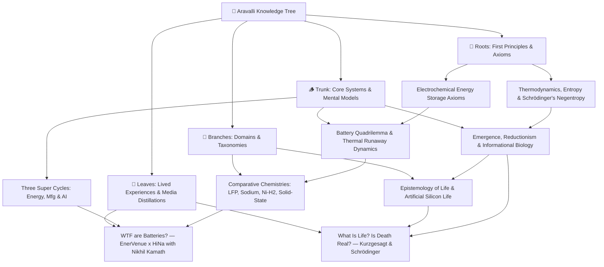

# The Aravalli Knowledge Tree — Master Index

---

## Active Knowledge Tree Hierarchy & File Links

### 1. 🌱 Roots (Foundations & Axioms)
* [**`roots/electrochemical-energy-storage-axioms.md`**](file:///c:/Users/visha/OneDrive/Documents/mind%20of%20aravalli/knowledge-tree/roots/electrochemical-energy-storage-axioms.md)  
  *First-principles charge separation, potential wells, Faraday/Nernst limits, and Gibbs free energy.*
* [**`roots/thermodynamics-entropy-and-schrodinger-negentropy.md`**](file:///c:/Users/visha/OneDrive/Documents/mind%20of%20aravalli/knowledge-tree/roots/thermodynamics-entropy-and-schrodinger-negentropy.md)  
  *The physical definition of life: open non-equilibrium thermodynamic systems dissipating entropy to maintain localized order ($dS_{\text{int}} < 0$).*

---

### 2. 🪵 Trunk (Core Mental Models & Systems)
* [**`trunk/battery-tradeoff-trilemma-and-thermal-runaway.md`**](file:///c:/Users/visha/OneDrive/Documents/mind%20of%20aravalli/knowledge-tree/trunk/battery-tradeoff-trilemma-and-thermal-runaway.md)  
  *The 4-way optimization space (Energy Density vs. Cycle Life vs. Safety vs. Cost) and self-accelerating thermal runaway cascades (14,000+ LFP fire baseline).*
* [**`trunk/three-super-cycles-energy-manufacturing-ai.md`**](file:///c:/Users/visha/OneDrive/Documents/mind%20of%20aravalli/knowledge-tree/trunk/three-super-cycles-energy-manufacturing-ai.md)  
  *Abundant Electrification + Precision Automated Manufacturing + Exponential AI Compute, 98% idle vehicle V2G buffers, and local-for-local supply chain sovereignty.*
* [**`trunk/emergence-reductionism-and-informational-biology.md`**](file:///c:/Users/visha/OneDrive/Documents/mind%20of%20aravalli/knowledge-tree/trunk/emergence-reductionism-and-informational-biology.md)  
  *The Reductionist Paradox: zero living molecules in a cell, life as an emergent catalytic orchestra, informational code (DNA as software), and the boundary spectrum (viruses, mitochondria).*

---

### 3. 🌿 Branches (Disciplines & Chemistry/Epistemology Paradigms)
* [**`branches/energy-storage-chemistries-lfp-sodium-nickel-hydrogen.md`**](file:///c:/Users/visha/OneDrive/Documents/mind%20of%20aravalli/knowledge-tree/branches/energy-storage-chemistries-lfp-sodium-nickel-hydrogen.md)  
  *Comparative benchmark matrix: LFP vs. Sodium-Ion (HiNa) vs. Nickel-Hydrogen (EnerVenue) vs. Solid-State (TRL 4).*
* [**`branches/definition-of-life-and-artificial-life.md`**](file:///c:/Users/visha/OneDrive/Documents/mind%20of%20aravalli/knowledge-tree/branches/definition-of-life-and-artificial-life.md)  
  *Astrobiology, NASA/Thermodynamic/Cybernetic operational definitions, substrate neutrality, and artificial silicon life.*

---

### 4. 🍃 Leaves (Podcasts, Essays & Empirical Crucibles)
* [**`leaves/podcast-enervenue-hina-nikhil-kamath-batteries.md`**](file:///c:/Users/visha/OneDrive/Documents/mind%20of%20aravalli/knowledge-tree/leaves/podcast-enervenue-hina-nikhil-kamath-batteries.md)  
  *Deconstruction of "WTF are Batteries?" featuring Henning Rath (CEO, EnerVenue) and Dr. Kun Tang (Chairman, HiNa Battery) hosted by Nikhil Kamath.*
* [**`leaves/kurzgesagt-schrodinger-what-is-life-death.md`**](file:///c:/Users/visha/OneDrive/Documents/mind%20of%20aravalli/knowledge-tree/leaves/kurzgesagt-schrodinger-what-is-life-death.md)  
  *Deconstruction of Kurzgesagt's "What Is Life? Is Death Real?": Schrödinger's negentropy, protein nanomachines, and the dissolution of the life/death binary.*

---

## Log of Ingested Media & Distillations
| Date | Source / Guest | Core Concept / Node | Tree Coordinates | Auditor Status |
| :--- | :--- | :--- | :--- | :--- |
| **2026-08-24** | **Nikhil Kamath** w/ **Henning Rath** & **Dr. Kun Tang** | Next-Gen Battery Chemistries, LFP Thermal Runaway, Sodium & Nickel-Hydrogen Scaling, 3 Super-Cycles | `Roots` $\rightarrow$ `Trunk` $\rightarrow$ `Branches` $\rightarrow$ `Leaves` | **Verified & Indexed** |
| **2026-08-24** | **Kurzgesagt – In a Nutshell** (Schrödinger) | What Is Life? Negentropy, Reductionism Paradox, Protein Robots, Viruses & The Illusion of Death | `Roots` $\rightarrow$ `Trunk` $\rightarrow$ `Branches` $\rightarrow$ `Leaves` | **Verified & Indexed** |
