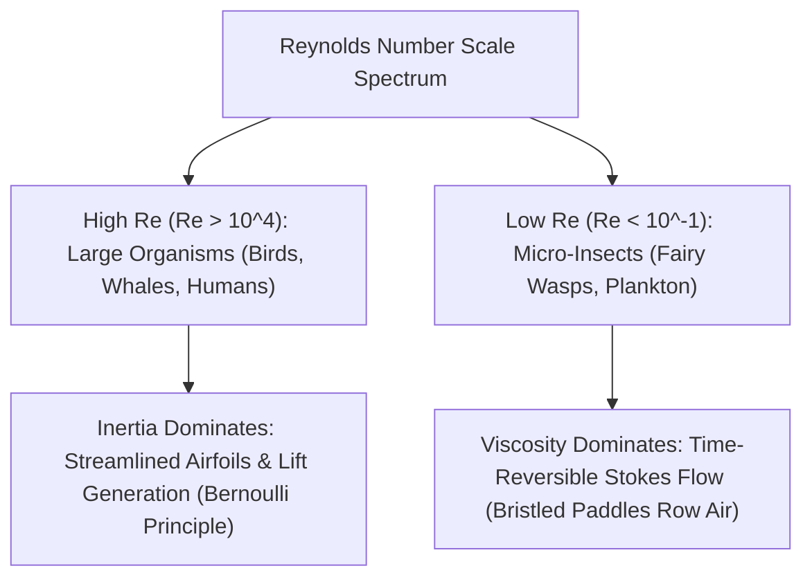

# Allometric Biomechanics: Reynolds Numbers, Surface Tension & Plastron Respiration

> **Taxonomic Thesis**: Biological evolution engineered functional nanotechnology—superhydrophobic hairs, micro-grooved hydrophobic tarsal claws, and bristled rowing wings—hundreds of millions of years before human physics formulated the Navier-Stokes equations and fluid mechanics.

---

## 1. The Fluid Dynamics Invariant: Reynolds Number ($Re$)

\[
Re = \frac{\text{Inertial Forces}}{\text{Viscous Forces}} = \frac{\rho \cdot v \cdot L}{\mu}
\]

* **Micro-Wasp Locomotion (*Dicopomorpha echmepterygis*)**: At $0.15\text{ mm}$, air acts as a viscous syrup. Smooth aerodynamic airfoils fail to generate circulation; instead, wings evolve into **bristled combs** that drag fluid with minimal leak-through.

---

## 2. Nanoscale Surface Tension Engineering: The Plastron Lung

| Biomechanical Innovation | Physics Principle | Biological Application |
| :--- | :--- | :--- |
| **Plastron Respiration** | Surface tension preventing water entry ($\Delta P = \frac{2\gamma \cos \theta}{r}$) + Gas partial pressure diffusion. | Diving beetles (*Aphelocheirus*) breathe underwater indefinitely without resurfacing. |
| **Tarsal Water-Walking** | Hydrophobic cuticular nanogrooves + Surface tension force ($F_\gamma > F_g$). | Water striders (*Gerridae*) stand and sprint on water surfaces without sinking. |
| **Cuticular Wax Layer** | Low surface energy lipid barrier preventing water adhesion. | Protects ants from being trapped and drowned by ambient moisture. |

---

## 3. Tree Linkages
- **Roots**: [[square-cube-law-and-dimensional-scaling-invariants]], [[thermodynamics-entropy-and-schrodinger-negentropy]]
- **Trunk**: [[physical-regimes-across-scales-viscosity-to-gravity]]
- **Leaves**: [[kurzgesagt-size-square-cube-law-elephant]]
