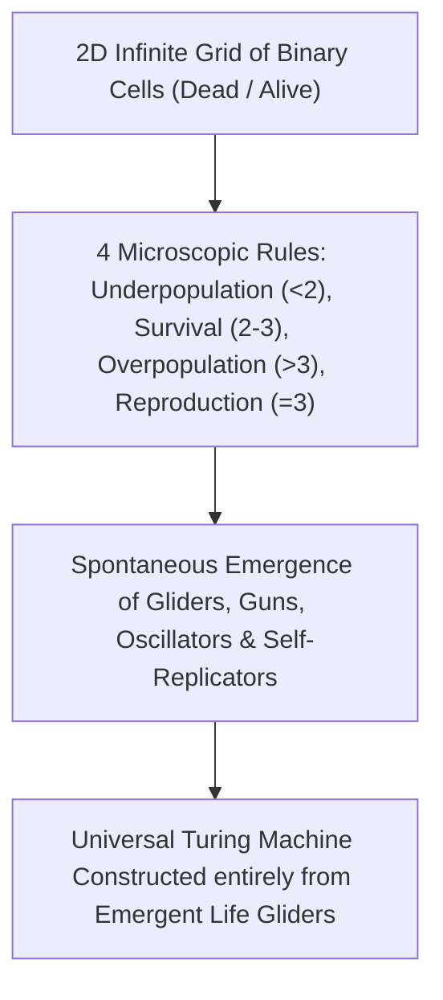

# Complex Adaptive Systems & Cellular Automata

> **Taxonomic Thesis**: Complex adaptive systems exist at the **Edge of Chaos**—a delicate boundary between rigid crystalline order and turbulent entropy—where elementary local computational rules generate Turing-complete universal computation, self-reproduction, and open-ended evolution.

---

## 1. Computational Emergence: Conway's Game of Life & Wolfram Classes

| Complexity Class (Wolfram) | Microscopic Dynamic | Macroscopic Behavior | Real-World System Equivalent |
| :--- | :--- | :--- | :--- |
| **Class 1: Static** | Converges rapidly to uniform state. | Total homogeneity, zero evolution. | Crystalline solid / Absolute thermodynamic death. |
| **Class 2: Periodic** | Converges to simple cyclical loops. | Predictable repeating structures. | Stable planetary orbits / Simple clocks. |
| **Class 3: Chaotic** | Completely random, aperiodic patterns. | High entropy, deterministic chaos. | Turbulent fluid eddies / Thermal noise. |
| **Class 4: Complex (Edge of Chaos)** | Localized structures interacting computation-capable. | **Emergence, Universal Computation, Life**. | Biological evolution, human consciousness, AI networks. |

---

## 2. Self-Organized Criticality & Sandpile Cascades

* **Per Bak's Sandpile Invariant**: Adding grains of sand one by one to a pile spontaneously organizes the system into a critical state where a single additional grain can trigger either a tiny localized shift or a system-wide catastrophic avalanche.
* **Isomorphic Transfers**: Power-law avalanche distributions govern earthquake magnitudes (Gutenberg-Richter law), financial market flash crashes, neural avalanches in the cerebral cortex, and mass extinction events.

---

## 3. Tree Linkages
- **Roots**: [[emergence-invariants-and-local-rule-networks]], [[quantum-unitarity-and-information-conservation]]
- **Trunk**: [[decentralized-superorganisms-and-swarm-intelligence]], [[three-super-cycles-energy-manufacturing-ai]]
- **Leaves**: [[kurzgesagt-emergence-how-stupid-things-become-smart]]
