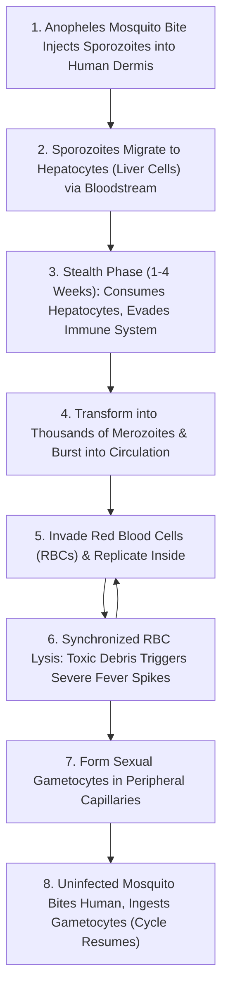

# CRISPR-Cas9 Gene Drives & Vector-Borne Parasitology

> **Taxonomic Thesis**: Vector-borne infectious diseases operate via obligate tripartite ecological dependencies: Host $\leftrightarrow$ Parasite $\leftrightarrow$ Insect Vector. Intercepting the vector's capacity to host the parasite via molecular immunization eliminates human transmission without requiring the chemical poisoning of entire ecosystems.

---

## 1. The Pathogenic Life Cycle of *Plasmodium*

---

## 2. Molecular Gene Drive Engineering Strategies

| Strategy | Molecular Mechanism | Target Gene / Payload | Intended Ecological Outcome |
| :--- | :--- | :--- | :--- |
| **Population Modification (Replacement)** | Expresses single-chain antibodies (scFv) or synthetic peptides (SM1) in mosquito gut tissue upon blood meal. | Synthetic anti-*Plasmodium* effector genes | Mosquito population persists normally, but is rendered **$100\%$ immune to malaria parasite carriage**. |
| **Population Suppression (Eradication)** | Targets and disrupts female-specific sex determination or fertility genes. | *doublesex* ($dsx$) or *fru* gene locus | Intersex/sterile females cause target *Anopheles* population collapse within 8–12 generations. |

---

## 3. Potential Application Across Vector-Borne Pathogens

1. **Dengue, Zika, Yellow Fever & Chikungunya**: Vector: *Aedes aegypti* (Suppression via gene drives or *Wolbachia* symbionts).
2. **Lyme Disease**: Vector: *Ixodes scapularis* (Tick gene drives to block *Borrelia burgdorferi* transmission).
3. **African Sleeping Sickness**: Vector: *Glossina* (Tsetse fly gene drives against *Trypanosoma brucei*).
4. **Bubonic Plague**: Vector: *Xenopsylla cheopis* (Flea vectors transmitting *Yersinia pestis*).

---

## 4. Tree Linkages
- **Roots**: [[mendelian-inheritance-and-super-mendelian-gene-drives]], [[emergence-reductionism-and-informational-biology]]
- **Trunk**: [[ecological-engineering-biocatalytic-cascades-and-irreversibility]]
- **Leaves**: [[kurzgesagt-crispr-gene-drives-malaria]]
