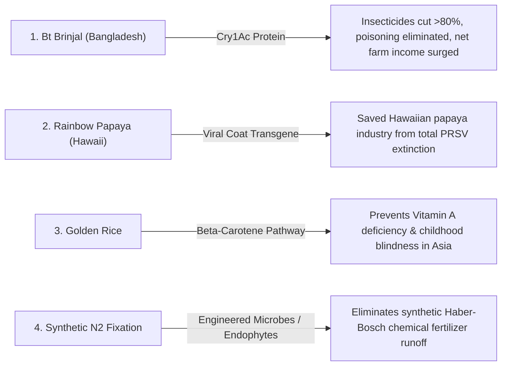

# Crop Bioengineering: Bt Endotoxins, Viral Immunization & Biofortification

> **Taxonomic Thesis**: Applied crop biotechnology operates across three distinct functional paradigms: **Endogenous Pest Defense** (Bt endotoxins), **Pathogen Immunization** (viral coat protein expression), and **Nutritional Biofortification** (Golden Rice / Nitrogen Fixation), replacing external chemical inputs with self-contained biological programs.

---

## 1. The Core Applied Case Studies

| Technology / Crop | Target Vulnerability / Enhancement | Molecular Mechanism | Real-World Impact |
| :--- | :--- | :--- | :--- |
| **Bt Brinjal (Eggplant)** | Fruit and Shoot Borer (*Leucinodes orbonalis*). | *Bacillus thuringiensis* $Cry1Ac$ gene expression. | **$>80\%$ drop in pesticide spraying**; eliminated farmer chemical toxicity; boosted farmer revenues by $>60\%$. |
| **Rainbow Papaya** | Papaya Ringspot Virus (PRSV). | Pathogen-derived resistance via viral coat protein expression. | Rescued Hawaii's agricultural fruit export economy from $100\%$ devastation in the 1990s. |
| **Golden Rice** | Vitamin A Deficiency (VAD). | Phytoene synthase ($psy$) & carotene desaturase ($crtI$) inserted into rice endosperm. | Delivers up to $50\%$ of daily Vitamin A requirement to combat preventable blindness in children. |
| **Sub1 Flood-Tolerant Rice** | Submergence survival in flood-prone deltas. | *Sub1A* ethylene-response transcription factor. | Enables rice to survive complete underwater submergence for up to **$14\text{ consecutive days}$**. |

---

## 2. Tree Linkages
- **Roots**: [[agricultural-energetics-and-land-sparing-invariants]], [[mendelian-inheritance-and-super-mendelian-gene-drives]]
- **Trunk**: [[selective-toxicity-and-appeal-to-nature-fallacy]], [[ecological-engineering-biocatalytic-cascades-and-irreversibility]]
- **Leaves**: [[kurzgesagt-gmo-food-genetic-engineering]]
