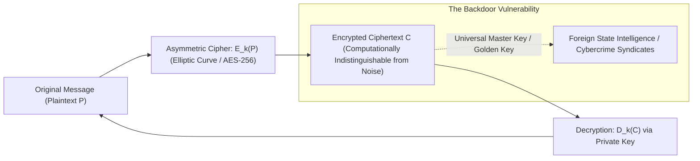

# Cryptographic Asymmetry & The Backdoor Fallacy

> **Taxonomic Thesis**: In pure mathematics and computer science, there is no such concept as a "golden key" or a "law-enforcement-only backdoor." Weakening the cryptographic architecture of consumer hardware or communication protocols introduces an intrinsic vulnerability that is mathematically accessible to all adversaries.

---

## 1. The Mathematical Foundations of Cryptographic Privacy

### Key Principles
1. **Mathematical Asymmetry**: Encryption relies on one-way trapdoor functions (e.g. discrete logarithms, prime factorization). Encrypting data is computationally cheap ($O(1)$), while brute-forcing without the private key requires more energy than exists in the observable universe ($2^{256}\text{ operations}$).
2. **Kerckhoffs's Principle**: A cryptographic system must be secure even if everything about the system, except the key, is public knowledge.
3. **The "Golden Key" Illusion**: If software engineers engineer a bypass mechanism or weakened master key into an operating system (e.g. iOS / Android), that mechanism inevitably leaks, gets reverse-engineered, or is discovered by hostile nation-state actors.

---

## 2. The Apple vs. FBI Precedent (2016)

* **The Demand**: Law enforcement requested Apple to engineer a specialized modified firmware (FSoPs) to disable the passcode delay and auto-erase security protections on an encrypted iPhone.
* **The Cryptographic Defense**: Creating a master tool capable of bypassing encryption on one device creates a software weapon that undermines the security infrastructure of billions of consumer devices globally.
* **Outcome**: The FBI subsequently acquired a zero-day exploit from private security contractors, proving that existing targeted forensic capabilities rendered the demand for systemic encryption backdoors unnecessary and dangerous.

---

## 3. Tree Linkages
- **Roots**: [[signal-detection-theory-and-haystack-fallacy]], [[atomic-hypothesis-quantum-fields-scale]]
- **Trunk**: [[surveillance-function-creep-and-ratchet-effect]], [[three-super-cycles-energy-manufacturing-ai]]
- **Leaves**: [[kurzgesagt-surveillance-terrorism-civil-liberties]]
