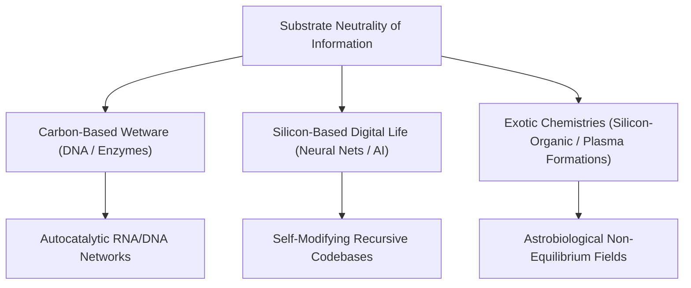

# Epistemology of Life: Carbon Chauvinism, Definitions & Artificial Life

> **Epistemic Invariant**: "Life" is a fuzzy set, not a binary boolean. As human technology approaches synthetic biology and autonomous artificial intelligence, binary definitions of life collapse into a continuous spectrum of system complexity, autonomy, and error-correcting information transmission.

---

## 1. Competing Operational Definitions of Life

| Theoretical Lens | Formal Definition | Primary Metric | Boundary Edge Cases |
| :--- | :--- | :--- | :--- |
| **Thermodynamic (Schrödinger / Prigogine)** | An open system maintaining a steep internal entropy gradient via continuous free energy dissipation. | Negative Entropy ($\frac{dS_{\text{int}}}{dt} < 0$) | Flames, hurricanes, convection cells (dissipative, but no genetic memory). |
| **Evolutionary (NASA Standard)** | A self-sustaining chemical system capable of Darwinian evolution. | Heredity + Mutation + Selection | Mules, sterile worker ants, post-menopausal humans (cannot reproduce, but alive). |
| **Cybernetic / Informational** | An autonomous information-processing loop with self-correcting feedback mechanisms (homeostasis). | Error-correction & autonomy | Self-replicating computer code, autonomous AI networks. |
| **Metabolic / Cellular** | A compartmentalized system executing catalytic synthesis of its own components (autopoiesis). | Membrane separation + catalytic closure | Viruses (lack independent metabolism), prions. |

---

## 2. Overcoming Carbon Chauvinism

* **Substrate Neutrality**: If life is an emergent computational process of self-organization, information preservation, and adaptation, it is not fundamentally restricted to carbon-water biochemistry.
* **Artificial Silicon Life**: Autonomous software entities with goals, error-correcting loops, self-replication capabilities, and adaptive learning fulfill nearly all behavioral criteria of living organisms.

---

## 3. The Philosophical Culmination: The Illusion of Death

If the universe is composed entirely of fundamental quantum fields and subatomic particles:
1. **The Materialist Continuum**: A human body is made of the exact same atoms as interstellar gas and granite rocks.
2. **The Emergent Pattern**: You are not the atoms themselves; you are the **informational pattern and dynamic energy flow** passing through those atoms.
3. **The Dissolution of the Life/Death Dichotomy**: "Death" is not the disappearance of a mysterious physical substance; it is simply the thermodynamic decoherence of a complex dissipative pattern back into background equilibrium.

---

## 4. Tree Linkages
- **Roots**: [[thermodynamics-entropy-and-schrodinger-negentropy]], [[electrochemical-energy-storage-axioms]]
- **Trunk**: [[emergence-reductionism-and-informational-biology]]
- **Leaves**: [[kurzgesagt-schrodinger-what-is-life-death]]
