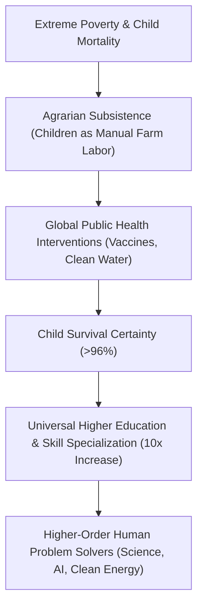

# Development Economics: TFR Compression, Leapfrogging & Peak Humanity

> **Taxonomic Thesis**: The Demographic Transition is not unique to Western culture; it is an invariant law of economic development. Developing nations traverse the transition orders of magnitude faster due to global technology, medical knowledge transfer, and educational diffusion.

---

## 1. The Global Leapfrogging Timeline (TFR $>6.0 \rightarrow <3.0$)

| Country | Transition Window | Starting TFR & Child Mortality | Ending TFR & Child Mortality | Core Catalyst |
| :--- | :--- | :--- | :--- | :--- |
| **United Kingdom** | $\approx 80\text{ Years}$ ($1770-1850$) | $\text{TFR } 6.0$, $>30\%\text{ under-5 mortality}$ | $\text{TFR } 2.5$, $<10\%\text{ mortality}$ | Pioneering industrialization, slow medical discovery. |
| **Bangladesh** | **$20\text{ Years}$** ($1971-2015$) | $\text{TFR } 7.0$, $25\%\text{ under-5 mortality}$ | $\text{TFR } 2.2$, $3.8\%\text{ under-5 mortality}$ | Oral rehydration therapy, microfinance, female education. |
| **Iran** | **$10\text{ Years}$** ($1986-1996$) | $\text{TFR } 6.5$, $>15\%\text{ under-5 mortality}$ | $\text{TFR } 2.0$, $<3\%\text{ mortality}$ | Nationwide rural health house network & family planning. |

---

## 2. Human Intelligence Expansion: From Muscle to Mind

* **The Problem-Solver Invariant (Julian Simon / Hans Rosling)**: A larger, highly educated global population is an intellectual asset rather than an ecological liability. Each additional educated human increases the probability of technological breakthroughs in fusion energy, synthetic biology, and materials science.

---

## 3. Tree Linkages
- **Roots**: [[demographic-transition-and-logistic-population-dynamics]], [[three-super-cycles-energy-manufacturing-ai]]
- **Trunk**: [[demographic-momentum-and-fertility-transition]]
- **Leaves**: [[kurzgesagt-overpopulation-demographic-transition]]
