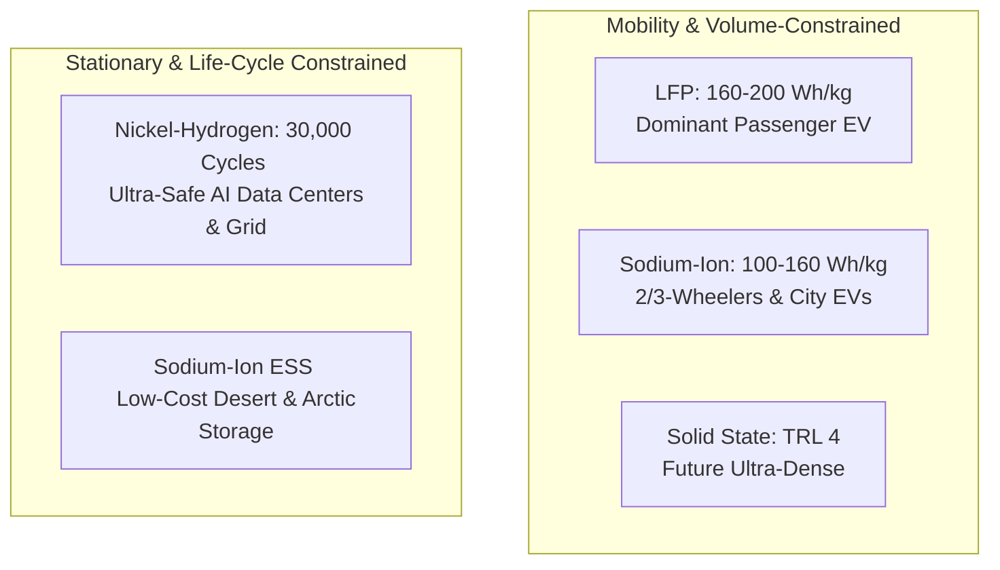

# Comparative Battery Chemistries: LFP vs. Sodium-Ion vs. Nickel-Hydrogen vs. Solid-State

> **Taxonomic Thesis**: Different energy storage chemistries occupy distinct ecological niches. No single chemistry wins across all sectors; LFP dominates long-range EVs, Sodium-ion dominates low-cost urban mobility & short-duration ESS, and Nickel-Hydrogen dominates 30-year stationary grid and data center infrastructure.

---

## 1. Multi-Chemistry Comparative Benchmark

| Attribute | **LFP (Lithium Iron Phosphate)** | **Sodium-Ion ($\text{Na-ion}$)** | **Nickel-Hydrogen ($\text{Ni-H}_2$)** | **Solid-State (TRL 4)** |
| :--- | :--- | :--- | :--- | :--- |
| **Primary Ion Carrier** | $\text{Li}^+$ | $\text{Na}^+$ | $\text{H}^+$ / Aqueous $\text{OH}^-$ | $\text{Li}^+$ (Solid matrix) |
| **Specific Energy** | $160 - 200\text{ Wh/kg}$ | $100 - 160\text{ Wh/kg}$ | $\approx 40 - 60\text{ Wh/kg}$ | Projected $300 - 450\text{ Wh/kg}$ |
| **Cycle Life ($80\%\text{ SOH}$)**| $3,000 - 10,000\text{ cycles}$ | $4,000 - 8,000\text{ cycles}$ | **$30,000\text{ cycles}$** ($30+\text{ years}$) | Currently $<1,000\text{ cycles}$ |
| **Operating Temp Window**| $0^\circ\text{C}$ to $45^\circ\text{C}$ (Losses in cold)| **$-40^\circ\text{C}$ to $55^\circ\text{C}$** | **$-10^\circ\text{C}$ to $50^\circ\text{C}$** | Highly temp-dependent |
| **Thermal Runaway Risk** | Moderate to High (Flammable organic solvent) | Low to Moderate (Aqueous or stable solvents) | **Zero (Aqueous electrolyte, non-flammable)** | Low flammability, dendrite risks remain |
| **Raw Material Cost Basis**| Lithium Carbonate ($\approx \$15-\$25/\text{kg}$)| Sodium Carbonate ($\approx \$1.5-\$2.5/\text{kg}$, **$1/10\text{th}$ cost**)| Nickel + Stainless Steel + Water | High-purity lithium metal foil |
| **Recycling Model** | Complex pyrometallurgy / hydrometallurgy | Simple hydrometallurgy | **$98\%$ Reusable Nickel Leasing Model** | Unsolved at commercial scale |
| **Optimal Domain** | Mid/Long-Range EVs ($500-1000\text{ km}$)| 2/3-Wheelers, Urban EVs, Short ESS | AI Data Centers, Grid Sub-stations, Telecom | High-performance EVs, Aerospace |

---

## 2. Chemistry Deep-Dives

### 1. Lithium Iron Phosphate ($\text{LiFePO}_4$)
- **Strengths**: Established gigawatt supply chains, decent energy density, cell-to-pack (CTP) innovations enabling $1,000\text{ km}$ EV range.
- **Weaknesses**: Flammable organic carbonate electrolytes, thermal runaway propagation cascade, cold-weather capacity drop.

### 2. Sodium-Ion ($\text{Na-ion}$ — HiNa Battery Paradigm)
- **Strengths**: Universal abundance ($\text{Na}_2\text{CO}_3$ from common salt), cost stability immune to commodity speculation, extreme cold-temperature discharge ($>80\%$ capacity retention at $-20^\circ\text{C}$), drops directly into existing lithium cell manufacturing lines.
- **Ceiling**: Larger ionic radius makes gravimetric density peak near $160\text{ Wh/kg}$, limiting long-range heavy EV usage.

### 3. Nickel-Hydrogen / Aqueous Metal Cell (EnerVenue Paradigm)
- **Strengths**: NASA space-station heritage, non-combustible water-based electrolyte, zero thermal runaway, survives $30,000\text{ full cycles}$ without degradation, zero maintenance.
- **Business Model Innovation**: **"Rent the Metal"** — Customers lease the nickel via an SPV; at end of 30-year life, $98\%$ of the nickel is recovered and re-manufactured into new electrodes, creating a permanent circular asset.

### 4. The Solid-State Reality Check
- **Industry State**: Rated at **Technology Readiness Level 4 out of 9** (TRL 4: Lab validation / early prototypes).
- **Bottlenecks**: Solid-solid interface impedance, volumetric breathing during cycling causing micro-cracking, expensive lithium metal anodes, and absence of high-yield roll-to-roll manufacturing equipment.

---

## 3. Tree Linkages
- **Roots**: [[electrochemical-energy-storage-axioms]]
- **Trunk**: [[battery-tradeoff-trilemma-and-thermal-runaway]], [[three-super-cycles-energy-manufacturing-ai]]
- **Leaves**: [[podcast-enervenue-hina-nikhil-kamath-batteries]]
