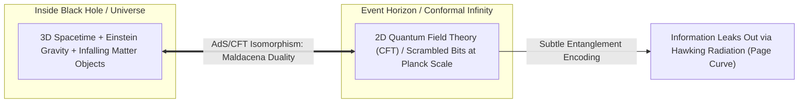

# The Holographic Principle, AdS/CFT Duality & Quantum Gravity

> **Taxonomic Thesis**: The three-dimensional bulk physics of a gravitational spacetime (including black holes and possibly our observable universe) can be fully encoded without loss of information on its two-dimensional spatial boundary—establishing that quantum entanglement is the fundamental constituent generating the emergent geometry of spacetime.

---

## 1. The Holographic Duality Architecture

### Key Quantum Gravity Pillars
1. **The Holographic Principle ('t Hooft / Susskind)**: Because maximum entropy scales as $S \propto \text{Area}$ rather than Volume, the fundamental degrees of freedom of any 3D spatial volume reside on its 2D bounding surface.
2. **AdS/CFT Correspondence (Juan Maldacena, 1997)**: Anti-de Sitter (AdS) spacetime with gravity in $(d+1)$ dimensions is mathematically dual and identical to a Conformal Field Theory (CFT) without gravity living on the $d$-dimensional boundary.
3. **The Page Curve & Information Recovery (Don Page)**: Information does not vanish; until the "Page time" (when the black hole reaches half its initial entropy), radiation appears thermal. After the Page time, quantum entanglement between emitted Hawking photons and the remaining black hole allows information to leak out completely before final evaporation.

---

## 2. Cosmic Epistemology: The Projection of Reality

* **The Holographic Universe Conjecture**: An observer inside a 3D gravitational universe experiences three continuous spatial dimensions, yet mathematically, every event, memory, and physical interaction could be a precise holographic projection of quantum bits situated on the outer cosmological horizon.

---

## 3. Tree Linkages
- **Roots**: [[quantum-unitarity-and-information-conservation]], [[atomic-hypothesis-quantum-fields-scale]]
- **Trunk**: [[black-hole-information-paradox-and-bekenstein-entropy]], [[emergence-reductionism-and-informational-biology]]
- **Leaves**: [[kurzgesagt-black-hole-information-paradox]]
