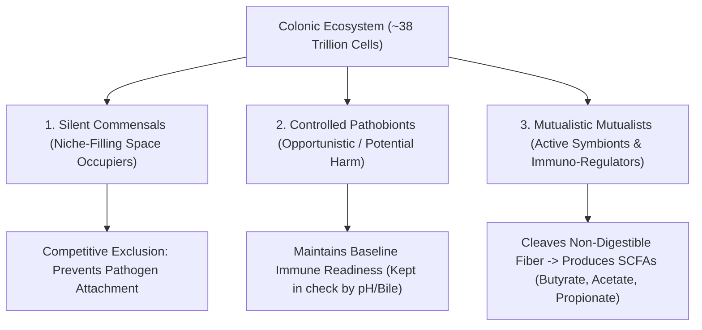

# Microbial Ecology: Dysbiosis, C. Difficile & Fecal Microbiota Transplants (FMT)

> **Taxonomic Thesis**: The human gut is a competitive climax ecological community. When broad-spectrum antibiotic intervention annihilates commensal diversity, opportunistic pathobionts fill the niche. Restoring ecological diversity via **Fecal Microbiota Transplantation (FMT)** achieves clinical remission rates exceeding $>90\%$, outperforming single-molecule pharmaceuticals.

---

## 1. The 3 Classes of Symbiotic Inhabitants

---

## 2. Dysbiosis & The FMT Ecological Restoration Paradigm

| Condition / Mechanism | Pathophysiology | Ecological Intervention | Clinical Outcome |
| :--- | :--- | :--- | :--- |
| **Recurrent *C. difficile* Infection** | Post-antibiotic annihilation of commensals allows spore-forming *Clostridioides difficile* to proliferate and release enterotoxins. | **Fecal Microbiota Transplant (FMT)**: Inoculates donor climax ecological diversity into colon. | **$>90\%$ Clinical Cure Rate**, reversing refractory pseudomembranous colitis within 48–72 hours. |
| **Metabolic Syndrome & Insulin Sensitivity** | Low-diversity microbiota elevated in inflammatory endotoxins (LPS leakage). | FMT from lean donors to obese metabolic syndrome patients. | Transient improvement in peripheral insulin sensitivity and metabolic markers. |
| **Inflammatory Bowel Disease (IBD)** | Loss of short-chain fatty acid-producing *Faecalibacterium prausnitzii*; breakdown of mucosal barrier. | Targeted microbial consortia / prebiotic fiber administration. | Down-regulates inflammatory cytokines ($TNF\text{-\alpha}, IL\text{-17}$) and restores epithelial tight junctions. |

---

## 3. Tree Linkages
- **Roots**: [[holobiont-theory-and-symbiogenesis-invariants]], [[thermodynamics-entropy-and-schrodinger-negentropy]]
- **Trunk**: [[gut-brain-axis-neurochemistry-and-feedback-cravings]], [[emergence-reductionism-and-informational-biology]]
- **Leaves**: [[kurzgesagt-microbiome-gut-brain-axis]]
