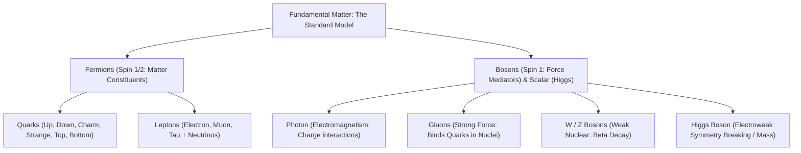

# Standard Model of Particle Physics: The Taxonomy of Fundamental Matter

> **Taxonomic Thesis**: The visible complexity of the cosmos (all 118 elements of the periodic table, galaxies, and living organisms) is generated by the permutation of only three primary stable fundamental entities: Up Quarks, Down Quarks, and Electrons, bound by the Four Fundamental Interactions.

---

## 1. The Particle Matrix

| Particle | Type | Generation | Electric Charge | Rest Mass | Fundamental Role |
| :--- | :--- | :--- | :--- | :--- | :--- |
| **Up Quark ($u$)** | Quark | 1st | $+\frac{2}{3} e$ | $2.16\text{ MeV/c}^2$ | Primary constituent of protons ($uud$) and neutrons ($udd$). |
| **Down Quark ($d$)**| Quark | 1st | $-\frac{1}{3} e$ | $4.67\text{ MeV/c}^2$ | Primary constituent of protons and neutrons. |
| **Electron ($e^-$)**| Lepton | 1st | $-1 e$ | $0.511\text{ MeV/c}^2$| Orbitals, chemical bonds, electrical conductivity. |
| **Gluon ($g$)** | Vector Boson | — | $0$ | $0$ | Mediates Strong Force holding quarks together. |
| **Photon ($\gamma$)** | Vector Boson | — | $0$ | $0$ | Mediates Electromagnetic radiation and atomic shells. |

---

## 2. The Four Fundamental Forces

1. **Strong Nuclear Force**: Carried by **Gluons**; binds quarks together via color charge ($SU(3)$ gauge symmetry). Strongest force ($10^{38}\times$ gravity), but confined to subatomic distances ($\approx 10^{-15}\text{ m}$).
2. **Electromagnetic Force**: Carried by **Photons**; governs all chemistry, solid matter rigidity, and light ($U(1)$ gauge symmetry).
3. **Weak Nuclear Force**: Carried by **$W^\pm, Z^0$ Bosons**; mediates radioactive beta decay and initiates solar nuclear fusion ($SU(2)$ symmetry).
4. **Gravity**: Governed by General Relativity (spacetime curvature); weakest force ($10^{-39}\times$ strong force), but infinitely long-range and always attractive.

---

## 3. Tree Linkages
- **Roots**: [[atomic-hypothesis-quantum-fields-scale]], [[electrochemical-energy-storage-axioms]]
- **Trunk**: [[degenerate-matter-and-extreme-cosmic-density]]
- **Leaves**: [[kurzgesagt-quantum-atomic-scale-feynman]]
