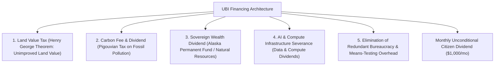

# Universal Basic Income Architectures, Georgism & Automation Levies

> **Taxonomic Thesis**: Financing an unconditional social floor does not necessitate currency hyperinflation or punitive corporate income taxes; non-distortive funding mechanisms exist via **Land Value Taxes (Georgism)**, **Carbon Dividends**, **Sovereign Resource Funds (Alaska Model)**, and **AI/Compute Automation Dividends**.

---

## 1. Non-Distortive Fiscal Financing Mechanisms

| Funding Mechanism | Economic Rationale | Distortionary Impact |
| :--- | :--- | :--- |
| **Land Value Tax (LVT)** | Land supply is perfectly inelastic ($E_s = 0$); taxing unimproved land value captures economic rents without creating deadweight loss. | **Zero Deadweight Loss** (Most efficient tax in economic theory). |
| **Carbon Fee & Dividend** | Internalizes the social cost of greenhouse gas emissions; $100\%$ of collected revenue is rebated per capita. | **Net-Positive**: Progressively redistributes from high-carbon polluters to clean households. |
| **Consolidation of Welfare Bureaucracy** | Replaces dozens of fragmented overlapping administrative agencies with automated direct bank transfers. | **Massive Cost Reduction**: Eliminates fraud-policing overhead. |

---

## 2. Policy Vulnerabilities & Safeguards

1. **The Single-Payment Risk**: A flat cash transfer alone cannot cover acute medical emergencies or severe disabilities; universal catastrophic healthcare must remain a separate public good.
2. **The Urban Rent Extraction Hazard**: In cities with restricted housing supply, landlords may raise rents to capture UBI cash. Solution: Combine UBI with **aggressive housing deregulation and land value taxation**.

---

## 3. Tree Linkages
- **Roots**: [[marginal-propensity-to-consume-and-poverty-traps]], [[agricultural-energetics-and-land-sparing-invariants]]
- **Trunk**: [[unconditional-floors-vs-welfare-cliffs]], [[three-super-cycles-energy-manufacturing-ai]]
- **Leaves**: [[kurzgesagt-universal-basic-income-ubi]]
