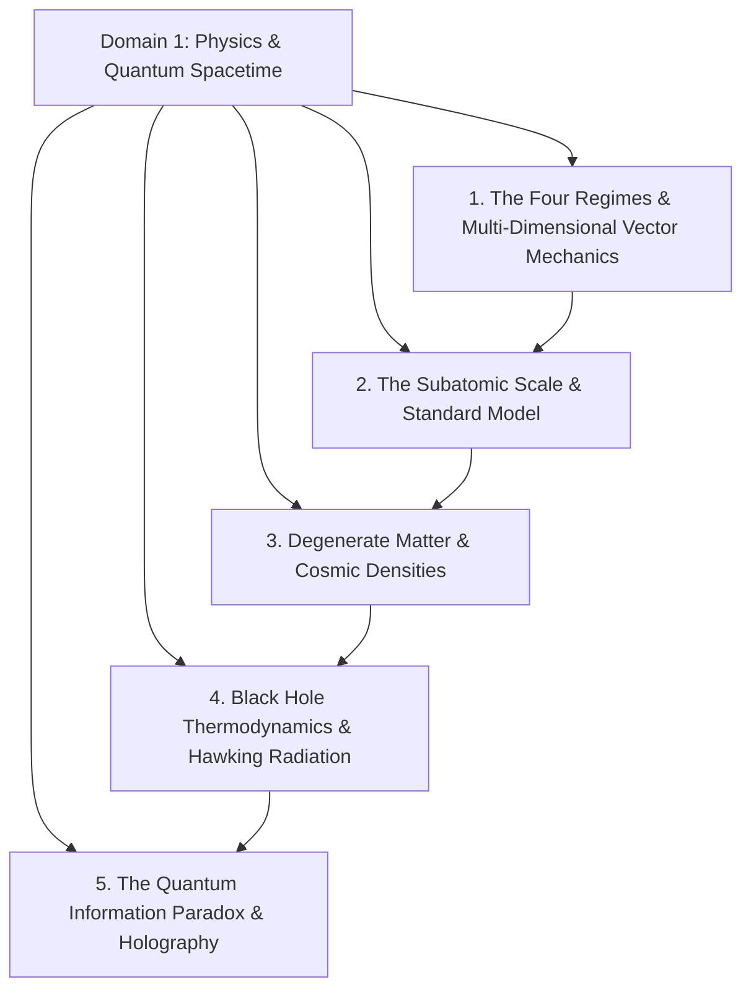
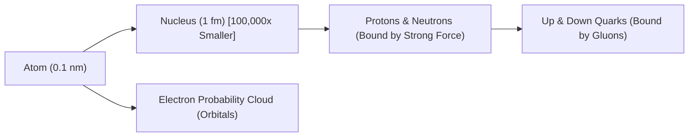
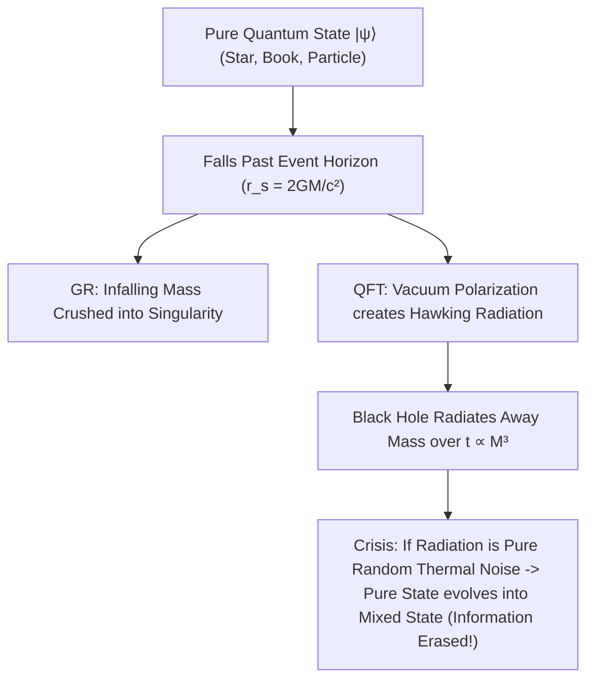
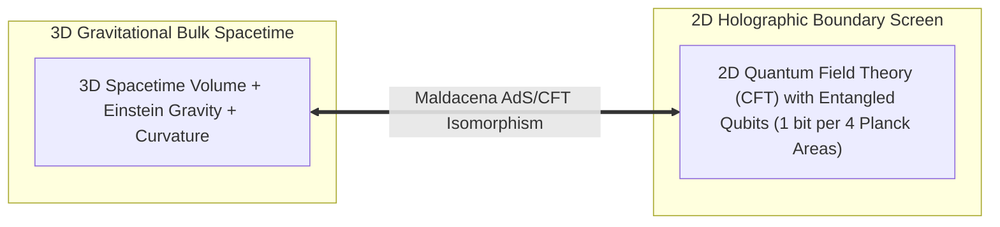

# Domain 1: Physics, Quantum Mechanics & The Fabric of Spacetime

> **Domain Kernel**: Reality at its most fundamental level is not a collection of isolated solid objects, but an interconnected tapestry of classical trajectories, coordinate-invariant vector spaces, quantum fields, probability amplitudes, and spacetime geometry. From the deterministic second-order differential equations of Newtonian mechanics to the femtometer scale of atomic nuclei and the event horizons of evaporating black holes, the universe is governed by strictly conserved information, dimensional scaling invariants, and holographic dualities.

---

## 1. Executive Synthesis & Architectural Map



---

## 2. The Four Regimes of Physics & Multi-Dimensional Vector Mechanics (Shankar Framework)

### 2.1 The Four Regimes of Fundamental Physics
As articulated by Prof. Ramamurti Shankar (Yale University), all physical theories navigate a 2D parameter space bounded by **velocity ($v/c$)** and **action scale ($S/\hbar$)**:

```mermaid
graph TD
    subgraph Macro Scale [Action S ≫ ℏ]
        SlowMacro["Classical Mechanics (Newton, Galileo: v ≪ c)"]
        FastMacro["Special Relativity (Einstein 1905: v ≈ c)"]
    end

    subgraph Micro Scale [Action S ~ ℏ]
        SlowMicro["Quantum Mechanics (Schrödinger, Heisenberg: v ≪ c)"]
        FastMicro["Relativistic Quantum Field Theory (Dirac, Feynman: v ≈ c)"]
    end

    SlowMacro -->|Scale Down (Atomic)| SlowMicro
    SlowMacro -->|Speed Up (Light)| FastMacro
    SlowMicro -->|Speed Up| FastMicro
    FastMacro -->|Scale Down| FastMicro
    FastMacro -->|Add Strong Gravity| GR["General Relativity (Einstein 1915: Curved Spacetime)"]
```

| Physical Regime | Velocity ($v$) | Action Scale ($S$) | Foundational Framework | Key Governing Equation |
| :--- | :--- | :--- | :--- | :--- |
| **Classical Mechanics** | $v \ll c$ | $S \gg \hbar$ | Newtonian / Hamiltonian Dynamics | $\mathbf{F} = m\frac{d^2\mathbf{r}}{dt^2}$ |
| **Special Relativity** | $v \approx c$ | $S \gg \hbar$ | Minkowski Spacetime / Lorentz Invariance | $E^2 = (pc)^2 + (m_0 c^2)^2$ |
| **Quantum Mechanics** | $v \ll c$ | $S \sim \hbar$ | Non-Relativistic Wave Mechanics | $i\hbar \frac{\partial \psi}{\partial t} = \hat{H}\psi$ |
| **Quantum Field Theory (QFT)** | $v \approx c$ | $S \sim \hbar$ | Operator Fields / Standard Model | $(i\gamma^\mu \partial_\mu - m)\psi = 0$ (Dirac) |
| **General Relativity** | Any | $S \gg \hbar$ (Strong $G$) | Pseudo-Riemannian Geometry | $G_{\mu\nu} + \Lambda g_{\mu\nu} = \frac{8\pi G}{c^4} T_{\mu\nu}$ |

### 2.2 The State of a Classical System & Second-Order Determinism
In classical Newtonian mechanics, the **state of a particle** at time $t$ is fully specified by its position and velocity (or momentum):
\[
\text{State}(t) = \{\mathbf{r}(t), \mathbf{v}(t)\} \equiv \{\mathbf{r}(t), \mathbf{p}(t)\}
\]
Newton's Second Law is a **second-order ordinary differential equation**:
\[
\mathbf{F}(\mathbf{r}, \mathbf{v}, t) = m \frac{d^2\mathbf{r}}{dt^2} = m \mathbf{a}
\]
* **Why Second-Order Matters**: Because the law connects force directly to acceleration ($\ddot{\mathbf{r}}$) rather than velocity ($\dot{\mathbf{r}}$), determining the future trajectory requires exactly **two initial conditions**: initial position $\mathbf{r}(0)$ and initial velocity $\mathbf{v}(0)$.
* **Laplacian Determinism**: Given $\mathbf{r}(0)$, $\mathbf{v}(0)$, and the force law $\mathbf{F}$, the differential equation possesses a unique solution for all past ($t < 0$) and future ($t > 0$) time.
* **The Equivalence Principle**: Inertial mass ($m_i$ in $\mathbf{F} = m_i \mathbf{a}$) is empirically identical to gravitational mass ($m_g$ in $\mathbf{F}_g = \frac{G M m_g}{r^2} \hat{\mathbf{r}}$), meaning all objects undergo identical gravitational acceleration in a vacuum regardless of mass: $a = \frac{GM}{r^2}$.

### 2.3 Vectors in Multi-Dimensions & Rotational Coordinate Invariance
In $\mathbb{R}^3$, physical vectors are geometric entities independent of human coordinate axes:
\[
\mathbf{A} = A_x \hat{\mathbf{i}} + A_y \hat{\mathbf{j}} + A_z \hat{\mathbf{k}}
\]
* **Coordinate Invariance**: When coordinate axes rotate by angle $\theta$, the individual components $(A_x, A_y)$ transform via the rotation matrix $R(\theta)$:
\[
\begin{pmatrix} A'_x \\ A'_y \end{pmatrix} = \begin{pmatrix} \cos\theta & \sin\theta \\ -\sin\theta & \cos\theta \end{pmatrix} \begin{pmatrix} A_x \\ A_y \end{pmatrix}
\]
* **The Invariant Scalar Product**: While individual components change with the observer's frame, the length $|\mathbf{A}|^2 = A_x^2 + A_y^2 = (A'_x)^2 + (A'_y)^2$ and the dot product $\mathbf{A} \cdot \mathbf{B} = |\mathbf{A}||\mathbf{B}|\cos\theta$ are **strictly invariant** under rotations ($SO(3)$ symmetry).
* **Decoupled Orthogonal Dynamics**: In projectile motion under gravity ($\mathbf{a} = -g\hat{\mathbf{j}}$), the horizontal motion ($x(t) = x_0 + v_{0x}t$) is completely independent of the vertical free-fall acceleration ($y(t) = y_0 + v_{0y}t - \frac{1}{2}gt^2$).
* **Bridge to Quantum Mechanics**: The Euclidean dot product $\mathbf{A}\cdot\mathbf{B} = \sum A_i B_i$ is the finite-dimensional precursor to the inner product $\langle\phi|\psi\rangle = \int \phi^*(x)\psi(x)\,dx$ in infinite-dimensional Hilbert space, establishing vectors as the universal mathematical architecture of physics.

---

## 3. The Atomic Scale, Standard Model & The Illusion of Solidity

### 3.1 The Atomic Hypothesis (Feynman's Invariant)
As Richard Feynman noted in the *Feynman Lectures on Physics*:
> *"All things are made of atoms—little particles that move around in perpetual motion, attracting each other when they are a little distance apart, but repelling upon being squeezed into one another."*

Atoms are not rigid spheres. An atom (diameter $\approx 10^{-10}\text{ m}$ / $0.1\text{ nm}$) consists of a central nucleus (diameter $\approx 10^{-15}\text{ m}$ / $1\text{ fm}$) surrounded by an electron probability cloud. 



### 3.2 The Spatial Ratio & The Vacuum of Matter
* **The $10^5 : 1$ Spatial Ratio**: If an atom were enlarged to the size of a vast sports stadium, the nucleus would be a small marble at the center, and the electrons would be probability ripples at the outer edge.
* **Quantum Electrodynamic (QED) Vacuum**: Over **$99.999999999999\%$** of an atom's volume is non-classical vacuum. In modern quantum field theory, this vacuum is a boiling sea of zero-point fluctuations where virtual particle-antiparticle pairs continuously pop into existence and annihilate:
\[
\Delta E \cdot \Delta t \ge \frac{\hbar}{2}
\]
* **Wave-Particle Duality & Orbitals**: Electrons exist as three-dimensional probability density clouds governed by the Schrödinger wave equation:
\[
i\hbar \frac{\partial}{\partial t}\psi(\mathbf{r}, t) = \left[ -\frac{\hbar^2}{2m}\nabla^2 + V(\mathbf{r}) \right] \psi(\mathbf{r}, t)
\]
The Born rule dictates that the probability density of finding an electron is $P(\mathbf{r}) = |\psi(\mathbf{r})|^2$. Because this wave function decays exponentially ($|\psi|^2 \propto e^{-2r/a_0}$) but never reaches absolute zero, every electron's probability field extends throughout the universe.

### 3.3 The Standard Model Particle Matrix
All 118 elements of the periodic table are constructed from just **three stable elementary fermions** bound by **four fundamental gauge forces**:

| Particle / Force | Type / Carrier | Electric Charge | Role in Spacetime |
| :--- | :--- | :--- | :--- |
| **Up Quark ($u$)** | Fermion (Quark) | $+\frac{2}{3}e$ | Constituent of protons ($uud$) and neutrons ($udd$). |
| **Down Quark ($d$)** | Fermion (Quark) | $-\frac{1}{3}e$ | Constituent of protons and neutrons. |
| **Electron ($e^-$)** | Fermion (Lepton) | $-1e$ | Chemical bonding, electromagnetism, electricity. |
| **Strong Force** | Gluons ($g$) | $0$ | Binds quarks inside nucleons ($SU(3)$ color symmetry). |
| **Electromagnetism** | Photons ($\gamma$) | $0$ | Governs light, atomic shells, chemistry, and solid matter rigidity. |
| **Weak Force** | $W^\pm, Z^0$ Bosons | $\pm 1e, 0$ | Governs radioactive beta decay and initiates solar fusion ($SU(2)$). |
| **Gravity** | Graviton / Metric ($g_{\mu\nu}$) | $0$ | Spacetime curvature governed by Einstein's field equations. |

---

## 4. Degenerate Matter, Extreme Cosmic Densities & Indistinguishability

### 4.1 What Happens When You Remove the Void?
Because $99.999999999999\%$ of normal matter is vacuum, solid matter's rigidity is an electrostatic and quantum illusion produced by the **Pauli Exclusion Principle** (which forbids two identical fermions from occupying the same quantum state).

When immense gravity crushes electron orbitals:
1. **The Empire State Building**: Removing the subatomic vacuum condenses its entire mass into the volume of a single **grain of rice**.
2. **The Teaspoon of Humanity**: Removing the atomic void from all **8 billion living humans** condenses our collective biological mass into less than a **single teaspoon** ($<5\text{ cm}^3$), reaching neutron star density ($\approx 10^{17}\text{ kg/m}^3$).
3. **Neutron Stars**: When a collapsing star exceeds the Chandrasekhar limit ($\approx 1.44 M_\odot$), electron degeneracy pressure fails ($e^- + p^+ \to n + \nu_e$). The mass of $3\text{ Suns}$ is packed into a sphere only $10\text{ km}$ in diameter.

### 4.2 Universal Indistinguishability of Elementary Particles
In quantum mechanics, fundamental particles have **zero individuality**. Every electron in the universe has the identical mass ($9.109 \times 10^{-31}\text{ kg}$), electric charge ($-1.602 \times 10^{-19}\text{ C}$), and half-integer spin ($\frac{1}{2}\hbar$). 

This led physicist John Wheeler to propose his famous *"One-Electron Universe"* thought experiment to Richard Feynman: the notion that every electron and positron across cosmic history could mathematically be the exact same worldline weaving forward and backward across spacetime.

---

## 5. Black Hole Thermodynamics, Hawking Radiation & The Information Paradox



### 5.1 The Physical Definition of Information
In physics, **Information** is the complete specification of a system's microstate (quantum numbers, spin, momentum, wave function).
* A piece of coal, a diamond, a banana, and a human brain are all composed of identical carbon, hydrogen, and oxygen atoms. The only physical difference is the **informational arrangement** of those quantum states.
* **Quantum Unitarity**: Under the Schrödinger equation, quantum time evolution is strictly unitary ($U(t) = e^{-iHt/\hbar}$, $U^\dagger U = \hat{I}$). This guarantees:
  1. Total probability is always conserved ($\sum P_i = 1$).
  2. Pure quantum states remain pure ($\text{Tr}(\rho^2) = 1$).
  3. Physical information is **mathematically indestructible**. (Burning a book scrambles its text into heat and smoke, but running the microscopic laws backward theoretically reconstructs the book).

### 5.2 Hawking Radiation & The Evaporation Paradox (1974)
Stephen Hawking demonstrated that near the Event Horizon of a black hole, quantum vacuum fluctuations produce entangled virtual particle pairs. One particle falls past the horizon with negative energy, while the partner escapes into space as **Hawking Radiation** at temperature:
\[
T_H = \frac{\hbar c^3}{8 \pi G M k_B}
\]
Over astronomical timescales ($t_{\text{evap}} \propto M^3 \approx 10^{67}\text{ years}$ for a solar-mass black hole), the black hole radiates away its entire mass and vanishes.

**The Paradox**: If the escaping Hawking radiation is purely random and thermal, then when the black hole evaporates completely, all the quantum information of the matter that formed it has been erased from the universe. This violates Quantum Unitarity and threatens the foundation of all modern physics.

---

## 6. Bekenstein Entropy & The Holographic Principle



### 6.1 Bekenstein-Hawking Area Law
Jacob Bekenstein and Stephen Hawking proved that the maximum entropy (information capacity) of a black hole scales not with its 3D interior volume ($V \propto L^3$), but strictly with the **2D surface area of its event horizon**:
\[
S_{BH} = \frac{k_B c^3 A}{4 G \hbar} = \frac{k_B A}{4 \ell_P^2}
\]
where $\ell_P = \sqrt{\frac{G\hbar}{c^3}} \approx 1.616 \times 10^{-35}\text{ m}$ is the Planck length.

* **The Ultimate Storage Drive**: Every Planck-area pixel ($4\ell_P^2 \approx 10^{-69}\text{ m}^2$) on the event horizon encodes exactly **one bit** of quantum information.

### 6.2 The Holographic Resolution & AdS/CFT Duality
1. **The Holographic Principle (Gerard 't Hooft & Leonard Susskind)**: Because maximum entropy is bounded by surface area, all the physical degrees of freedom of a 3D gravitational system can be mathematically projected onto a 2D boundary without information loss.
2. **AdS/CFT Duality (Juan Maldacena, 1997)**: A 3D gravitational spacetime (Anti-de Sitter bulk) is mathematically identical (dual) to a 2D conformal quantum field theory living on its boundary screen.
3. **The Page Curve (Information Recovery)**: As a black hole evaporates, the emitted Hawking photons become subtly quantum-entangled with the remaining horizon. After the **Page Time** (when the black hole reaches half its initial entropy), information begins leaking back out into the cosmos, preserving quantum unitarity.

> [!IMPORTANT]
> **Metacognitive & Cosmological Takeaway**:
> The 3D reality we experience—space, depth, matter, and movement—may be an emergent holographic projection generated by quantum entanglement living on the distant cosmological boundary of the universe.

---

## 7. Synthesized Academic & Media Crucibles in this Domain
* **Yale University (Prof. Ramamurti Shankar)**: *Fundamentals of Physics I: Lecture 1 & Lecture 2 (Newtonian Mechanics & Multi-Dimensional Vectors)* (The 4 regimes of physics, rotational coordinate invariance $SO(3)$, and decoupled orthogonal kinematics).
* **Kurzgesagt**: *How Small Is An Atom? Spoiler: Very Small* (Spatial progression, atomic voids, and Feynman's invariant).
* **Kurzgesagt**: *Why Black Holes Could Delete The Universe – The Information Paradox* (Hawking radiation, unitary conservation, and the 2D holographic horizon).
