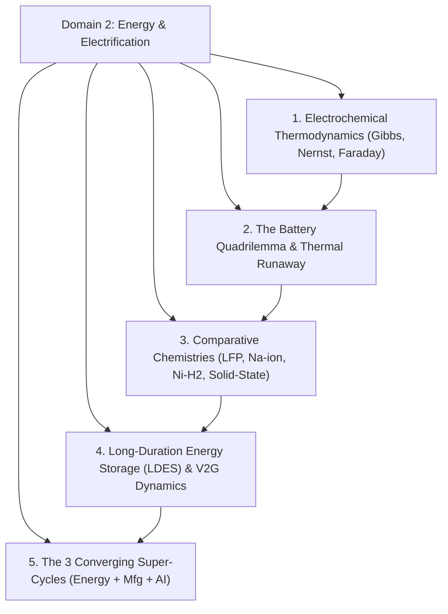
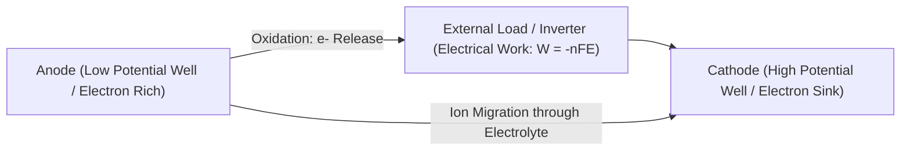
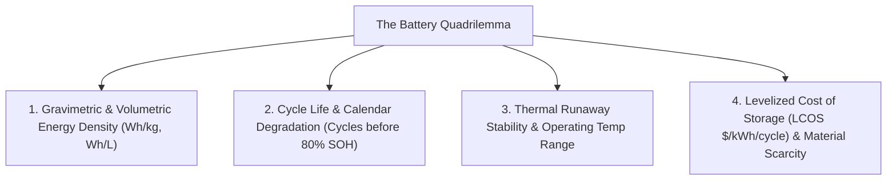
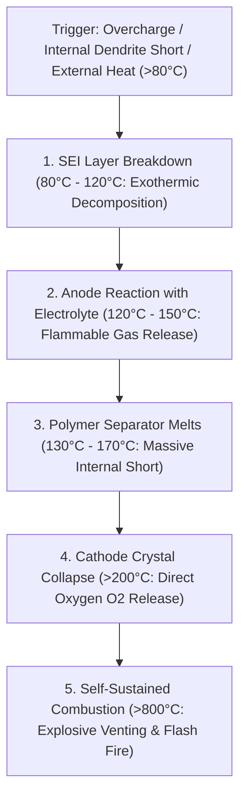
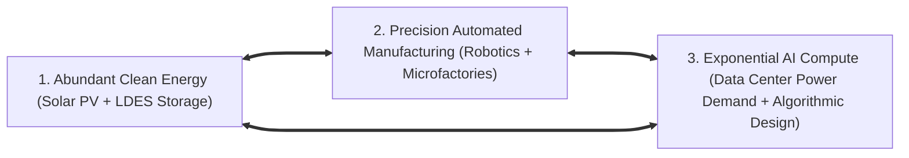

# Domain 2: Energy Storage, Electrification & Material Super-Cycles

> **Domain Kernel**: The master bottleneck of modern civilization is the conversion of raw, intermittent primary energetic flows (solar, wind, nuclear) into dispatchable chemical potential wells. The global transition to abundant clean power is governed by the electrochemical quadrilemma of energy density, cycle life, thermal safety, and raw-material sovereignty, accelerating three converging industrial super-cycles: Abundant Energy, Precision Automated Manufacturing, and Exponential Compute.

---

## 1. Executive Synthesis & Systemic Overview

---

## 2. Electrochemical Thermodynamics & First-Principles Invariants

### 2.1 Gibbs Free Energy & Reversible Cell Voltage
A rechargeable electrochemical cell is a device that converts chemical bond rearrangement into directed electron flux. The maximum theoretical non-expansion work accessible from an electrochemical redox reaction is governed by the change in **Gibbs Free Energy ($\Delta G$)**:
\[
\Delta G = -nFE_{\text{cell}}
\]
where:
* $n$ is the number of moles of electrons transferred per mole of reaction.
* $F$ is the Faraday constant ($96,485.33\text{ C/mol}$).
* $E_{\text{cell}}$ is the electromotive cell potential (voltage).

### 2.2 The Nernst Equation & Concentration Overpotentials
Under non-standard conditions (varying state-of-charge, ion concentration, and temperature), actual cell voltage is described by the **Nernst Equation**:
\[
E = E^0 - \frac{RT}{nF} \ln Q
\]
As ions intercalate into the host lattice, concentration gradients build up, resulting in internal resistive overpotentials ($\eta_{\text{activation}} + \eta_{\text{ohmic}} + \eta_{\text{concentration}}$) that dissipate energy as waste Joule heating ($P_{\text{loss}} = I^2 R$).

---

## 3. The Battery Optimization Quadrilemma & Thermal Runaway Dynamics

No single battery chemistry can simultaneously maximize all design parameters. Every electrochemical architecture represents a strategic trade-off within a multi-dimensional constraint space:

### 3.1 The Positive-Feedback Mechanism of Thermal Runaway
In high-energy lithium-ion batteries containing volatile organic liquid carbonates, thermal runaway occurs via a self-accelerating exothermic cascade:

* **The Baseline Fire Hazard**: In commercial grid-scale lithium iron phosphate (LFP) installations, global empirical fire event rates occur at approximately **$1\text{ in } 14,000\text{ systems}$**, necessitating massive HVAC chillers, nitrogen purge systems, and blast separation barriers.

---

## 4. Comparative Taxonomy of Energy Storage Chemistries

| Parameter | Lithium Iron Phosphate (LFP) | Sodium-Ion ($\text{Na-ion}$) | Nickel-Hydrogen ($\text{Ni-H}_2$) | Solid-State (TRL 4) |
| :--- | :--- | :--- | :--- | :--- |
| **Active Charge Carrier** | $\text{Li}^+$ ($0.76\text{ \AA}$) | $\text{Na}^+$ ($1.02\text{ \AA}$) | $\text{H}_2$ Gas + $\text{Ni(OH)}_2$ | $\text{Li}^+$ through Solid Ceramic |
| **Cell Voltage ($E^0$)** | $3.2\text{ V}$ | $3.0 - 3.1\text{ V}$ | $1.25 - 1.3\text{ V}$ | $3.8 - 4.2\text{ V}$ |
| **Energy Density** | $160 - 190\text{ Wh/kg}$ | $120 - 160\text{ Wh/kg}$ | $40 - 60\text{ Wh/kg}$ | $350 - 500\text{ Wh/kg}$ (Projected) |
| **Cycle Life ($80\%\text{ DoD}$)**| $3,000 - 6,000\text{ cycles}$ | $2,000 - 4,000\text{ cycles}$ | **$>30,000\text{ cycles}$ (30+ Years)** | $500 - 1,000\text{ cycles}$ (Lab) |
| **Operating Temp Window** | $-20\text{°C to } +60\text{°C}$ | **$-40\text{°C to } +80\text{°C}$** | **$-40\text{°C to } +60\text{°C}$ (Zero HVAC)** | High Stack Pressure Required |
| **Thermal Runaway Risk** | Moderate (Cathode $O_2$ release at $\approx 270\text{°C}$) | Low (Stable Prussian white/oxide lattices) | **Zero (Non-flammable aqueous electrolyte)** | Low (Non-flammable solid barrier) |
| **Material Abundance** | Lithium, Phosphorus, Iron | **Universal Salt ($\text{NaCl}$), Aluminum foils** | Nickel, Pressurized Steel Vessel | Lithium Metal, Specialized Sulfides |
| **Optimal Use Case** | Mass EV Passenger Vehicles | Low-Cost EVs, Cold Climates | **Grid LDES, Solar Microgrids, Industrial Baseload** | Aviation, Luxury Long-Range EVs |

---

## 5. Long-Duration Energy Storage (LDES), V2G Buffers & The 3 Super-Cycles

### 5.1 The 3 Converging Industrial Super-Cycles
1. **Abundant Electrification**: The levelized cost of solar electricity and utility storage has dropped $>85\%$ in a decade, transforming energy from an extractive scarcity into an abundant manufacturing output.
2. **Precision Automated Manufacturing**: Advanced automation and local-for-local supply chains eliminate reliance on vulnerable trans-oceanic shipping routes.
3. **Exponential AI Compute**: Massive AI clusters (e.g. 100k+ GPU data centers consuming hundreds of megawatts) require 24/7 firm clean power, becoming the anchor customer for ultra-scalable grid storage and advanced baseload energy.

### 5.2 The 98% Idle Vehicle-to-Grid (V2G) Arbitrage
Passenger automobiles sit parked and idle **$98\%$ of their total operating lifespan**. When hundreds of millions of electric vehicles are connected via bidirectional smart charging (V2G), they form a distributed, multi-terawatt-hour virtual power plant capable of buffering transient grid fluctuations without requiring redundant utility infrastructure.

---

## 6. Synthesized Media Crucibles in this Domain
* **Nikhil Kamath Podcast**: *WTF are Batteries?* featuring Henning Rath (CEO, EnerVenue) and Dr. Kun Tang (Chairman, HiNa Battery) — Deconstructing grid stationary storage, sodium-ion industrialization, and 30,000-cycle metal-hydrogen vessels.
