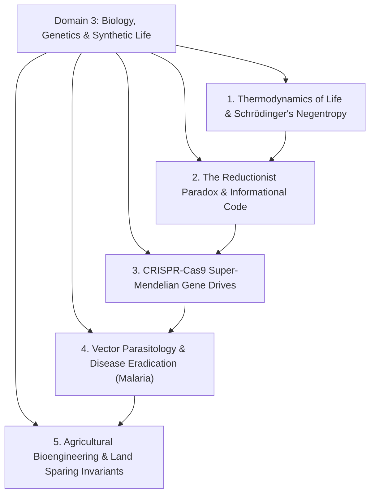
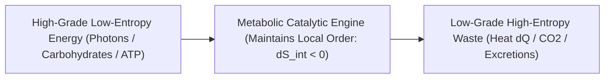
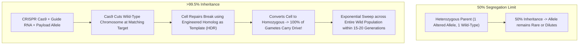
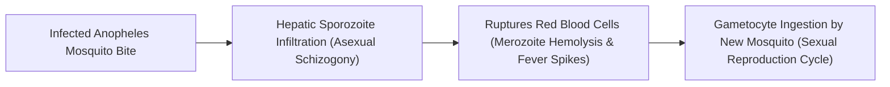
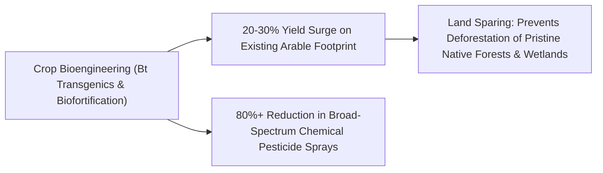

# Domain 3: Evolutionary Biology, Genetics & Synthetic Biospheres

> **Domain Kernel**: Biological life is an open, non-equilibrium thermodynamic system that sustains localized internal order by actively pumping out entropy into its environment. At the molecular scale, living systems operate as informational software (nucleic acids) executed by catalytic protein hardware. Modern synthetic biology—spanning CRISPR super-Mendelian gene drives to transgenic crop biofortification—transforms humanity from passive subjects of natural selection into active architects of the biosphere.

---

## 1. Executive Synthesis & Conceptual Framework

---

## 2. The Physical Definition of Life & Schrödinger's Negentropy

### 2.1 The Non-Equilibrium Thermodynamic Invariant
In *What Is Life?* (1944), Erwin Schrödinger posed the fundamental question: *How do living organisms avoid decaying into thermodynamic equilibrium (death)?*
* **The Second Law of Thermodynamics**: In any isolated system, total entropy must non-decrease ($\Delta S_{\text{total}} \ge 0$).
* **Life as an Open Dissipative Structure (Ilya Prigogine)**: A living cell is an open thermodynamic system that sustains a steady-state far from equilibrium by continuously importing free energy ($F = E - TS$) and exporting entropy into the surroundings:
\[
\frac{dS_{\text{system}}}{dt} = \frac{dS_{\text{internal}}}{dt} + \frac{dS_{\text{exchange}}}{dt} < 0 \quad \left(\text{provided } \frac{dS_{\text{exchange}}}{dt} > \left| \frac{dS_{\text{internal}}}{dt} \right|\right)
\]
* Life "feeds on negative entropy" (negentropy). Death is simply the cessation of this entropy-pumping engine, allowing the organism to relax into maximum-entropy thermodynamic equilibrium.

### 2.2 The Reductionist Paradox & Substrate Neutrality
If you dissect a living cell down to its elemental molecules (water, lipids, amino acids, nucleotides), **not a single isolated molecule is alive**.
* A ribosome is a mechanical macromolecular factory ($2.5\text{ MDa}$) assembling peptide chains at $20\text{ amino acids/second}$.
* A motor protein (kinesin) physically walks along microtubule highways carrying vesicles at $800\text{ nm/second}$.
* **Informational Software**: DNA is digital software encoded in a quaternary base system (A, T, C, G) with an information density of $2.15 \times 10^{17}\text{ bytes/gram}$. Life is an emergent property of the informational and catalytic network, rendering the definition of life **substrate-neutral** (opening the doorway to synthetic silicon life and artificial intelligence).

---

## 3. CRISPR-Cas9 Super-Mendelian Gene Drives & Vector Parasitology

### 3.1 Overriding Mendelian Segregation
In classic Mendelian genetics, a diploid parent passes an allele to offspring with a probability of $P = 0.50$.
* **CRISPR Gene Drive Invariant**: By inserting the Cas9 endonuclease and guide RNA directly into the organism's genome alongside the desired payload gene, the gene drive actively cuts the opposing wild-type chromosome during gametogenesis.
* The cell's endogenous **Homology-Directed Repair (HDR)** pathway copies the entire gene drive cassette into the broken chromosome, converting a heterozygote into a homozygote ($>99.5\%$ inheritance rate).

### 3.2 Vector Parasitology & Malaria Eradication
Malaria (*Plasmodium falciparum*, transmitted by female *Anopheles* mosquitoes) claims over **$600,000\text{ lives annually}$**, the vast majority children under age 5.

* **Targeted Gene Drive Intervention**:
  1. **Population Suppression**: Targeting the *doublesex* ($dsx$) sex-determination gene renders female mosquitoes sterile without affecting males, driving target *Anopheles* populations to local extinction within 15 generations.
  2. **Population Modification**: Inserting synthetic antibody genes that neutralize *Plasmodium* inside the mosquito gut, rendering mosquitoes biologically immune to transmitting malaria.

---

## 4. Agricultural Bioengineering, Selective Toxicity & Land Sparing

### 4.1 Selective Toxicity & Dismantling the "Natural" Fallacy
A central heuristic in toxicology is receptor specificity: **Toxicity is not a binary property of whether a compound is "synthetic" or "natural"**.

| Compound / Organism | Source | Mode of Action & Receptor Specificity | Human Toxicity Profile |
| :--- | :--- | :--- | :--- |
| **Bt Endotoxin (Cry1Ac)** | *Bacillus thuringiensis* (Soil bacterium) | Binds alkaline insect gut receptors (Cadherin/APN), creating pore lysis. In human acidic stomachs ($\text{pH } 1.5$), it is digested instantly as harmless dietary protein. | **Completely Non-Toxic to Humans / Mammals** |
| **Caffeine** | Coffee / Tea plant | Natural insecticide synthesized by plants to paralyze herbivorous bugs; blocks adenosine receptors in humans. | Toxic to insects; mild stimulant to humans. |
| **Organic Copper Sulfate** | "Natural" mineral pesticide | Heavy metal accumulation in topsoils; non-specific aquatic and fungal toxin. | Persistent soil contaminant. |
| **Golden Rice** | Engineered Oryza sativa | Biosynthesizes $\beta$-carotene (Vitamin A precursor) in endosperm via phytoene synthase. | Cures childhood blindness and immune deficiency in low-income populations. |

### 4.2 The Land-Sparing vs. Land-Sharing Ecological Paradigm
* **The Photosynthetic Energetic Bottleneck**: Modern humanity requires $\approx 5 \times 10^{16}\text{ Joules/year}$ in dietary caloric intake.
* **Extensification (Land Sharing)**: Relying exclusively on lower-yield non-transgenic agriculture requires clearing millions of additional hectares of primary rainforests and savannahs, destroying biodiversity.
* **Intensification (Land Sparing)**: Maximizing agricultural yield per hectare via genetic engineering (Bt pest resistance, drought-tolerant Sub1 rice, nitrogen-use efficiency) confines farming to minimal acreage, allowing remaining global ecosystems to rewild.

---

## 5. Synthesized Media Crucibles in this Domain
* **Kurzgesagt**: *What Is Life? Is Death Real?* (Schrödinger's negentropy, non-equilibrium systems, and the dissolution of the life/death boundary).
* **Kurzgesagt**: *Genetic Engineering and Diseases – Gene Drive & Malaria* (CRISPR super-Mendelian sweeps, *Plasmodium* vector lifecycle, and bioethics).
* **Kurzgesagt**: *Are GMOs Good or Bad? Genetic Engineering & Our Food* (Scientific safety consensus, Bt endotoxin selective toxicity, and the Land-Sparing invariant).
