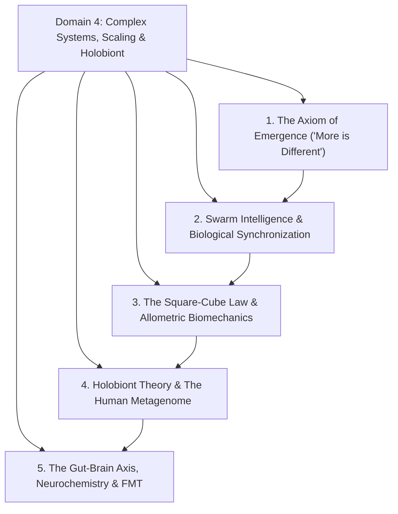
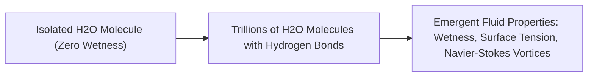
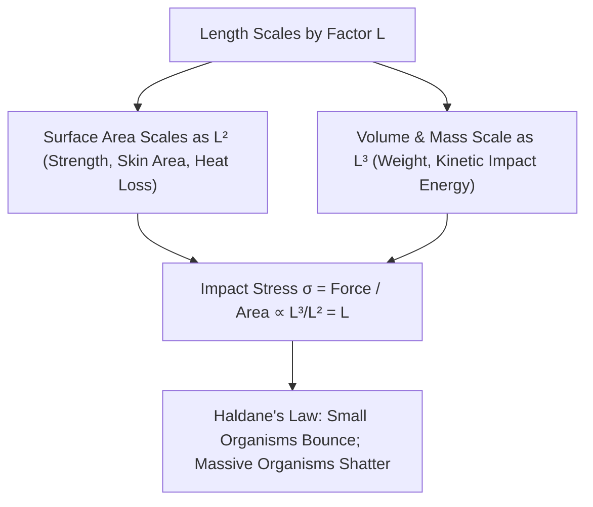

# Domain 4: Complex Adaptive Systems, Dimensional Scaling & The Holobiont

> **Domain Kernel**: Nature organizes across scales through non-linear emergence and dimensional scaling laws. Macroscopic intelligence and functional harmony arise spontaneously from simple decentralized rules without a central executive. At the same time, the physical forces governing an organism—from the viscous, surface-tension-dominated world of microscopic wasps to the inertia-dominated realm of elephants, and the microbial ecosystem within our own guts—are strictly dictated by mathematical scaling invariants.

---

## 1. Executive Synthesis & Architectural Hierarchy



---

## 2. The Axiom of Emergence & Decentralized Swarm Intelligence

### 2.1 Anderson's Invariant: "More is Different" (1972)
Nobel laureate Philip W. Anderson demonstrated that the ability to reduce everything to simple fundamental laws does not imply the ability to reconstruct the universe from those laws.
* **The Emergence Principle**: At each level of scale and complexity, entirely new physical laws and ontological properties appear.
* **The Wetness of Water**: A single $H_2O$ molecule possesses dipole moments and vibrational modes, but **no property of wetness**. Wetness is a macroscopic emergent phenomenon arising solely from the intermolecular hydrogen-bonding network of $10^{23}$ water molecules interacting in aggregate.



### 2.2 Stigmergic Task Allocation in Ant Superorganisms
An ant colony functions as an intelligent superorganism with zero top-down command. The queen is purely an egg-laying organ, not a general.
* **Olfactory Encounter Frequency**: Ants identify tasks via cuticular hydrocarbon scents (foragers, nest maintenance, nursery, soldiers).
* If a predator decimates the outer foragers, nest workers encounter fewer returning foragers. Once their internal encounter frequency drops below a critical activation threshold ($T_{\text{crit}}$), workers automatically switch roles into foragers, self-healing the colony's supply lines without centralized oversight:
\[
P(\text{Switch to Foraging}) = \frac{(\text{Deficit})^n}{(\text{Deficit})^n + (\theta_{\text{threshold}})^n}
\]

### 2.3 Kuramoto Biological Phase Synchronization
* **Cardiac Pacemaker Synchronization**: Billions of cardiomyocytes in the sinoatrial node fire electrical action potentials synchronously ($60-100\text{ BPM}$) through gap junction ion fluxes governed by the Kuramoto coupled oscillator model:
\[
\frac{d\theta_i}{dt} = \omega_i + \frac{K}{N} \sum_{j=1}^N \sin(\theta_j - \theta_i)
\]
When cell-to-cell coupling strength $K$ crosses a mathematical threshold, random individual pacemakers spontaneously lock phase into a unified heartbeat.

---

## 3. The Square-Cube Law & Allometric Dimensional Scaling



### 3.1 Mathematical Derivation of Impact Stress
As J.B.S. Haldane summarized in *On Being the Right Size* (1926):
> *"You can drop a mouse down a thousand-yard mine shaft; and, on arriving at the bottom, it gets a slight shock and walks away. A rat is killed, a man is broken, a horse splashes."*

When an organism scales up by linear factor $L$:
* Cross-sectional bone and tendon area: $A \propto L^2$.
* Body mass and kinetic energy at terminal velocity: $M \propto L^3$.
* Deceleration impact stress on skeletal tissues ($\sigma$):
\[
\sigma = \frac{F_{\text{impact}}}{A} \propto \frac{M \cdot g}{A} \propto \frac{L^3}{L^2} = L^1
\]
For an elephant ($L \approx 100\times\text{ mouse}$), the internal impact stress upon falling from a skyscraper is **100 times greater** than its biological materials can withstand, causing fatal hydraulic rupture upon impact.

### 3.2 The Physical Regimes Across 7 Orders of Magnitude

| Scale / Organism | Governing Physical Regime | Dominant Physical Force | Biomechanical Adaptation |
| :--- | :--- | :--- | :--- |
| **Micro-Wasp / Fairyfly ($0.2\text{ mm}$)** | Stokes Flow ($Re \ll 1$) | **Viscous Fluid Drag** (Air feels like thick molasses) | Comb-like bristled wings that "paddle" air rather than generating aerodynamic lift. |
| **Water Strider / Ant ($2-10\text{ mm}$)** | Capillary Regime | **Surface Tension ($\gamma$)** | Hydrophobic nanoscale hair arrays; water droplets act as lethal glue traps. |
| **Mouse / Rat ($5-20\text{ cm}$)** | Intermediate Allometry | **Thermal Heat Loss ($\frac{A}{V} \propto \frac{1}{L}$)** | Hyper-accelerated metabolic heart rate ($600\text{ BPM}$) to prevent freezing. |
| **Human / Elephant ($1.8-4\text{ m}$)** | Gravitational Regime ($Re \gg 10^5$) | **Inertia & Gravitational Stress** | Thick columnar bones, low metabolic rates ($30\text{ BPM}$), high susceptibility to falls. |

---

## 4. Holobiont Theory, The Human Metagenome & The Gut-Brain Axis

```mermaid
graph LR
    GutMicrobiota["Gut Microbiome (~38 Trillion Cells | >2M Genes)"] -->|Produces 90% of Bodily Serotonin (5-HT) + SCFAs| VagusNerve["Vagus Nerve Highway (Cranial Nerve X)"]
    VagusNerve --> CNS["Central Nervous System (Hypothalamus / Mood / Cravings)"]
    CNS -->|Alters Dietary Choices / Stress Hormones| GutMicrobiota
```

### 4.1 The Human Holobiont Superorganism
A human is not an isolated genetic individual, but a **Holobiont**—a composite organism containing:
* $\approx 3.0 \times 10^{13}$ human eukaryotic cells ($\approx 20,000$ genes).
* $\approx 3.8 \times 10^{13}$ symbiotic bacterial cells ($\mathbf{>2,000,000\text{ unique genes}}$).

Over **$99\%$ of the distinct metabolic enzymes** expressed in the human body are encoded by our microbial symbionts, performing essential carbohydrate fermentation, vitamin synthesis ($B_{12}, K$), and xenobiotic neutralization.

### 4.2 The Enteric Nervous System & Serotonin Synthesis
* **The 90% Serotonin Invariant**: Enterochromaffin cells in the gut epithelium, stimulated by microbial short-chain fatty acids (acetate, propionate, butyrate), synthesize **over $90\%$ of the human body's serotonin**.
* **The Junk Food Feedback Trap**: Consuming ultra-processed sugar and trans-fats selectively blooms fast-food-fermenting bacteria. These strains send neurochemical and vagal impulses to the brain, triggering amplified cravings for simple carbohydrates to fuel their own proliferation.

### 4.3 Fecal Microbiota Transplantation (FMT)
When broad-spectrum antibiotics obliterate commensal gut biodiversity, opportunistic pathogens (*Clostridioides difficile*) release lethal enterotoxins. 
* **Ecological Restoration**: Infusing climax microbial diversity from healthy donors via **FMT achieves a $>90\%$ cure rate** for recurrent *C. diff*, demonstrating that complex chronic conditions are emergent ecological states rather than single-pathogen infections.

---

## 5. Synthesized Media Crucibles in this Domain
* **Kurzgesagt**: *Emergence – How Stupid Things Become Smart Together* (Stigmergy, water wetness, pacemaker synchronization, and national superorganisms).
* **Kurzgesagt**: *What Happens If We Throw an Elephant From a Skyscraper? Life & Size 1* (The Square-Cube Law, Haldane's scaling, and Stokes flow aerodynamics).
* **Kurzgesagt**: *How Bacteria Rule Over Your Body – The Microbiome* (Holobionts, the vagus highway, 90% serotonin, and FMT ecological therapy).
