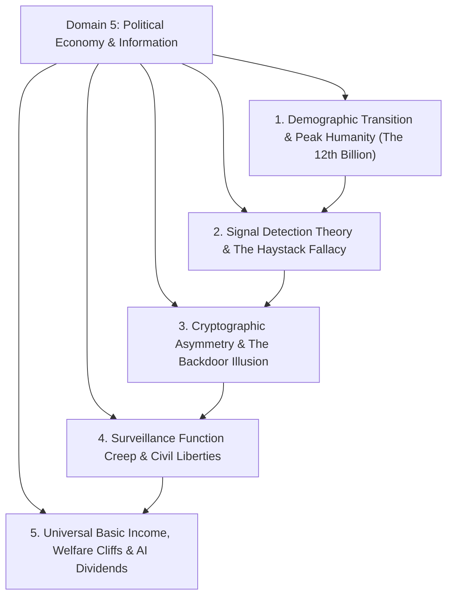
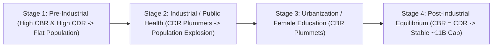
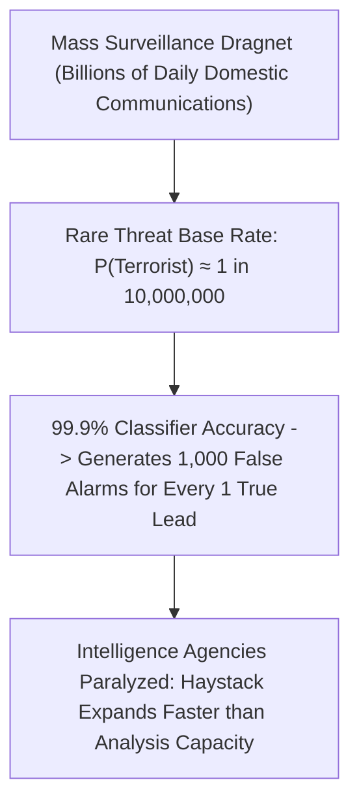

# Domain 5: Political Economy, Information Security & Human Flourishing

> **Domain Kernel**: Modern civilization is a multi-layered complex system governed by demographic transitions, mathematical information security, and macroeconomic resource distribution. Ensuring long-term human flourishing requires understanding the systemic limits of population growth, the mathematical vulnerabilities of mass state surveillance, and the macroeconomic necessity of unconditional economic floors (UBI) as AI automation accelerates.

---

## 1. Executive Synthesis & Structural Framework



---

## 2. Demographic Transition Invariants & Peak Humanity



### 2.1 The 4-Stage Demographic Transition Model (DTM)
Global population growth is not an exponential runaway disaster, but an **S-shaped logistic transition** (Verhulst model):
\[
\frac{dN}{dt} = rN \left(1 - \frac{N}{K}\right)
\]
1. **The Modern Explosion Explained**: The population expanded from 1 billion in 1800 to 8 billion today not because humans started reproducing faster, but because modern sanitation, antibiotics, and clean water stopped children from dying (infant mortality plummeted from $40\%$ to $<4\%$).
2. **The Inevitable Convergence**: As nations industrialize, expand female education, and urbanize, Total Fertility Rates ($\text{TFR}$) collapse toward or below replacement level ($\text{TFR} \approx 2.1$).
3. **The 12th Billion Invariant**: Global population will peak at $\approx 10.5 - 11.0\text{ billion}$ around 2080–2100 before plateauing or gently declining. The 12th billion human will likely never be born.

---

## 3. Signal Detection Theory, Mass Surveillance & The Haystack Fallacy



### 3.1 The Base Rate Fallacy in Intelligence Dragnets
Governments justify mass bulk surveillance under the premise that capturing all data will intercept catastrophic threats. Mathematically, this violates **Bayes' Theorem**:
\[
P(\text{Threat} \mid \text{Flag}) = \frac{P(\text{Flag} \mid \text{Threat}) P(\text{Threat})}{P(\text{Flag} \mid \text{Threat}) P(\text{Threat}) + P(\text{Flag} \mid \text{Innocent}) P(\text{Innocent})}
\]
* Because true malicious actors represent an infinitesimally small fraction of the population ($P(\text{Threat}) \approx 10^{-7}$), even a hypothetical classifier with $99.9\%$ accuracy produces **thousands of false positive investigations for every legitimate lead**.
* Ingesting the entire domestic population's metadata does not find the needle; it **infinitely enlarges the haystack**, blinding intelligence analysts with operational noise.

### 3.2 Cryptographic Asymmetry & The "Golden Key" Illusion
* **Public-Key Cryptography (RSA / ECC)**: Information security is asymmetric. Multiplying two large prime numbers is computationally trivial ($\mathcal{O}(n^2)$), but factoring their product back into primes is mathematically intractable ($\text{Sub-exponential}$).
* **The Backdoor Fallacy**: Math has no concept of "law enforcement credentials". Introducing a deliberate escrow backdoor or weakening encryption algorithms creates a universal structural flaw that can be reverse-engineered by hostile foreign powers, organized cyber-cartels, and rogue actors.

### 3.3 Institutional Function Creep & The Ratchet Effect
Every mass surveillance infrastructure enacted under the aegis of "anti-terrorism emergency" inevitably undergoes **Function Creep**:
* Dragnet tools originally built for foreign counter-terrorism expand into monitoring domestic political dissidents, labor organizers, tax auditing, and petty civil offenses.
* Dismantling the *"Nothing to Hide"* fallacy: Privacy is not about hiding wrongdoing; it is the constitutional architectural boundary that protects democratic self-determination against authoritarian capture.

---

## 4. Universal Basic Income (UBI), Welfare Cliffs & AI Automation

```mermaid
graph TD
    subgraph The Poverty Trap (Conditional Welfare)
        Welfare["Means-Tested Aid ($1,000/mo)"] --> Work["Recipient Takes Job Earning $1,200/mo"]
        Work --> Loss["Loss of Subsidies (-$1,000) + Taxes (-$150) -> Net: $1,050/mo (Penalizes Labor!)"]
    end

    subgraph The Unconditional Floor (UBI)
        UBI["Universal Floor ($1,000/mo Non-Withdrawable)"] --> Work2["Recipient Takes Job Earning $1,200/mo"]
        Work2 --> Gain["Net Income: $2,160/mo -> Working Always Increases Financial Wealth"]
    end
```

### 4.1 Effective Marginal Tax Rates & Poverty Cliffs
Traditional conditional welfare programs create a severe structural trap:
\[
\text{EMTR} = 1 - \frac{\Delta \text{Net Income}}{\Delta \text{Gross Earnings}} > 100\%
\]
When an impoverished individual gains employment, the abrupt withdrawal of childcare, healthcare, and housing subsidies causes their net financial position to worsen, making work economically irrational.

### 4.2 The Macroeconomic Multiplier of Cash Transfers
* **High Marginal Propensity to Consume ($\text{MPC} \approx 1.0$)**: Low-income households spend cash transfers immediately on local essentials.
* **Empirical Multiplier**: Every **$\$1.00$ transferred to low-income earners stimulates $\$1.21$ in aggregate GDP growth**, compared to only **$\$0.39$** when concentrated in upper-wealth brackets.
* A $\$1,000/\text{month}$ UBI is modeled to expand US GDP by **$12\%$ over an 8-year horizon**.

### 4.3 Non-Distortive Funding: Georgism, Carbon Dividends & AI Levies
Financing an unconditional floor does not require runaway money printing:
1. **Land Value Tax (Georgism)**: Taxing inelastic unimproved land captures economic rents with **zero deadweight loss**.
2. **Carbon Fee & Dividend**: Taxing fossil carbon and rebating $100\%$ per capita progressively enriches low-carbon households.
3. **AI Compute & Automation Dividends**: As machine intelligence drives the marginal cost of physical labor to zero, automated capital yields are distributed to all citizens as a baseline social dividend.

---

## 5. Synthesized Media Crucibles in this Domain
* **Kurzgesagt**: *Safe and Sorry – Terrorism & Mass Surveillance* (Base rate fallacy, the Apple vs. FBI encryption battle, and function creep).
* **Kurzgesagt**: *Overpopulation – The Human Explosion Explained* (The 4 stages of the DTM, TFR leapfrogging, and peak humanity).
* **Kurzgesagt**: *Universal Basic Income Explained – Free Money for Everybody?* (Welfare cliffs, Canadian Mincome findings, and macroeconomic stimulus multipliers).
