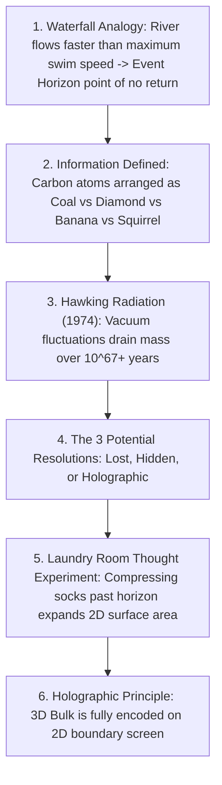

# Leaf Node: *Why Black Holes Could Delete The Universe* — Kurzgesagt (The Information Paradox)

> **Synthesized Epistemic Thesis**: Information—the distinct quantum arrangement of matter that differentiates a diamond from a lump of coal—is mathematically indestructible under quantum unitarity. Black holes threaten this fundamental law through Hawking evaporation. The resolution—the Holographic Principle—reveals that black holes store infalling matter as 2D boundary pixels at the Planck scale, implying that our 3D cosmos may itself be a holographic projection.

---

## 1. Episode Metadata & Tree Coordinates
* **Source**: *Kurzgesagt – In a Nutshell* (with scientific advisory by Dr. Alessandro Sfondrini)
* **Core Inquiry**: What happens to physical information when matter falls into a black hole that eventually evaporates? Does black hole evaporation violate quantum physics?
* **Tree Coordinates**: `Roots: quantum-unitarity-and-information-conservation` $\rightarrow$ `Trunk: black-hole-information-paradox-and-bekenstein-entropy` $\rightarrow$ `Branches: holographic-principle-and-quantum-gravity`

---

## 2. Theoretical Deconstruction & Gedankenexperiments

### 1. What is Information in Physics?
* All matter is constructed from identical fundamental fermions (up quarks, down quarks, electrons).
* The only difference between a rock, a bird, and an encyclopedia is **Information**: the exact quantum state configuration ($|\psi\rangle$).
* In standard physics, burning a book scrambles the information into smoke and thermal photons, but inverting the microscopic laws of physics could theoretically reconstruct the original text.

### 2. The 3 Potential Resolutions
1. **Information is Truly Erased**: Destroys quantum mechanics, requiring all physics to be rebuilt from scratch.
2. **Information is Hidden in Remnants / Baby Universes**: Matter pinches off into unreachable isolated spacetime pockets.
3. **The Holographic Resolution (Leading Consensus)**: Information is inscribed onto the 2D surface area of the Event Horizon in Planck-scale pixels ($\Delta A \approx 4\ell_P^2$) and carried away through subtle quantum entanglement in Hawking radiation.

---

## 3. Senior Auditor Commentary & Epistemic Synthesis

> [!NOTE]
> **The Radical Implication of Holography**:
> * If a black hole's 3D internal geometry is mathematically identical to a 2D boundary quantum hologram, our entire 3D physical universe may operate on the same principle: we may be experiencing the 3D projection of 2D quantum information encoded on the cosmic horizon of the universe.

---

## 4. Tree Linkages
* **Roots**: [[quantum-unitarity-and-information-conservation]], [[thermodynamics-entropy-and-schrodinger-negentropy]], [[atomic-hypothesis-quantum-fields-scale]]
* **Trunk**: [[black-hole-information-paradox-and-bekenstein-entropy]], [[emergence-reductionism-and-informational-biology]]
* **Branches**: [[holographic-principle-and-quantum-gravity]], [[standard-model-and-particle-physics-taxonomy]]
