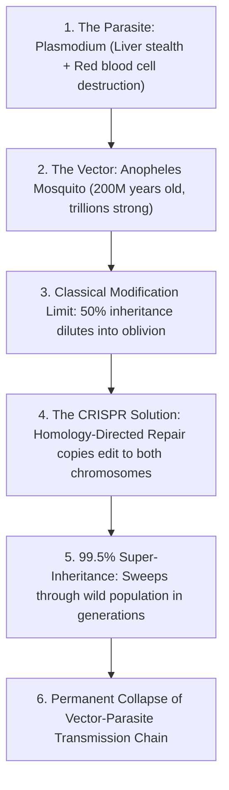

# Leaf Node: *Genetic Engineering & Diseases* — Kurzgesagt (Gene Drives & Malaria)

> **Synthesized Epistemic Thesis**: Malaria (*Plasmodium*) is historically the deadliest parasite in human history, killing nearly 500,000 people annually (primarily children under five). CRISPR-Cas9 super-Mendelian gene drives provide the first viable technology to permanently immunize or suppress wild mosquito vectors, transforming genetic engineering from localized lab therapy to biosphere-scale public health infrastructure.

---

## 1. Episode Metadata & Tree Coordinates
* **Source**: *Kurzgesagt – In a Nutshell*
* **Core Subject**: *Plasmodium* Parasitology, *Anopheles* Mosquito Vectors, CRISPR-Cas9 Non-Mendelian Gene Drives, and Ecosystem-Scale Bioethics.
* **Tree Coordinates**: `Roots: mendelian-inheritance-and-super-mendelian-gene-drives` $\rightarrow$ `Trunk: ecological-engineering-biocatalytic-cascades-and-irreversibility` $\rightarrow$ `Branches: crispr-cas9-gene-drives-and-vector-parasitology`

---

## 2. Technical & Biological Deconstruction

### 1. The Parasite's Mechanics of Terror
* *Plasmodium* evades the human immune system by concealing itself inside liver hepatocytes for up to a month, then using the membranes of destroyed liver cells as camouflage.
* When bursting into the bloodstream, it systematically invades, replicates within, and detonates red blood cells in cyclical waves, causing severe hemolytic anemia, metabolic acidosis, and fatal cerebral coma.

### 2. Why Conventional Eradication Fails
* Mosquitoes have existed for over **200 million years**. Trillions exist globally, and a single female can lay up to **300 eggs per cycle**. Chemical pesticides (like DDT) cause widespread ecological toxicity and rapidly select for pesticide-resistant insect strains.

### 3. The Gene Drive Revolution (99.5% Inheritance)
* Under standard Mendelian genetics, an engineered gene is passed to only half of the offspring.
* CRISPR Gene Drives force the cell's own repair machinery to copy the anti-parasitic construct into the opposing wild-type chromosome, achieving **$>99.5\%$ transmission across all subsequent generations**.

---

## 3. Senior Auditor Commentary & Epistemic Verdict

> [!IMPORTANT]
> **The Moral Calculus of Inaction**:
> * While caution regarding ecological modification is scientifically warranted, the moral cost of inaction is acute: **approximately 1,000 children die from malaria every single day**.
> * Deploying targeted population modification (making mosquitoes immune to *Plasmodium* rather than eradicating the insect species) represents a minimal-entropy ecological intervention with maximum human life preservation.

---

## 4. Tree Linkages
* **Roots**: [[mendelian-inheritance-and-super-mendelian-gene-drives]], [[thermodynamics-entropy-and-schrodinger-negentropy]], [[atomic-hypothesis-quantum-fields-scale]]
* **Trunk**: [[ecological-engineering-biocatalytic-cascades-and-irreversibility]], [[emergence-reductionism-and-informational-biology]]
* **Branches**: [[crispr-cas9-gene-drives-and-vector-parasitology]], [[definition-of-life-and-artificial-life]]
