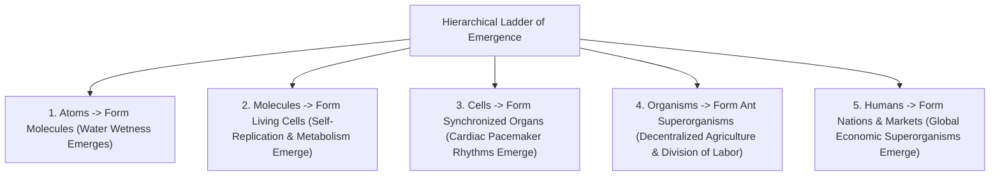

# Leaf Node: *Emergence* — Kurzgesagt (How Stupid Things Become Smart Together)

> **Synthesized Epistemic Thesis**: Individual components in nature—whether water molecules, cardiomyocytes, foraging ants, or human neurons—possess neither global foresight nor central leadership. Yet, governed by elementary local interaction rules, their collective assembly generates liquid fluidity, rhythmic heartbeats, superorganism agriculture, and conscious intelligence.

---

## 1. Episode Metadata & Tree Coordinates
* **Source**: *Kurzgesagt – In a Nutshell*
* **Core Inquiry**: How do simple, brainless constituents combine to create high-order intelligence, self-repairing systems, and complex societies?
* **Tree Coordinates**: `Roots: emergence-invariants-and-local-rule-networks` $\rightarrow$ `Trunk: decentralized-superorganisms-and-swarm-intelligence` $\rightarrow$ `Branches: complex-adaptive-systems-and-cellular-automata`

---

## 2. Core Case Studies & Mechanistic Progression

### 1. The Wetness of Water
* A single $H_2O$ molecule does not possess "wetness". Wetness is an emergent property arising solely when trillions of water molecules interact through hydrogen bonding and surface tension.

### 2. Ant Superorganism Task Switching
* In an ant colony, there is no commander. Individual ants track their encounter frequency with other castes (foragers, workers, soldiers) using olfactory signals.
* If a predator decimates the foragers, remaining workers encounter fewer foragers, crossing an internal threshold that triggers them to switch roles into foragers automatically.

### 3. Biological Pacemakers & Collective Sync
* Billions of pacemaker cells in the heart synchronize their electrochemical firings without a master coordinator by exchanging ions through gap junctions, creating a unified heartbeat.

### 4. Anthropological Emergence: The Nation
* A nation has no face, physical brain, or biological body, and its human constituents continuously turn over across generations. Yet it exists as an emergent superorganism capable of waging wars, enforcing laws, and terraforming landscapes.

---

## 3. Senior Auditor Commentary & Epistemic Verdict

> [!NOTE]
> **Metacognitive Implication (Consciousness as Emergence)**:
> * 86 billion non-conscious neurons in the human brain, each passing simple electrochemical spikes across synapses, collectively produce subjective awareness, intentionality, and self-reflection.
> * Understanding emergence frees human thinking from crude reductionism, allowing us to recognize how intelligence self-assembles across all scales of the cosmos.

---

## 4. Tree Linkages
* **Roots**: [[emergence-invariants-and-local-rule-networks]], [[thermodynamics-entropy-and-schrodinger-negentropy]], [[holobiont-theory-and-symbiogenesis-invariants]]
* **Trunk**: [[decentralized-superorganisms-and-swarm-intelligence]], [[emergence-reductionism-and-informational-biology]]
* **Branches**: [[complex-adaptive-systems-and-cellular-automata]], [[definition-of-life-and-artificial-life]]
