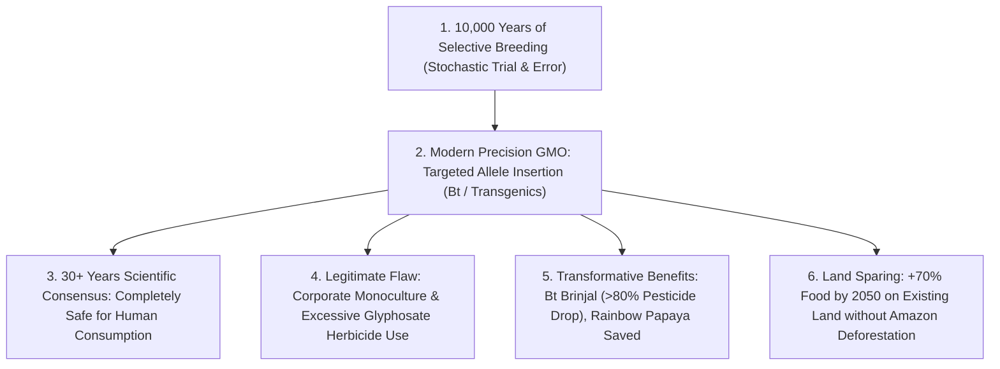

# Leaf Node: *Are GMOs Good or Bad?* — Kurzgesagt (Genetic Engineering & Our Food)

> **Synthesized Epistemic Thesis**: The scientific debate over GMO safety is settled: three decades of global empirical research demonstrate that bioengineered crops are as safe to consume as non-GMOs. The true ecological imperative of agricultural biotechnology is **Intensification (Land Sparing)**: maximizing food yields on existing farmland to feed 10 billion people while halting deforestation and preserving Earth's wild biomes.

---

## 1. Episode Metadata & Tree Coordinates
* **Source**: *Kurzgesagt – In a Nutshell*
* **Core Inquiry**: Are GMOs dangerous to human health and the environment, or are they an indispensable ecological tool for sustainable agriculture?
* **Tree Coordinates**: `Roots: agricultural-energetics-and-land-sparing-invariants` $\rightarrow$ `Trunk: selective-toxicity-and-appeal-to-nature-fallacy` $\rightarrow$ `Branches: crop-bioengineering-bt-endotoxins-and-biofortification`

---

## 2. Technical & Empirical Deconstruction

### 1. The Selective Toxicity of Bt Endotoxin
* The Bt protein (*Bacillus thuringiensis*) specifically binds to alkaline midgut receptors in caterpillars and borers, bursting their gut membranes.
* In mammalian stomachs (acidic $\text{pH } 1.5-2.0$), the protein is broken down into ordinary nutritional amino acids, rendering it completely non-toxic to humans (identical to how caffeine is a lethal insect poison but safe for humans).

### 2. Empirical Validation Case Studies
* **Bt Brinjal in Bangladesh (2013)**: Reduced chemical pesticide spraying by **$>80\%$**, eliminated farmer chronic pesticide poisoning, and significantly boosted household farm income.
* **Hawaiian Rainbow Papaya (1990s)**: Genetically vaccinated against the Papaya Ringspot Virus, saving the entire state's papaya industry from permanent collapse.

### 3. Land Sparing vs. Extensification
* By 2050, humanity will require **$70\%$ more food** ($>11\text{ billion lbs}$ consumed daily).
* Attempting to produce this through low-yield expansion would necessitate massive deforestation of rainforests and carbon sinks. High-yield bioengineering allows humanity to spare wild land while achieving global food security.

---

## 3. Senior Auditor Commentary & Epistemic Verdict

> [!TIP]
> **Separating the Science from the Business Model**:
> * Do not confuse the **tool** (recombinant DNA / CRISPR precision biology) with the **business practices** of agrochemical conglomerates (seed patent monopolies, chemical herbicide bundling).
> * Public-domain, open-source biotechnology (e.g. Golden Rice, public university Bt crops) is a cornerstone of global human health and ecological conservation.

---

## 4. Tree Linkages
* **Roots**: [[agricultural-energetics-and-land-sparing-invariants]], [[mendelian-inheritance-and-super-mendelian-gene-drives]], [[demographic-transition-and-logistic-population-dynamics]]
* **Trunk**: [[selective-toxicity-and-appeal-to-nature-fallacy]], [[ecological-engineering-biocatalytic-cascades-and-irreversibility]]
* **Branches**: [[crop-bioengineering-bt-endotoxins-and-biofortification]], [[development-economics-tfr-and-peak-humanity]]
