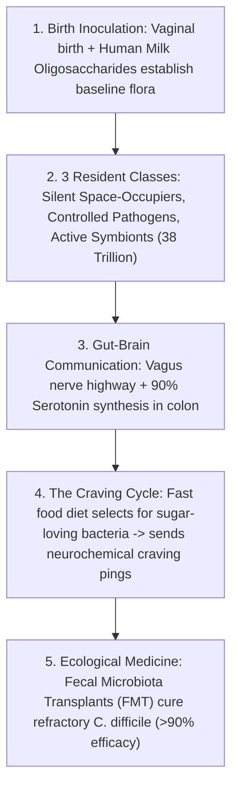

# Leaf Node: *How Bacteria Rule Over Your Body* — Kurzgesagt (The Microbiome)

> **Synthesized Epistemic Thesis**: The human body is a multi-species commonwealth inhabited by over 38 trillion bacterial symbionts. The microbiome governs immune education, synthesizes $90\%$ of bodily serotonin, communicates directly with the brain via the vagus nerve, and drives dietary craving feedback loops—demonstrating that mental health, metabolic vitality, and immune integrity are emergent properties of internal microbial ecology.

---

## 1. Episode Metadata & Tree Coordinates
* **Source**: *Kurzgesagt – In a Nutshell*
* **Core Inquiry**: How do the trillions of bacteria living inside the human gut influence our immune system, digestion, cravings, and brain function?
* **Tree Coordinates**: `Roots: holobiont-theory-and-symbiogenesis-invariants` $\rightarrow$ `Trunk: gut-brain-axis-neurochemistry-and-feedback-cravings` $\rightarrow$ `Branches: microbial-ecology-dysbiosis-and-fecal-transplants`

---

## 2. Biological Architecture & Key Phenomena

### 1. Inoculation & The 3 Classes of Guests
* **Birth & Breast Milk**: Infants in the sterile womb are colonized during vaginal birth. Breast milk contains complex oligosaccharides specifically designed by evolution not to feed the baby, but to feed beneficial *Bifidobacteria* that train the infant immune system.
* **The 3 Inhabitants**:
  1. *Silent Passengers*: Benign bacteria taking up space to block pathogens.
  2. *Harmful Opportunists*: Acid-producing bacteria (e.g. dental plaque) kept under tight control.
  3. *Vital Allies*: Trillions of gut bacteria extracting calories from fiber and producing vital metabolites.

### 2. The Gut-Brain Axis & Psychological Impact
* Over **$90\%$ of serotonin** is produced in the gut under microbial influence.
* Transferring microbiome samples from depressed humans to healthy mice induces depressive and anxiety-like behaviors.
* **The Self-Reinforcing Junk Food Cycle**: Eating junk food fuels fast-food-loving bacteria, which multiply and chemically prompt the brain to crave more junk food.

### 3. Fecal Microbiota Transplants (FMT)
* When antibiotics obliterate the microbiome, *C. difficile* takes over, causing life-threatening illness. Transplanting healthy donor stool restores microbial equilibrium with a **$>90\%$ success rate**.

---

## 3. Senior Auditor Commentary & Actionable Heuristics

> [!TIP]
> **Actionable Lifestyle Invariant**:
> * View every meal not merely as personal nutrition, but as an ecological feeding protocol for your internal microbial ecosystem.
> * Prioritizing diverse **soluble and insoluble plant fibers, fermented foods, and polyphenol-rich plants** directly fuels butyrate-producing commensals, lowering systemic inflammation and stabilizing neurochemical balance.

---

## 4. Tree Linkages
* **Roots**: [[holobiont-theory-and-symbiogenesis-invariants]], [[thermodynamics-entropy-and-schrodinger-negentropy]], [[emergence-reductionism-and-informational-biology]]
* **Trunk**: [[gut-brain-axis-neurochemistry-and-feedback-cravings]], [[selective-toxicity-and-appeal-to-nature-fallacy]]
* **Branches**: [[microbial-ecology-dysbiosis-and-fecal-transplants]], [[definition-of-life-and-artificial-life]]
