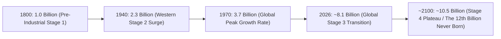

# Leaf Node: *Overpopulation* — Kurzgesagt (The Human Explosion Explained)

> **Synthesized Epistemic Thesis**: The global population explosion is not an apocalyptic runaway disaster, but a temporary four-stage demographic transition. Because global fertility rates have plummeted toward replacement level ($2.1$), world population growth is rapidly decelerating, guaranteeing that humanity will plateau at $\approx 10-11\text{ billion}$ and the 12th billion human will never be born.

---

## 1. Episode Metadata & Tree Coordinates
* **Source**: *Kurzgesagt – In a Nutshell* (in collaboration with Max Roser / *Our World in Data* and Hans Rosling)
* **Core Inquiry**: Will human overpopulation lead to apocalyptic famine, resource collapse, and overcrowding, or is population growth naturally bounded?
* **Tree Coordinates**: `Roots: demographic-transition-and-logistic-population-dynamics` $\rightarrow$ `Trunk: demographic-momentum-and-fertility-transition` $\rightarrow$ `Branches: development-economics-tfr-and-peak-humanity`

---

## 2. Quantitative Growth Milestones & The 4 Stages

### The 4 Stages Deconstructed
1. **Stage 1 (Pre-1750 UK / Traditional Society)**: High birth rate + High infant mortality $\rightarrow$ Zero population growth. (Women average 4–6 children, only 2 reach adulthood).
2. **Stage 2 (Industrial & Medical Revolution)**: Better food, clean water, and hygiene cause death rates to drop $\rightarrow$ **Population Explosion** (UK doubled in 100 years).
3. **Stage 3 (Social Maturation & Fertility Collapse)**: With infant survival guaranteed, women enter higher education and careers $\rightarrow$ Total Fertility Rate (TFR) plunges from $5.0+$ to $<2.5$.
4. **Stage 4 (Modern Global Equilibrium)**: Low birth rate balances low death rate $\rightarrow$ Stable population plateau.

### The Phenomenon of Compressed Leapfrogging
* While the UK took **80 years** to transition from TFR $6.0$ to $<3.0$:
  * **South Africa & Malaysia**: Completed in **34 years**.
  * **Bangladesh**: Completed in **20 years** (1971: TFR $7.0$, $25\%$ child mortality $\rightarrow$ 2015: TFR $2.2$, $3.8\%$ mortality).
  * **Iran**: Completed in **10 years** ($1986-1996$).

---

## 3. Senior Auditor Commentary & Epistemic Verdict

> [!NOTE]
> **The Fallacy of Malthusian Scarcity**:
> * Doom-mongering predictions of population collapse fail because they treat humans solely as **consumers of resources** rather than **generators of knowledge, innovation, and abundance**.
> * As global living standards rise, the number of individuals receiving higher education increases **tenfold**, accelerating the technological capacity to power clean energy grids, engineer disease resistance, and optimize resource logistics.

---

## 4. Tree Linkages
* **Roots**: [[demographic-transition-and-logistic-population-dynamics]], [[thermodynamics-entropy-and-schrodinger-negentropy]], [[signal-detection-theory-and-haystack-fallacy]]
* **Trunk**: [[demographic-momentum-and-fertility-transition]], [[three-super-cycles-energy-manufacturing-ai]]
* **Branches**: [[development-economics-tfr-and-peak-humanity]], [[definition-of-life-and-artificial-life]]
