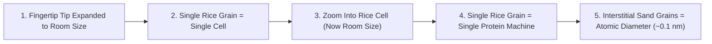

# Leaf Node: *How Small Is An Atom?* — Kurzgesagt (Quantum Scale & Particle Mechanics)

> **Synthesized Epistemic Thesis**: Atoms are not solid building blocks; they are energetic probability vortices composed of $99.999999999999\%$ quantum vacuum fluctuations. The entirety of human physical mass is concentrated in sub-femtometer nuclei that could collectively fit within a single teaspoon.

---

## 1. Episode Metadata & Tree Coordinates
* **Source**: *Kurzgesagt – In a Nutshell*
* **Core Subject**: Spatial Scales of Matter, The Standard Model, Atomic Voids, Quantum Probability Orbitals, and Degenerate Densities.
* **Tree Coordinates**: `Roots: atomic-hypothesis-quantum-fields-scale` $\rightarrow$ `Trunk: degenerate-matter-and-extreme-cosmic-density` $\rightarrow$ `Branches: standard-model-and-particle-physics-taxonomy`

---

## 2. Intuitive Mental Models & Scale Analogies

### The 4 High-Leverage Gedankenexperiments
1. **The Human Hair Scale**: A single strand of human hair is approximately **$500,000\text{ carbon atoms}$** wide stacked edge-to-edge.
2. **The Marble vs. Earth Scale**: If a single atom in your fist were expanded to the size of a marble, your fist would expand to the diameter of **Planet Earth**.
3. **The Empire State Building Void**: If you extracted all the vacuum space between the atomic nuclei of the Empire State Building, its entire mass would condense to the volume of a single grain of rice.
4. **The Teaspoon of Humanity**: Removing the atomic void from all **8 billion living human beings** condenses the entire biological mass of our species into less than a **single teaspoon** ($<5\text{ cm}^3$), reaching neutron star density ($\approx 10^{17}\text{ kg/m}^3$).

---

## 3. Atomic Mechanics & Quantum Reality

* **Electron Orbitals ($|\psi|^2$)**: Electrons travel at approximately $2,200\text{ km/s}$ (fast enough to circumnavigate Earth in 18 seconds). They do not exist at discrete spatial coordinates, but as probability clouds where they have a $95\%$ statistical likelihood of being detected.
* **Elementary Permutations**:
  * $1\text{ Proton} + 1\text{ Electron} = \text{Hydrogen}$
  * $+1\text{ Proton} + 1\text{ Neutron} = \text{Helium}$
  * $+4\text{ Protons} + 4\text{ Neutrons} = \text{Carbon}$
  * $+73\text{ Protons} + 118\text{ Neutrons} = \text{Gold}$

---

## 4. Senior Auditor Commentary & Feynman's Legacy

> [!NOTE]
> **Auditor Reflection on the Atomic Hypothesis**:
> As Richard Feynman stated in the opening of the *Feynman Lectures on Physics*:
> *"If, in some cataclysm, all of scientific knowledge were to be destroyed, and only one sentence passed on to the next generation of creatures, what statement would contain the most information in the fewest words? I believe it is the atomic hypothesis that all things are made of atoms..."*
> Recognizing that every hydrogen atom in your body was synthesized during the Big Bang, and every heavier element was forged in the core of dying massive stars, grounds humanity in the direct physical continuum of cosmic evolution.

---

## 5. Tree Linkages
* **Roots**: [[atomic-hypothesis-quantum-fields-scale]], [[thermodynamics-entropy-and-schrodinger-negentropy]], [[electrochemical-energy-storage-axioms]]
* **Trunk**: [[degenerate-matter-and-extreme-cosmic-density]], [[emergence-reductionism-and-informational-biology]]
* **Branches**: [[standard-model-and-particle-physics-taxonomy]], [[definition-of-life-and-artificial-life]]
