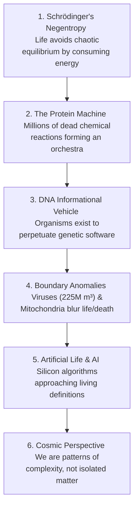

# Leaf Node: *What Is Life? Is Death Real?* — Kurzgesagt (Schrödinger & Emergence)

> **Synthesized Epistemic Thesis**: Every constituent part of a living cell is dead inanimate matter. Life is not a special physical ingredient (vitalism is dead); it is a temporary, self-organizing thermodynamic storm fighting entropy through informational replication. Death is the cessation of this pattern, returning borrowed atoms to cosmic equilibrium.

---

## 1. Episode Metadata & Tree Coordinates
* **Source**: *Kurzgesagt – In a Nutshell*
* **Core Inquiry**: What defines life? Where is the exact boundary between alive and dead matter? Is death an objective physical reality or an artifact of categorization?
* **Tree Coordinates**: `Roots: thermodynamics-entropy-and-schrodinger-negentropy` $\rightarrow$ `Trunk: emergence-reductionism-and-informational-biology` $\rightarrow$ `Branches: definition-of-life-and-artificial-life`

---

## 2. Core Concepts & Philosophical Deconstruction

### 1. Schrödinger's Definition of Life
* Everything in the universe trends from order toward chaos and maximum entropy (equilibrium).
* A living entity resists this decay by constantly taking in free energy to create internal order (like continuously cleaning a messy downloading folder).

### 2. The Cellular Machine
* A cell has a protective boundary, maintains homeostasis, consumes fuel, responds to the environment, and reproduces.
* **Yet no part of a cell is alive.** It is an intricate clockwork of lifeless protein nanomachines performing millions of coordinated chemical reactions per second.
* **The Analogy**: Driving a car at $100\text{ km/h}$ while continuously rebuilding every single component using raw materials scooped from the road.

### 3. The Informational Code & Evolution
* Individual survival vehicles perish; what persists is the code (DNA/RNA).
* Life can be viewed as matter organized by information to guarantee the continuity of that information.

### 4. Boundary Dissolution: Viruses, Mitochondria & AI
* **Viruses**: $225,000,000\text{ m}^3$ of viral material exist on Earth. They are inert crystalline code outside cells, yet active, replicating agents inside cells (sometimes even hijacking and reviving dead cells).
* **Mitochondria**: Formerly free-living bacteria that surrendered individual organismal "life" to become cellular powerhouses in exchange for genetic perpetuation.
* **Artificial Intelligence**: As computer algorithms develop autonomous goals, self-healing code, and evolutionary optimization, the distinction between "natural life" and "artificial machine" dissolves.

---

## 3. Senior Auditor Commentary & Metacognitive Takeaway

> [!IMPORTANT]
> **Existential Reframing on Life & Death**:
> * **The Particle Continuity**: You are made of the exact same fundamental particles (quarks, leptons, bosons) that existed at the Big Bang and compose every star and rock in the universe.
> * **The Pattern Identity**: You are not a static object; you are a continuous, dynamic vortex of energy and information. When a wave crashes on the shore, the water does not die—the wave pattern simply dissolves back into the ocean. Contemplating this does not diminish humanity; it connects us directly to the foundational fabric of the cosmos.

---

## 4. Actionable Cognitive Heuristics

* **Heuristic 1 (Anti-Vitalist Thinking)**: When analyzing complex biological, psychological, or artificial systems, never search for a "magical essence." Look for the **feedback loops, boundary constraints, and energy flows** that produce the emergent behavior.
* **Heuristic 2 (Pattern over Material)**: Recognize that personal identity, knowledge, and mental models are software patterns running on wetware. Optimize the clarity and durability of the pattern.

---

## 5. Tree Linkages
* **Roots**: [[thermodynamics-entropy-and-schrodinger-negentropy]], [[electrochemical-energy-storage-axioms]]
* **Trunk**: [[emergence-reductionism-and-informational-biology]], [[three-super-cycles-energy-manufacturing-ai]]
* **Branches**: [[definition-of-life-and-artificial-life]]
