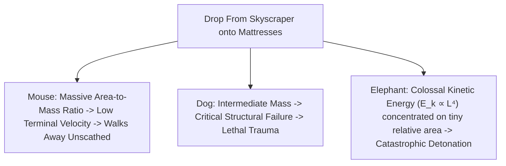

# Leaf Node: *What Happens If We Throw an Elephant From a Skyscraper?* — Kurzgesagt (Life & Size 1)

> **Synthesized Epistemic Thesis**: Physical size is the supreme architect of biological morphology and ecological experience. Because surface area scales quadratically ($L^2$) while mass scales cubically ($L^3$), a falling mouse walks away unscathed, a dog is broken, and an elephant detonates on impact—demonstrating that gravity, surface tension, and viscosity operate in completely separate regimes across the seven orders of magnitude of life.

---

## 1. Episode Metadata & Tree Coordinates
* **Source**: *Kurzgesagt – In a Nutshell* (inspired by J.B.S. Haldane's classic 1926 essay *"On Being the Right Size"*)
* **Core Inquiry**: Why does size dictate survival? What are the physical laws governing organisms from single-cell microbes to elephants and blue whales?
* **Tree Coordinates**: `Roots: square-cube-law-and-dimensional-scaling-invariants` $\rightarrow$ `Trunk: physical-regimes-across-scales-viscosity-to-gravity` $\rightarrow$ `Branches: allometric-biomechanics-reynolds-numbers-plastrons`

---

## 2. Quantitative Scaling & Gedankenexperiments

### 1. The Skyscraper Fall Deconstructed
* **The Falling Mouse**: A mouse possesses a very large surface area relative to its minuscule mass. Air resistance caps its terminal velocity at $\approx 12\text{ km/h}$. Upon landing, its kinetic energy per unit bone cross-section is negligible, allowing it to walk away unharmed.
* **The Falling Elephant**: An elephant has an enormous mass ($>5,000\text{ kg}$) and very little relative surface area ($\frac{A}{V} \to 0$). Air resistance barely impedes its acceleration. Upon impact, massive kinetic energy ($E_k \propto L^4$) crushes its skeletal structure, obliterating its body into a puddle.

### 2. Surface Tension as a Mortal Threat
* For humans, getting wet adds $\approx 800\text{ g}$ ($1\%$ of body weight).
* For a mouse, clinging water equals $>10\%$ of body weight (equivalent to carrying $8$ full bottles of water after a shower).
* For an ant, surface tension behaves like industrial adhesive: touching water risks being instantly pulled in and drowned.

### 3. Biological Nanotechnology
* **Cuticular Wax**: Insects coat their exoskeletons in hydrophobic wax to prevent droplets from sticking.
* **Plastron Lungs**: Aquatic insects use $>1,000,000\text{ micro-hairs/mm}^2$ to trap a permanent air bubble that acts as an external lung, continuously extracting dissolved $O_2$ from water.
* **The Fairyfly (*0.15 mm*)**: At low Reynolds numbers, air acts as viscous syrup. The insect swims through air using bristled paddle wings rather than aerodynamic gliders.

---

## 3. Senior Auditor Commentary & Cross-Domain Isomorphism

> [!IMPORTANT]
> **Cross-Disciplinary Transfer (Scaling Laws in Engineering)**:
> * The Square-Cube Law is an invariant that governs not just biology, but also **battery thermal dissipation** (larger cylindrical battery cells struggle to reject internal heat because volume heat generation scales cubically $L^3$ while surface cooling scales quadratically $L^2$) and **microchip architecture** (heat dissipation bottlenecks in 3D stacked semiconductor dies).

---

## 4. Tree Linkages
* **Roots**: [[square-cube-law-and-dimensional-scaling-invariants]], [[electrochemical-energy-storage-axioms]], [[atomic-hypothesis-quantum-fields-scale]]
* **Trunk**: [[physical-regimes-across-scales-viscosity-to-gravity]], [[battery-tradeoff-trilemma-and-thermal-runaway]]
* **Branches**: [[allometric-biomechanics-reynolds-numbers-plastrons]], [[standard-model-and-particle-physics-taxonomy]]
