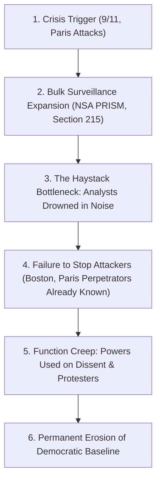

# Leaf Node: *Safe and Sorry* — Kurzgesagt (Terrorism, Mass Surveillance & Civil Liberties)

> **Synthesized Epistemic Thesis**: Mass surveillance operates on a flawed mathematical premise: collecting more data from innocent citizens drowns intelligence analysts in false positives while failing to stop rare catastrophic attacks. Sacrificing fundamental privacy rights under the banner of security erodes democratic institutions without increasing physical safety.

---

## 1. Episode Metadata & Tree Coordinates
* **Source**: *Kurzgesagt – In a Nutshell* (in partnership with the Civil Liberties Union for Europe)
* **Core Inquiry**: Has mass dragnet surveillance made society safer? What are the empirical outcomes of bulk data collection, encryption backdoors, and post-crisis civil liberty restrictions?
* **Tree Coordinates**: `Roots: signal-detection-theory-and-haystack-fallacy` $\rightarrow$ `Trunk: surveillance-function-creep-and-ratchet-effect` $\rightarrow$ `Branches: cryptographic-asymmetry-and-systemic-backdoors`

---

## 2. Empirical Deconstruction & Case Studies

### 1. The Post-9/11 Racial Profiling Failure
* Immediately following 9/11, the US government subjected **80,000 Arab and Muslim immigrants** to mandatory registration, called **8,000 in for interrogations**, and held **5,000 in preventive detention**.
* **Empirical Outcome**: Not a single convicted terrorist was discovered through this mass dragnet—making it one of the most aggressive and ineffective profiling campaigns since World War II.

### 2. The Haystack Fallacy & Real-World Intelligence
* **The Analogy**: Searching for a needle in a haystack is not made easier by dumping thousands of truckloads of extra hay onto the pile.
* **The Reality**: Major attack perpetrators (e.g. 2013 Boston Marathon bomber, 2015 Paris attackers) were already subjects of targeted intelligence files. The bottleneck was not lack of raw data, but the inability to process and act on existing targeted leads.

### 3. Encryption Backdoors (Apple vs. FBI Precedent)
* Government demands to mandate software backdoors in consumer encryption undermine the security of billions of law-abiding citizens, as mathematical backdoors cannot discriminate between domestic police and hostile nation-states.

### 4. Function Creep in European Democracies
* Post-2015 French emergency anti-terror measures were rapidly redeployed to place environmental activists under house arrest and shut down climate demonstrations during COP21.

---

## 3. Senior Auditor Commentary & Epistemic Verdict

> [!IMPORTANT]
> **The Principle of Proportionality**:
> * Mass surveillance shifts the social contract from **"presumption of innocence"** to **"universal permanent suspicion"**.
> * Effective counter-terrorism relies on **Targeted Human Intelligence (HUMINT)**, international diplomatic cooperation, and rigorous legal oversight—not the unconstitutional dragnet harvesting of citizen metadata.

---

## 4. Tree Linkages
* **Roots**: [[signal-detection-theory-and-haystack-fallacy]], [[atomic-hypothesis-quantum-fields-scale]]
* **Trunk**: [[surveillance-function-creep-and-ratchet-effect]], [[three-super-cycles-energy-manufacturing-ai]]
* **Branches**: [[cryptographic-asymmetry-and-systemic-backdoors]], [[definition-of-life-and-artificial-life]]
