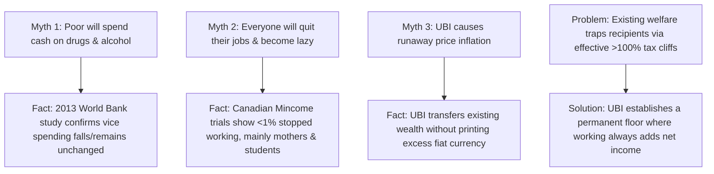

# Leaf Node: *Universal Basic Income Explained* — Kurzgesagt (UBI & The Future of Work)

> **Synthesized Epistemic Thesis**: Universal Basic Income is not a utopian fantasy or a vector for mass laziness; it is a structural mechanism to eliminate bureaucratic welfare cliffs, restore economic bargaining power to workers, and stimulate aggregate demand ($+\$1.21$ GDP per $\$1.00$ low-income transfer) as automated manufacturing and AI accelerate technological transformation.

---

## 1. Episode Metadata & Tree Coordinates
* **Source**: *Kurzgesagt – In a Nutshell*
* **Core Inquiry**: What happens if the government covers your baseline cost of living? Does UBI cause inflation, laziness, or economic ruin, or does it dismantle the poverty trap?
* **Tree Coordinates**: `Roots: marginal-propensity-to-consume-and-poverty-traps` $\rightarrow$ `Trunk: unconditional-floors-vs-welfare-cliffs` $\rightarrow$ `Branches: universal-basic-income-architectures-and-automation`

---

## 2. Technical & Empirical Deconstruction

### 1. The Realities of Human Labor & UBI
* **The 2013 World Bank Study**: Debunked the trope of the drunken recipient; cash transfers increase spending on childhood health, nutrition, and home repairs.
* **The Manitoba Mincome Experiment**: Hours worked declined by $<10\%$, with time reinvested in high school completion, university degrees, and job search matching.
* **Employee Disengagement**: Gallup data indicates that only **$33\%$ of workers are actively engaged** in their jobs. A survival floor enables workers to leave toxic employers and pursue productive entrepreneurship.

### 2. Macro-Economic Stimulus & Funding
* **The High MPC Multiplier**: Every $\$1.00$ transferred to low-income households expands GDP by **$\$1.21$** through active local spending, compared to only **$\$0.39$** when concentrated at the top.
* **Growth Impact**: A $\$1,000/\text{mo}$ UBI is modeled to expand US GDP by **$12\%$ over an 8-year horizon**.

---

## 3. Senior Auditor Commentary & AI Infrastructure Context

> [!NOTE]
> **Connecting UBI to the AI & Automation Super-Cycle**:
> * As autonomous manufacturing and generative AI drive the marginal cost of intelligence and energy toward zero, human labor will be freed from routine drudgery.
> * UBI transitions society from **survival-dependent labor** to **purpose-driven creation**, unlocking latent human capital for scientific discovery, philosophy, and cultural expansion.

---

## 4. Tree Linkages
* **Roots**: [[marginal-propensity-to-consume-and-poverty-traps]], [[demographic-transition-and-logistic-population-dynamics]], [[three-super-cycles-energy-manufacturing-ai]]
* **Trunk**: [[unconditional-floors-vs-welfare-cliffs]], [[decentralized-superorganisms-and-swarm-intelligence]]
* **Branches**: [[universal-basic-income-architectures-and-automation]], [[development-economics-tfr-and-peak-humanity]]
