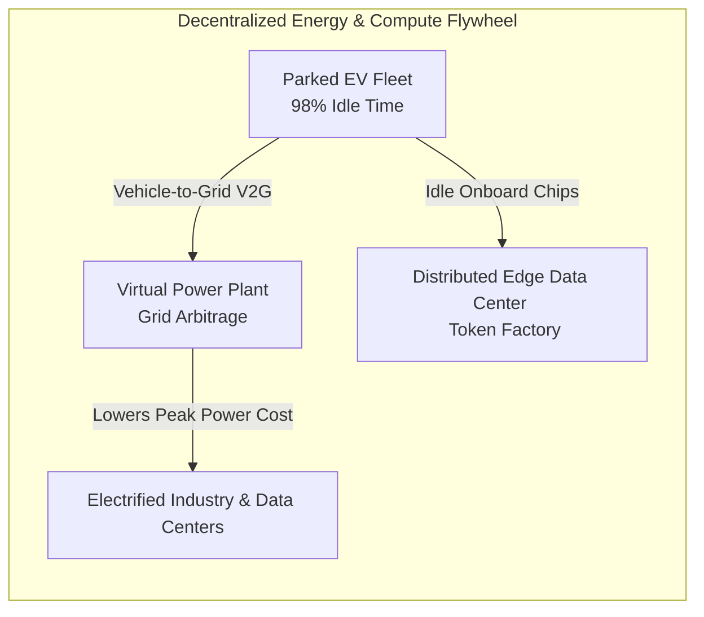

# Leaf Node: *WTF are Batteries?* — EnerVenue (Henning Rath) x HiNa Battery (Dr. Kun Tang) with Nikhil Kamath

> **Synthesized Epistemic Thesis**: Energy generation is a solved cost problem (solar/wind marginal cost approaching zero); the entire modern energy transition bottleneck is **fungibility, transport, and non-combustible stationary storage**. Surviving the post-globalized era requires decoupling from rare-earth choke points and deploying chemistry-specific solutions rather than a one-size-fits-all battery.

---

## 1. Episode Metadata & Tree Coordinates
* **Source**: *WTF is* Podcast by Nikhil Kamath (Recorded in Dalian at World Economic Forum Summer Davos)
* **Guests**:
  * **Henning Rath**: CEO of EnerVenue (ex-infrastructure engineer in Germany, Australia, India, China; leading Stanford-incubated Nickel-Hydrogen gigafactory in Changzhou).
  * **Dr. Kun Tang**: Executive Chairman & former CEO of HiNa Battery (PhD Chinese Academy of Sciences under Prof. Li Chenchen, Max Planck Institute postdoc; 10-year sodium-ion pioneer, 600 employees, 1 GW line).
* **Host**: Nikhil Kamath (Co-founder Zerodha & Gruhas, active energy transition fund investor).
* **Tree Coordinates**: `Roots: electrochemical-energy-storage-axioms` $\rightarrow$ `Trunk: battery-tradeoff-trilemma-and-thermal-runaway` $\rightarrow$ `Branches: energy-storage-chemistries-lfp-sodium-nickel-hydrogen`

---

## 2. Guest Crucibles & Core Perspectives

### 1. Henning Rath (The Infrastructure & System View)
* **The Rare Earth Warning**: If launching an energy transition company today, do **not** build a supply chain dependent on lithium refining or rare earths. Geopolitics is shifting from globalization to multipolar friction; local-for-local material sourcing (Nickel, Steel, Water, Sodium) is the only sovereign hedge.
* **The Nickel-Hydrogen Breakthrough**: Spun out of NASA’s satellite/space-station technology via Stanford, EnerVenue replaced flammable organic solvents with an aqueous electrolyte. Delivers **30,000 cycles** ($30+\text{ years}$) with zero fire risk, perfectly matched for AI data centers and utility-scale peak shaving.
* **The "Rent the Metal" Business Model**: Rather than selling battery cells as consumable assets that degrade, EnerVenue isolates nickel inside a Special Purpose Vehicle (SPV). Customers lease the nickel, and after 30 years, $98\%$ of the nickel is recovered and re-manufactured, creating a closed-loop balance sheet.

### 2. Dr. Kun Tang (The Deep-Tech Chemist & Scaling View)
* **Why He Picked Sodium over Solid-State**: When offered two startup spinouts 10 years ago (Sodium vs. Solid-State), he chose sodium because the precursor ($\text{Na}_2\text{CO}_3$) is ubiquitous in common salt at **$1/10\text{th}$ the price of lithium carbonate**, with zero commodity price swings.
* **The Solid-State Reality Check**: Confirms that solid-state battery technology is only at **Level 4 out of 9** (TRL 4). While publishing Nature/Science papers is easy, resolving solid-solid interface mechanics and industrial yields will take decades.
* **The Cold-Weather Advantage**: Unlike LFP which freezes and degrades at sub-zero temperatures, sodium-ion maintains full discharge kinetics in extreme cold ($-40^\circ\text{C}$ to $55^\circ\text{C}$), making it optimal for 2/3-wheelers, urban transport, and desert/arctic energy storage.

---

## 3. High-Leverage Mental Models & Insights

1. **The Parked Vehicle Paradox (V2G & Token Factory)**:
   - Private cars sit idle **98% of the time**.
   - Instead of building massive new peaker plants or standalone server farms, the parked EV fleet serves as a dual-purpose asset: an energy buffer (discharging during peak hours to earn arbitrage revenue) and a decentralized edge compute node (processing AI tokens overnight).
2. **The Data Center Energy Paradox**:
   - Hyperscalers currently store hundreds of thousands of liters of diesel fuel for backup generation. Replacing diesel with zero-fire risk stationary batteries ($\text{Ni-H}_2$ or Sodium-ion) is both an economic and physical safety imperative.
3. **The 3 Macro Super-Cycles**:
   - Wealth creation over the next 30 years will concentrate at the intersection of **Electrification + Automated High-Speed Manufacturing + Exponential AI Compute**.

---

## 4. Senior Auditor Commentary & Gap Fulfillment

> [!NOTE]
> **Auditor Analysis on EV Competition & Tier-1 vs Tier-2**:
> * **Why China Dominated EVs**: China leapfrogged internal combustion engines (ICE) by treating the electric car as a **software-first, vertically integrated computing platform** (battery + drivetrain + digital OS) rather than a mechanical assembly.
> * **The $50M CAPEX Reality Check**: A $50 million investment is sufficient to launch a specialized pilot gigawatt line using standard roll-to-roll coating equipment (especially for sodium-ion, which utilizes identical manufacturing infrastructure to lithium lines). However, breaking into passenger automotive requires billions in warranty reserves and software ecosystems. For emerging markets (e.g. India), the highest IRR path lies in **stationary grid ESS, AI data center buffering, and 2/3-wheeler battery packs**.

---

## 5. Actionable Decision Heuristics

* **Decision Rule 1 (Energy Siting)**: Always co-locate renewable generation, battery storage, and high-load consumers (e.g. AI data centers) within the same geographic perimeter to bypass transmission bottlenecks and avoid grid distribution losses.
* **Decision Rule 2 (Battery Technology Selection)**:
  * If the constraint is **Volume/Weight** (EVs, Aviation) $\rightarrow$ Choose **LFP / High-Nickel NMC**.
  * If the constraint is **Operating Temperature / Raw Material Cost** (2-wheelers, cold regions) $\rightarrow$ Choose **Sodium-Ion**.
  * If the constraint is **Fire Safety / 30-Year Lifecycle** (AI Data Centers, Grid Substations) $\rightarrow$ Choose **Nickel-Hydrogen ($\text{Ni-H}_2$)**.

---

## 6. Tree Linkages
* **Roots**: [[electrochemical-energy-storage-axioms]]
* **Trunk**: [[battery-tradeoff-trilemma-and-thermal-runaway]], [[three-super-cycles-energy-manufacturing-ai]]
* **Branches**: [[energy-storage-chemistries-lfp-sodium-nickel-hydrogen]]
