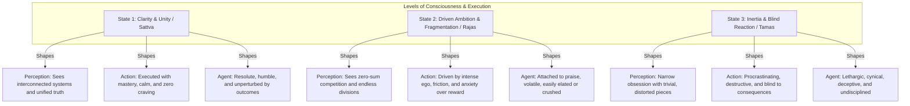
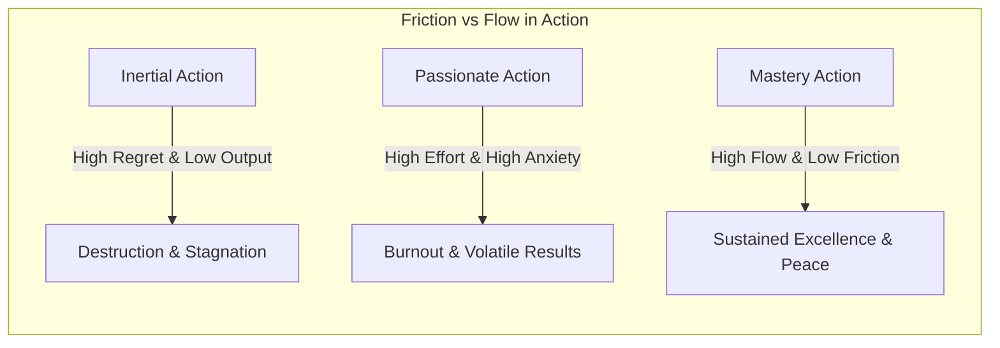
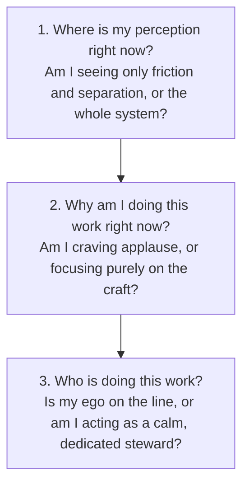

# Volume 3: Philosophy of Action & Metacognition

## Chapter 1: The Three Modes of Execution — Perception, Action, and the Self

Every human endeavor—whether building a life's work, solving a difficult problem, or navigating daily challenges—is shaped by three fundamental internal variables:
1. **The Lens of Perception (How you see reality)**
2. **The Nature of Action (How you execute your work)**
3. **The Identity of the Agent (Who you believe you are while doing it)**

Ancient analytical psychology (*Sānkhya*) maps these three variables across three distinct operational states or "qualities of mind": **Clarity & Harmony** (*Sattva*), **Passion & Reactive Drive** (*Rajas*), and **Inertia & Delusion** (*Tamas*). 

Understanding this 3×3 matrix provides a master diagnostic framework to elevate your focus, emotional resilience, and quality of work.

---

### The 3×3 Architecture of Human Execution

---

### Level 1: The Three Lenses of Knowledge (How You See)

The quality of your execution can never exceed the quality of your perception. Human understanding operates at three distinct resolutions:

#### 1. The Fragmented Lens (Inertia)
* **The Mechanism**: Clinging dogmatically to one tiny, isolated fragment of reality as if it were the whole truth, completely devoid of logic, context, or wider evidence.
* **Real-World Example**: A person who reads one sensationalist headline and forms an aggressive, unshakeable worldview, ignoring all broader systemic factors.

#### 2. The Transactional Lens (Reactive Passion)
* **The Mechanism**: Viewing the world strictly through divisions, competition, and transactional self-interest. You see entities, people, and domains as fundamentally separate and competing for scarce resources.
* **Real-World Example**: A manager who views colleagues only as rivals to outmaneuver, unable to see the collective system or collaborative synergies.

#### 3. The Unified Systems Lens (Pure Clarity)
* **The Mechanism**: Seeing the underlying unity beneath surface diversity. Recognizing that distinct parts are interconnected nodes of a single, continuous system.
* **Real-World Example**: An architect or scientist who understands how biology, physics, and human emotion all intersect to form an elegant whole.

---

### Level 2: The Three Qualities of Action (How You Work)

Not all effort is created equal. Two people can perform the exact same physical task with completely opposite psychological and long-term results.

1. **Inertial Action**: Work done haphazardly without regard for long-term consequences, personal capacity, or harm caused to others. It is characterized by chronic procrastination, avoidance of difficult truths, and impulsive shortcuts.
2. **Passionate Action**: Work undertaken with heavy emotional craving for external rewards (status, applause, money), accompanied by immense internal friction and ego inflation. It produces short bursts of high output followed inevitably by deep burnout and anxiety.
3. **Mastery Action**: Work performed as a matter of duty and craft, free from emotional attachment to the fruit, executed without resentment or frantic desire. It is smooth, focused, and sustainable over decades.

---

### Level 3: The Three Archetypes of the Doer (Who You Are)

Your identity during execution determines whether success inflates your ego and failure crushes your spirit.

| Dimension | The Inertial Doer | The Reactive / Passionate Doer | The Self-Mastered Doer |
| :--- | :--- | :--- | :--- |
| **Motivation** | Avoidance, fear, lethargy | Validation, greed, triumph over rivals | Dedication to duty, truth, and craft |
| **Response to Success** | Complacency or arrogance | Wild euphoria & ego expansion | Humble gratitude & calm presence |
| **Response to Failure** | Blame, cynicism, depression | Rage, acute anxiety, self-pity | Objective reflection & immediate calibration |
| **Work Ethic** | Chronic delay, undisciplined | Frenetic, chaotic, over-straining | Steady, cheerful, resolute, unshakeable |

---

### How to Apply the Framework Daily (The Diagnostic Pivot)

Whenever you find yourself stressed, procrastinating, or emotionally drained, run this **3-Question Diagnostic Pivot**:

1. **From Division to Unity**: Remind yourself of the wider context and long-term purpose of your task.
2. **From Craving to Craft**: Detach your emotional worth from the final outcome. Focus 100% of your energy on the single next sentence, line of code, or decision.
3. **From Ego to Stewardship**: Act with enthusiasm and diligence, knowing that while you control your efforts, the eventual results belong to time and external systems.

---

### The Core Takeaway to Remember
> You cannot control every circumstance in life, but you have absolute sovereignty over the quality of your mind. Shift your perception from fragmentation to unity, your action from anxiety to craft, and your identity from fragile ego to steady resolve.
