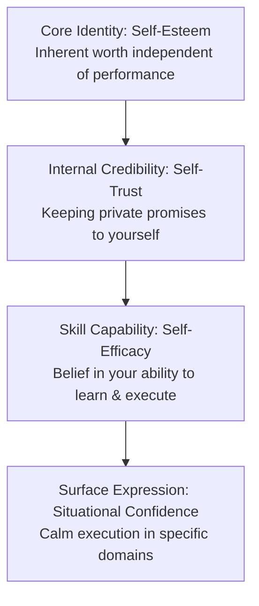
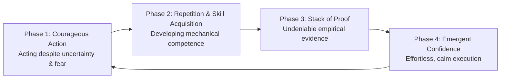
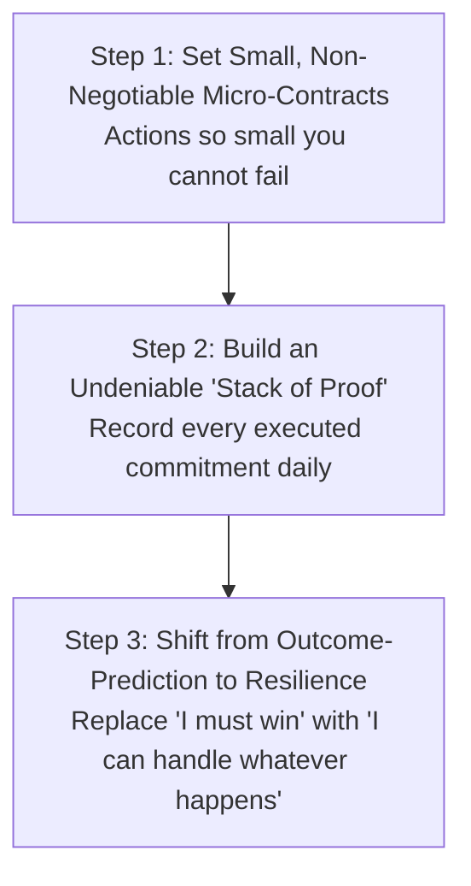

# Volume 3: Philosophy of Action & Metacognition

## Chapter 4: The Architecture of True Confidence — Self-Efficacy and Undeniable Proof

Confidence is one of the most misunderstood concepts in human psychology. Most people view confidence as a personality trait, an emotional state of fearlessness, or a feeling you must summon *before* attempting something difficult.

In cognitive science and empirical psychology, confidence is not a feeling; it is the **emergent result of a calibrated feedback loop between competence, self-trust, and evidence**.

True confidence is not the belief that you will never fail, look foolish, or encounter obstacles. It is the quiet, unshakeable internal conviction: **"Whatever happens, I have the capacity to handle it."**

---

### The Four Pillars of the Confident Self

To build durable confidence, you must first distinguish between four distinct psychological layers:

1. **Self-Esteem (Inherent Worth)**: The fundamental belief that you possess value as a human being, completely detached from external accolades, status, or temporary setbacks.
2. **Self-Trust (Internal Credibility)**: The reputation you have with yourself. Every time you set an intention and keep it, self-trust compounds; every time you break a private promise, self-trust deteriorates.
3. **Self-Efficacy (Bandura’s Competence Metric)**: Your belief in your capacity to acquire skills, adapt to novel challenges, and master a specific domain through deliberate practice.
4. **Situational Confidence (The Emergent Output)**: The outward calm and decisiveness displayed in a specific environment (e.g., public speaking, coding, investing) forged through repeated exposure.

---

### The Competence-Confidence Loop

The fundamental paradox of human action is that people wait to *feel* confident before they begin. In reality, the neurochemical and psychological sequence flows in the exact opposite direction:

* **The Illusion of Pre-Action Confidence**: You cannot think, affirm, or visualize your way into genuine confidence. The subconscious mind cannot be tricked by hollow positive affirmations; it respects only **empirical evidence**.
* **The Role of Courage**: The entry ticket to the loop is not confidence—it is **courage**. Courage is the willingness to act when fear, awkwardness, and uncertainty are present. Once you take action, competence develops, which deposits proof into your cognitive bank account.

---

### The Three Pathologies That Destroy Confidence

Confidence is rarely destroyed by lack of talent; it is eroded by three psychological traps:

#### 1. Perfectionism (Fear of Judgment in Disguise)
Perfectionism is not a pursuit of high standards; it is a defensive shield designed to protect a fragile ego from criticism. By setting impossible standards, the perfectionist delays publication, public exposure, or execution—thereby depriving the brain of real-world feedback loops.

#### 2. The Fantasy of Certainty (Analysis Paralysis)
Low-confidence individuals believe they must eliminate 100% of risk and ambiguity before starting. In complex systems, certainty is an illusion. High-agency individuals act when they have roughly **70% of the information**, trusting their real-time calibration to solve the remaining 30% along the way.

#### 3. Broken Micro-Contracts (The Internal Credibility Bleed)
When you tell yourself, *"I will wake up at 6:00 AM"* or *"I will read for 20 minutes tonight,"* and then hit snooze or scroll instead, you register a private micro-betrayal. Over time, your subconscious learns that your words have zero predictive power.

---

### The Protocol for Building Undeniable Confidence

To construct unshakeable self-trust and confidence from the ground up, implement three non-negotiable practices:

1. **The Micro-Contract Rule**: Never make a promise to yourself that you are not 100% committed to keeping. If you decide to do 5 pushups or write 100 words, treat that commitment with the same gravity as an external legal contract.
2. **Build a "Stack of Proof"**: Document your small daily wins in a physical notebook. When self-doubt or imposter syndrome arises, you do not need hype or motivational quotes; you simply look at the ledger of undeniable proof.
3. **The Core Stoic Shift**: Stop demanding that external events go smoothly. When entering a challenging situation, silently repeat: *"I do not need this to be easy; I only need to trust that whatever happens, I have the capacity to adapt, learn, and endure."*

---

### The Core Takeaway to Remember
> Confidence is not a feeling you wait for; it is the reputation you build with yourself. Keep your private promises, embrace the awkwardness of the beginner, and build an undeniable stack of proof through daily action.
