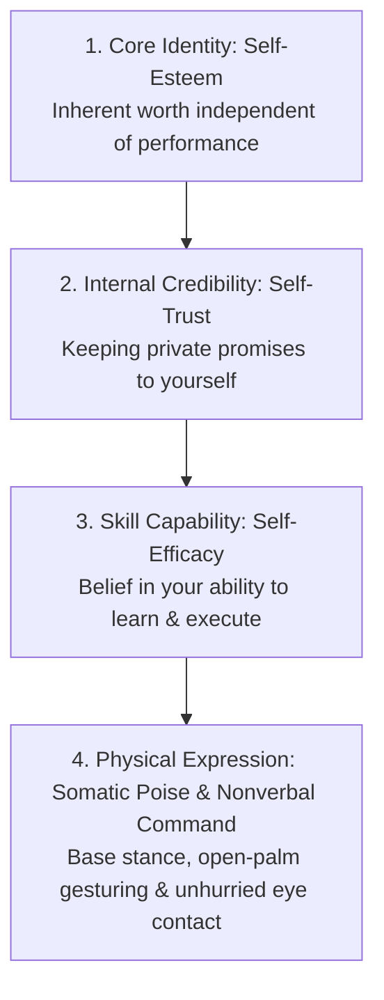
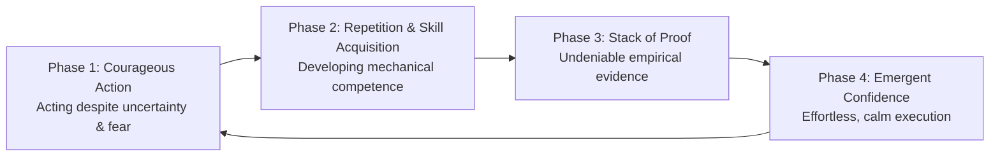
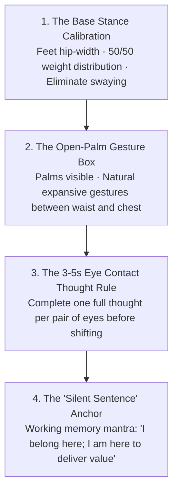
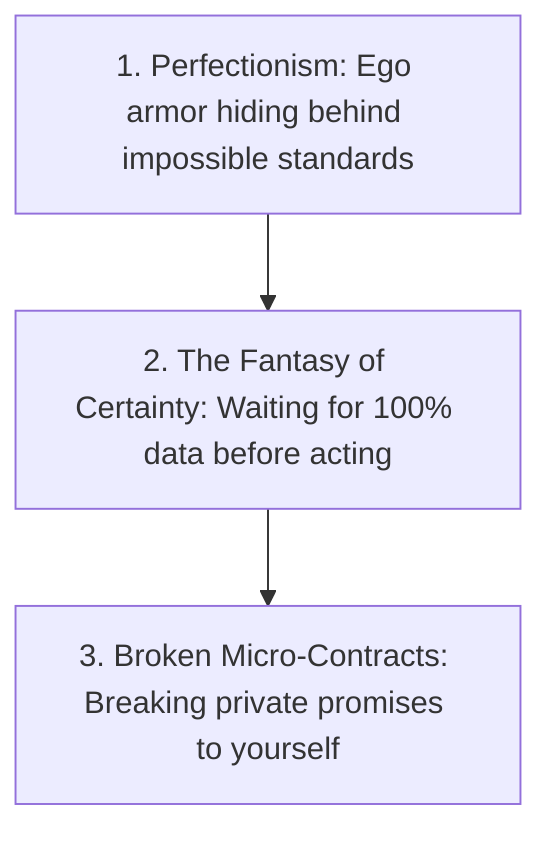
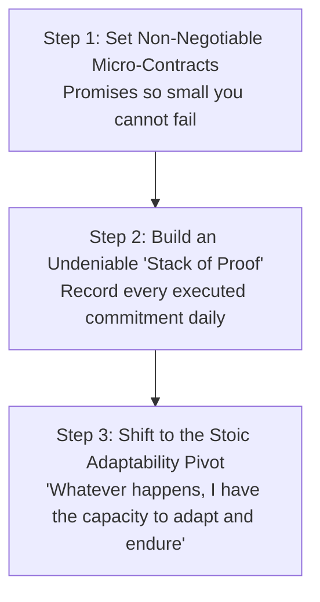

# Volume 6: Existential Sovereignty, Purpose & The Summit

## Chapter 36: The Architecture of True Confidence — Self-Efficacy, Somatic Poise & Undeniable Proof

Confidence is one of the most misunderstood concepts in human psychology. Most people view confidence as a personality trait, an emotional state of fearlessness, or a feeling you must summon *before* attempting something difficult.

In cognitive science and empirical psychology, confidence is not a feeling; it is the **emergent result of a calibrated feedback loop between competence, self-trust, somatic poise, and evidence**.

True confidence is not the belief that you will never fail, look foolish, or encounter obstacles. It is the quiet, unshakeable internal conviction: **"Whatever happens, I have the capacity to handle it."**

---

### The Four Pillars of the Confident Self

To build durable confidence, you must first distinguish between four distinct psychological layers:

1. **Self-Esteem (Inherent Worth)**: The fundamental belief that you possess value as a human being, completely detached from external accolades, status, or temporary setbacks.
2. **Self-Trust (Internal Credibility)**: The reputation you have with yourself. Every time you set an intention and keep it, self-trust compounds; every time you break a private promise, self-trust deteriorates.
3. **Self-Efficacy (Bandura’s Competence Metric)**: Your belief in your capacity to acquire skills, adapt to novel challenges, and master a specific domain through deliberate practice.
4. **Somatic Poise & Nonverbal Command**: The outward physical groundedness and biological poise displayed in real-time environments forged through deliberate nonverbal mechanics.

---

### The Competence-Confidence Loop

The fundamental paradox of human action is that people wait to *feel* confident before they begin. In reality, the neurochemical and psychological sequence flows in the exact opposite direction:

* **The Illusion of Pre-Action Confidence**: You cannot think, affirm, or visualize your way into genuine confidence. The subconscious mind cannot be tricked by hollow positive affirmations; it respects only **empirical evidence**.
* **The Role of Courage**: The entry ticket to the loop is not confidence—it is **courage**. Courage is the willingness to act when fear, awkwardness, and uncertainty are present. Once you take action, competence develops, which deposits proof into your cognitive bank account.

---

### Somatic Poise & Stanford Nonverbal Command

When walking into a high-stakes interview, meeting, or difficult conversation, your autonomic nervous system often defaults to nervous, defensive micro-movements (shifting weight, pacing, hiding hands).

You can reprogram this state through **Stanford Somatic Mechanics**:

#### 1. The Base Stance Calibration (The Physical Anchor)
* **The Technique**: Stand with your feet directly under your hips, weight balanced 50/50 between both feet. Raise both arms overhead to expand your ribcage, then let them fall naturally to your sides.
* **The Effect**: This posture eliminates nervous swaying, leg crossing, and weight shifting, instantly communicating grounded biological stability to the room.

#### 2. The Open-Palm Gesture Matrix & "The Box"
* **The Evolutionary Safety Signal**: The primitive human brain looks at hands first to verify safety. Keeping your palms open and visible signals biological transparency, honesty, and confidence.
* **The Gesture Box**: Keep your natural gestures contained between your waist and upper chest. Expansive, purposeful gestures within this zone reinforce your spoken words.
* **Banned Habits**: Avoid putting hands in pockets (signals evasion or disinterest), crossing arms (defensiveness), finger-jabbing (aggression), and the "fig leaf" clasp (submissiveness).

#### 3. The 3–5 Second Eye-Contact Thought Rule
* Nervous speakers dart their eyes rapidly across the room, projecting flight-or-flight panic.
* **The Rule**: Lock eye contact with one person, deliver **one full thought (3 to 5 seconds)**, pause, and then smoothly transition your gaze to another person for the next thought.

#### 4. The "Silent Sentence" Technique
* Performance anxiety occurs when your working memory is flooded with frantic, self-conscious thoughts (*"Do they like me? What if I stumble?"*).
* Overwrite this noise by loading a single **Silent Sentence** into your conscious awareness before speaking:
  * *"I belong in this room."*
  * *"I am here to deliver clarity, not to perform for approval."*

---

### The Three Pathologies That Destroy Confidence

1. **Perfectionism (Fear of Judgment in Disguise)**: Perfectionism is not high standards; it is a shield protecting a fragile ego. By delaying real-world exposure, it starves the brain of empirical feedback.
2. **The Fantasy of Certainty (Analysis Paralysis)**: High-agency individuals act when they have roughly **70% of the information**, trusting their real-time calibration to solve the remaining 30% along the way.
3. **Broken Micro-Contracts (Internal Credibility Bleed)**: Every time you set an alarm or schedule a study block and snooze or scroll instead, you register a private betrayal that erodes self-trust.

---

### The Protocol for Building Undeniable Confidence

1. **The Micro-Contract Rule**: Never make a promise to yourself that you are not 100% committed to keeping. If you decide to read 5 pages or do 10 pushups, treat that commitment like a legal contract.
2. **Build a "Stack of Proof"**: Document your small daily wins in a physical notebook. When imposter syndrome arises, do not rely on motivational hype—simply review the undeniable ledger of your executed work.
3. **The Core Stoic Shift**: Stop demanding that external circumstances be easy. Enter every challenge with the quiet posture: *"I do not need this to be easy; I only need to trust that whatever happens, I have the capacity to adapt, learn, and endure."*

---

### The Core Takeaway to Remember
> Confidence is not a feeling you wait for; it is the reputation you build with yourself through kept promises, paired with the somatic poise of an unhurried body. Calibrate your base stance, show your open palms, lock steady eye contact, and let your undeniable stack of proof speak for you.
