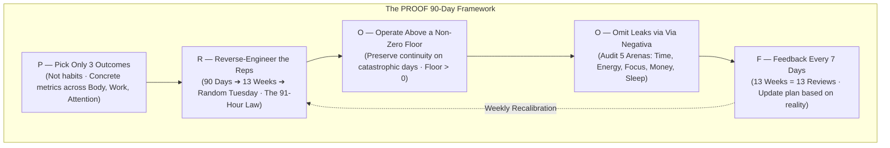
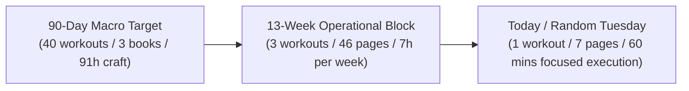
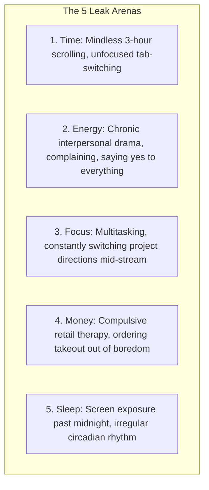
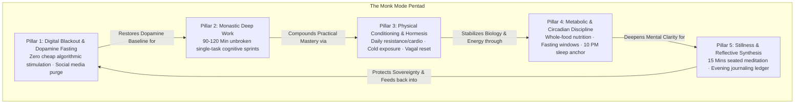
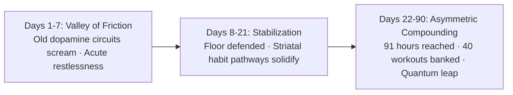
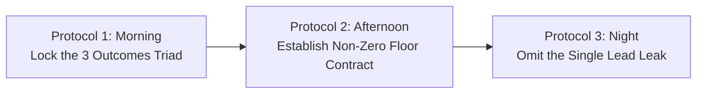

# Volume 2: Daily Systems & Habit Architecture

## Chapter 7: The High-Agency Reset — The Monk Mode Blueprint & The P-R-O-O-F 90-Day Execution Architecture

---

### 🏛️ Tier 1: The Jargon-Free Reality Bridge

Most human lives are not governed by conscious intent; they are governed by **subconscious inertia, algorithmic conditioning, and default drift**.

When an individual wakes up and immediately reaches for their smartphone, reacts to notifications, drifts through workplace obligations, and numbs exhaustion in the evening with hyper-stimulating algorithmic entertainment, they are trapped inside the **Autopilot Trap** (unregulated dominance of the Default Mode Network).

To break free from reactive drift, people often look toward seasonal resets—the "Winter Arc", "Q4 Sprint", or "Monk Mode". However, the modern internet has bastardized this concept into an unsustainable caricature.

#### The 15-Habit Internet Caricature vs. The Reality of Transformation
Every October, social media feeds flood audiences with recipes to "become unrecognizable in 90 days":
$$\text{Wake at 5:00 AM} + \text{Cold Showers} + \text{Read 10 Pages} + \text{Daily 2h Gym} + \text{Delete Apps} + \text{Drink 4L Water} + \text{Meditate} + \text{Journal}$$

* **Why the Caricature Guarantees Failure**: Executing 15 simultaneous novel habits consumes 100% of available daily metabolic glucose before your primary work even begins. By Day 15, severe prefrontal exhaustion sets in, the entire fragile architecture collapses, and the individual returns to old defaults burdened with shame.
* **The Core Axiom**: You do not need 15 simultaneous habits. You need **one deterministic execution system** that demands objective, empirical proof on Day 90 rather than fleeting emotional motivation.
* **The Paradigm Shift**: Stop staring at the 90-day mountain. Your entire mandate is to **win a random Tuesday**.

```mermaid
graph TD
    subgraph The Naive Internet Caricature (Additive Chaos)
        N1["15 Additive Habits (5 AM, Cold Showers, 4L Water, 2h Gym)"] 
        --> N2["Massive Prefrontal Metabolic Drain"]
        N2 --> N3["Exhaustion by Day 15 · Total System Abandonment"]
    end

    subgraph The PROOF Architecture (Subtractive Leverage)
        P1["3 Concrete Outcomes (Body, Work, Attention)"]
        --> P2["Reverse-Engineered to Daily Reps & Non-Zero Floor"]
        P2 --> P3["Subtractive Omission of the Lead Leak"]
        P3 --> P4["Sustained 90-Day Compounding with Weekly Feedback"]
    end
```

---

### 🔬 Tier 2: Cognitive Science, Epistemic Architecture & Mechanistic Depth

#### 1. The P-R-O-O-F 5-Step Execution System
Engineered for high-torque 90-day (13-week) sprints, the **P-R-O-O-F Architecture** strips away emotional motivation and installs a deterministic operational loop:



---

#### Step 1: P — Pick Only Three Outcomes (Not Habits)
* **Habits are Vehicles, Not Destinations**: Inquiring *"What habits should I adopt?"* is an incomplete diagnostic. The true operational inquiry is:
  > *"What must be objectively, physically different about my reality on December 31st for me to declare these 90 days an undeniable success?"*
* **The Cognitive Load Invariant (John Sweller)**: Human working memory and prefrontal executive capacity are strictly bounded. Pursuing 10 disparate goals guarantees diffuse half-effort across all fronts. Three outcomes preserve high-torque focus across three non-overlapping human domains:

| Domain | Vague / Abstract Aspiration (Discard) | Concrete Objective Metric (The Standard) |
| :--- | :--- | :--- |
| **1. The Body** | *"I want to get fit / lose weight."* | Complete **40 structured training sessions** by Day 90. |
| **2. The Work / Craft** | *"I want to get serious about my career."* | Publish **12 deep-dive case studies** OR acquire **first 2 paying clients**. |
| **3. The Attention / Mind** | *"I want to spend less time on my phone."* | Reduce daily screen time from **9 hours down to 6 hours**; finish **3 complete foundational treatises**. |

---

#### Step 2: R — Reverse-Engineer the Reps (The 91-Hour Law)
A 90-day macro target remains an intimidating, abstract fantasy unless mathematically dismantled into daily micro-quotas:



1. **Physical Deconstruction**:
   $$40 \text{ workouts} \div 13 \text{ weeks} \approx 3.07 \text{ workouts per week} \implies 3 \text{ sessions weekly}$$
2. **Intellectual Deconstruction**:
   $$3 \text{ books} \times 200 \text{ pages} = 600 \text{ pages} \div 13 \text{ weeks} \approx 46 \text{ pages/week} \implies \mathbf{6.5 \text{ pages per day}}$$
   Reading just 7 pages every afternoon guarantees finishing 3 major books in 90 days without fatigue.
3. **The 91-Hour Law of Asymmetric Craft**:
   Allocating just **60 minutes per day** to a single enterprise, code repository, or study topic yields:
   $$1 \text{ hour/day} \times 7 \text{ days} = 7 \text{ hours/week} \times 13 \text{ weeks} = \mathbf{91 \text{ Hours of Monastic Deep Work}}$$
   *91 hours of uninterrupted, deliberate practice is sufficient to build a market-ready software MVP, master an entire semester of technical syllabus, or launch a professional venture from scratch.*

---

#### Step 3: O — Operate Above a Non-Zero Floor (The Continuity Shield)
Most high-achievers fail because their systems are brittle: they design for ideal conditions and collapse during reality's inevitable crises.
* **The Ceiling vs. The Floor**:
  - *Good Days*: You operate at your ceiling (45-minute heavy lift, 2 hours deep writing, 10,000 steps).
  - *Catastrophic Days*: Power outages, family emergencies, sudden illness, or extreme travel.
* **The Non-Zero Floor Invariant**: What is your absolute non-negotiable minimum on the worst possible day?
  $$\text{The Floor can be minimal, but it CANNOT be zero: } \text{Floor} > 0$$

| Domain | The Ideal Ceiling (Good Days) | The Non-Zero Floor (Crisis Days) |
| :--- | :--- | :--- |
| **Physical Training** | 45 minutes heavy resistance | **15 minutes bodyweight mobility / push-ups** |
| **Deep Work / Study** | 2 hours intensive derivation | **20 minutes reading one core concept** |
| **Reading** | 10–15 pages | **2 pages before sleep** |
| **Movement / Walking** | 10,000 steps (45m outdoor walk) | **15 minutes brisk walking** |

* **The Neurobiology of the Floor**:
  - Skipping a day entirely grants the subconscious a "free ticket" to break the habit contract, paving the way for multi-week slumps.
  - Hitting your non-zero floor on your absolute worst day preserves **identity continuity and self-trust** (*"Even when everything went wrong, I defended the chain"*).
  - Keeps the basal ganglia striatal habit loop warm without triggering limbic resistance (Stephen Guise's Elastic Habits).

---

#### Step 4: O — Omit Leaks via Via Negativa (Subtractive Transformation)
Transformation is achieved more rapidly through **subtraction** than addition (Nassim Nicholas Taleb's *Via Negativa*):
* You often do not need another positive habit in your roster; you need **one less catastrophic default**.
* **Audit the 5 Primary Leak Arenas**:



* **The Lead Domino Diagnostic**: Identify the single leak that sabotages all others. For instance:
  $$\text{Late-night scrolling} \to \text{Destroys sleep} \to \text{Depletes morning glucose} \to \text{Paralyzes focus} \to \text{Triggers junk food craving}$$
  Eliminating that single leak produces massive downstream systemic recovery across all four other arenas.

---

#### Step 5: F — Feedback Every 7 Days (13 Weeks = 13 Reviews)
* The fundamental flaw of most plans is that they are treated as immutable constitutions rather than living operating systems.
* **The Protocol**: Every Sunday, conduct a mandatory **15-minute diagnostic review**:
  1. *What did I plan to execute this week?*
  2. *What was the objective physical reality of what occurred?*
  3. *What broke my continuity?* (Expose which of the 5 leaks infiltrated the schedule).
* If reality provides new constraints (illness, schedule changes), **you are permitted to recalibrate the 90-day plan**. An updated plan executed with precision is vastly superior to an outdated plan abandoned in shame.

---

#### 2. The Classic 5 Monk Mode Pillars (Operating Sub-Protocols)
Integrated inside the 90-day sprint, the five classical pillars of Monk Mode establish baseline biological and cognitive sovereignty:



1. **Digital Blackout (Signal Calibration)**: Total quarantine on algorithmic feeds, shorts, and frivolous group chats to allow striatal dopamine receptors to upregulate.
2. **Monastic Deep Work (Cognitive Capital)**: At least one **90 to 120-minute unbroken cognitive block** every morning before the world begins demanding your attention.
3. **Physical Conditioning & Hormesis (The Biological Anchor)**: 30 to 45 minutes of daily resistance or cardio to spike Brain-Derived Neurotrophic Factor (BDNF) and clear trapped cortisol.
4. **Metabolic & Circadian Discipline (Clean Fuel)**: Whole-food nutrition, zero refined sugar, and an 8-hour sleep window anchored at 22:00.
5. **Daily Stillness & Reflective Synthesis (Wisdom Ledger)**: 10 minutes of morning breath meditation paired with an evening ledger tracking victories, friction points, and tomorrow's single lead priority.

---

#### 3. The 21-to-90 Day Neuroplastic Arc


* **Days 1–7 (The Friction Hurdle)**: High metabolic resistance. The brain manufactures dozens of rationalizations to quit. Defending the Non-Zero Floor is paramount.
* **Days 8–21 (Stabilization)**: Routines settle. Basal ganglia habit loops fire with minimal conscious friction.
* **Days 22–90 (Asymmetric Compounding)**: The cumulative weight of the 91-Hour Law manifests. Real-world output diverges radically from peers operating on reactive drift.

---

### 🛡️ Tier 3: The Skeptic's Razor & Failure Mode Guardrails

#### Guardrail 1: The Chronic Floor Settling Trap
* **The Trap**: Using the non-zero floor (e.g., 15 minutes of exercise, 2 pages of reading) as a permanent daily excuse, never pushing toward the ceiling.
* **The Boundary**: The non-zero floor is an **emergency life-raft for crisis days**, not the baseline standard. If you operate at your floor for three consecutive weeks, your floor has become a disguised ceiling, arresting progressive adaptation.

#### Guardrail 2: The Social Isolation Fallacy
* **The Trap**: Interpreting "Monk Mode" as pathological misanthropy—burning bridges with friends, treating family as distractions, and withdrawing from human life.
* **The Correction**: Monk Mode is intentional boundary sovereignty over shallow distractions, not antisocial avoidance. Genuine relationships provide vital autonomic co-regulation and emotional resilience.

#### Guardrail 3: The Post-Sprint Rebound Binge
* **The Trap**: Completing Day 90 and immediately embarking on a week-long binge of junk food, gaming, and 12-hour screen time to "celebrate."
* **The Correction**: Controlled decompression. Shift into a sustainable maintenance protocol rather than blowing up the newly built neural architecture.

---

### 📋 Tier 4: The 24-Hour Behavioral Protocol ("The Homework")



#### 1. Protocol 1: The Outcome Triad Lock
Take an index card and define the three non-negotiable physical outcomes for your 90-day sprint across:
* **Body**: (e.g., *"40 resistance workouts logged"*).
* **Work / Craft**: (e.g., *"91 hours logged on project X"*).
* **Attention**: (e.g., *"Screen time capped under 6h; 3 treatises synthesized"*).

#### 2. Protocol 2: The Non-Zero Floor Contract
For each of the three outcomes above, establish the concrete minimum for your worst catastrophic day:
* *Training Floor*: Exactly 15 minutes of bodyweight circuits.
* *Work Floor*: Exactly 20 minutes of single-task reading or drafting.
* *Reading Floor*: Exactly 2 pages before sleep.
* Commit to the invariant: **The floor can be small, but it cannot be zero.**

#### 3. Protocol 3: The Lead Leak Subtraction
Audit the 5 arenas (Time, Energy, Focus, Money, Sleep). Identify the single lead domino behavior currently sabotaging your baseline (e.g., phone in bed past 23:00). Install an immediate environmental barrier (charge phone in another room) starting tonight.

---

### 🧠 Active Recall Flashcards

**Q1: Why does the popular internet caricature of "Monk Mode / Winter Arc" (15 simultaneous habits) almost universally cause failure?**
*Answer: Adopting 15 novel habits simultaneously imposes an insurmountable metabolic glucose drain on the prefrontal cortex. Executive stamina is depleted before primary deep work begins, leading to systemic burnout and total habit abandonment within 2 to 3 weeks.*
<!-- concept: monk-mode-internet-caricature -->

**Q2: What is the P-R-O-O-F 90-Day Execution Framework?**
*Answer: P = Pick only 3 outcomes (Body, Work, Attention); R = Reverse-engineer the reps (90 days ➔ 13 weeks ➔ random Tuesday); O = Operate above a non-zero floor; O = Omit leaks via via negativa (5 arenas); F = Feedback every 7 days (13 weekly diagnostic reviews).*
<!-- concept: proof-framework -->

**Q3: What is the "91-Hour Law of Asymmetric Craft"?**
*Answer: Committing just 60 minutes per day to a single craft or study discipline yields 7 hours per week, which compounds into 91 hours of uninterrupted deep work across a 13-week quarter. 91 monastic hours is mathematically sufficient to build an MVP, master an advanced curriculum, or launch an enterprise from scratch.*
<!-- concept: ninety-one-hour-law -->

**Q4: What is the purpose of the "Non-Zero Floor Protocol" on catastrophic days?**
*Answer: Life inevitably produces crisis days (illness, emergencies, travel). While ideal days hit the ceiling, crisis days mandate hitting a minimal non-zero floor (e.g., 15m exercise, 2 pages reading). Hitting the floor preserves identity continuity, self-trust, and basal ganglia neural pathways, preventing the subconscious from taking a "free ticket" to abandon the habit.*
<!-- concept: non-zero-floor-protocol -->

**Q5: What are the 5 Leak Arenas audited in Subtractive Transformation (Via Negativa)?**
*Answer: 1) Time (mindless scrolling); 2) Energy (complaining, people-pleasing); 3) Focus (multitasking, project-hopping); 4) Money (compulsive spending); 5) Sleep (late-night screen exposure). Eliminating the single lead domino leak creates downstream systemic recovery across all other arenas.*
<!-- concept: five-leak-arenas -->

**Q6: What three diagnostic questions must be answered during the mandatory 15-minute Sunday Feedback Review?**
*Answer: 1) What did I plan to execute this week? 2) What was the objective physical reality of what actually occurred? 3) What broke my continuity (identifying which specific leak compromised performance)?*
<!-- concept: weekly-feedback-loop -->

---

### 📚 Primary Provenance & Scientific Sources
1. **Paritosh Anand** — *watch these 21 minutes if you want to change your life in the next 90 days* ([YouTube Video `pA7eCdHaz8w`](https://www.youtube.com/watch?v=pA7eCdHaz8w)).
2. **John Sweller** — *Cognitive Load Theory & The Limits of Working Memory in Multi-Task Acquisition*.
3. **Nassim Nicholas Taleb** — *Antifragile: Things That Gain from Disorder (Via Negativa & Subtractive Epistemology)*.
4. **Brian P. Moran & Michael Lennington** — *The 12 Week Year: Get More Done in 12 Weeks than Others Do in 12 Months*.
5. **Stephen Guise** — *Elastic Habits & Mini Habits: Smaller Habits, Bigger Results (The Non-Zero Floor Mechanism)*.
6. **Dr. Sara Lazar & Harvard Neuroimaging** — *Tri-regional brain gray matter shifts in consistent mindfulness and focus protocols*.
