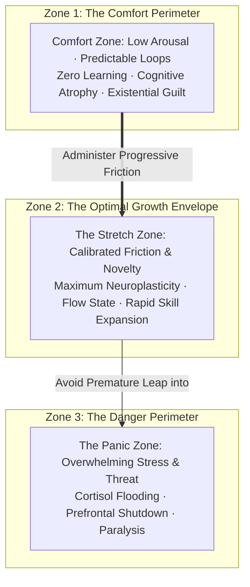
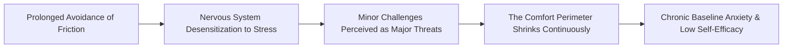
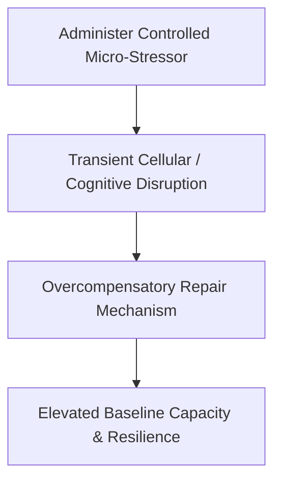
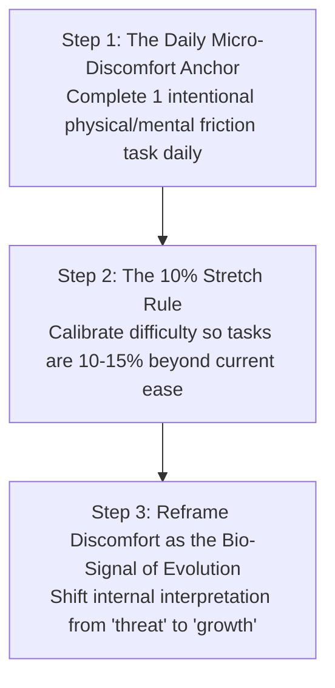

# Volume 3: Philosophy of Action & Metacognition

## Chapter 10: The Pathology of Comfort — Homeostasis, The Yerkes-Dodson Law & Progressive Friction

Most people who believe they are "lazy" are suffering from a biological misdiagnosis.

What you experience as laziness is not a character flaw or a deficiency of moral character. It is your ancient mammalian brain executing its default evolutionary directive: **energy conservation and risk minimization (homeostasis)**.

For hundreds of thousands of years, conserving calories and avoiding unknown risks were essential for biological survival. In the modern world—where calories, entertainment, and climate-controlled shelter are instantly accessible without physical danger—the brain's instinct for comfort becomes an **incubator of cognitive and existential atrophy**.

True growth occurs only when you understand the biological mechanics of the **Comfort Zone** and learn to systematically administer **Progressive Friction**.

---

### The Three Concentric Zones of Human Capacity

Human performance and neuroplastic adaptation are governed by the **Yerkes-Dodson Law of Optimal Arousal**:

1. **The Comfort Zone (Stagnation & Atrophy)**: A state of psychological and biological security where behavior is automatic and predictable. Because there is zero discrepancy between expectation and reality, the brain produces no *Error-Related Negativity (ERN)* signals, and neural pathways remain static.
2. **The Stretch Zone (Peak Adaptation)**: The precise boundary where a task exceeds current capability by roughly **10% to 15%**. In this zone, the nervous system is stimulated enough to trigger focused alertness (norepinephrine) and dopamine anticipation without overwhelming the prefrontal cortex.
3. **The Panic Zone (Burnout & Paralysis)**: When the challenge is excessively overwhelming, the amygdala activates fight-or-flight chemistry, shutting down higher-order problem-solving and causing catastrophic paralysis.

---

### The Hidden Danger of Prolonged Comfort

When an individual remains inside the comfort zone for months or years, the perimeter does not stay fixed—**it shrinks**:

* **Stress Intolerance**: The less voluntary discomfort you experience, the lower your threshold for adversity becomes. Ordinary life demands (an unexpected email, a hard exam question, a social interaction) begin to trigger acute panic.
* **The Existential Penalty (Cognitive Dissonance)**: Deep within your consciousness, you know what you are capable of achieving. When your daily actions fail to match your potential, your subconscious registers chronic guilt and self-betrayal, eroding baseline self-worth.

---

### The Law of Hormesis: Strength Through Calibrated Poison

In toxicology and physiology, **Hormesis** is the biological phenomenon whereby a beneficial effect (improved health, stress resistance, longevity) results from exposure to low, intermittent doses of an otherwise toxic or stressful agent.

* **Physical Hormesis**: Weight training micro-tears muscle fibers; the body repairs them stronger. Fasting stresses cells; the body activates autophagy (clearing cellular waste). Cold exposure spikes norepinephrine; the body increases mitochondrial density.
* **Cognitive Hormesis**: Engaging with hard, confusing problems produces temporary mental frustration; the brain responds by thickening synaptic myelination, making that complex domain intuitive over time.

---

### The 3-Step Progressive Friction Protocol

To systematically expand your comfort perimeter without triggering panic paralysis, implement the **Progressive Friction Protocol**:

#### 1. The Daily Micro-Discomfort Anchor
Every morning, deliberately introduce **one non-negotiable point of friction** that your primal brain wishes to avoid:
* A 60-second ice-cold shower at the end of your wash.
* Tackling the hardest analytical problem or chapter before checking any notifications.
* Performing a set of strenuous physical exercises immediately upon waking.
* *The Result*: By conquering friction within the first hour of the day, you inoculate your nervous system against reactive comfort-seeking for the remainder of the day.

#### 2. The 10% Stretch Rule
Never attempt a chaotic, 100% lifestyle overhaul that throws you directly into the Panic Zone. Always target the immediate perimeter of your current capability. If you study for 2 hours daily, stretch to 2 hours and 20 minutes; if you solve level-1 problems, attempt level-2 problems.

#### 3. Cognitive Re-framing of Internal Resistance
When you feel the physical sensation of dread, awkwardness, or strain, immediately label it accurately:
> *"This physical resistance is not a signal that something is wrong; it is the biological sensation of my capacity expanding."*

---

### The Core Takeaway to Remember
> Comfort is not peace; comfort is the quiet decay of your potential. You are not lazy—your evolutionary safety engine is simply unchallenged. Administer voluntary friction daily, lean into the stretch zone, and watch your boundaries expand.
