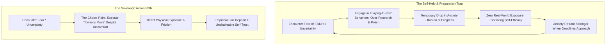
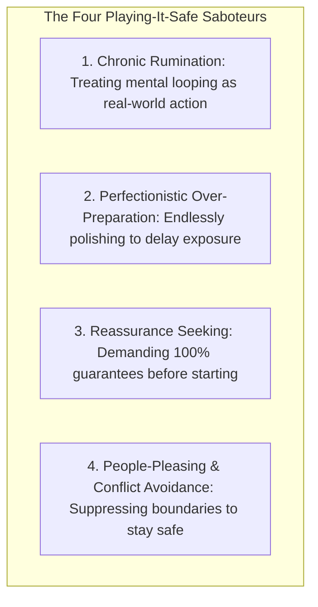
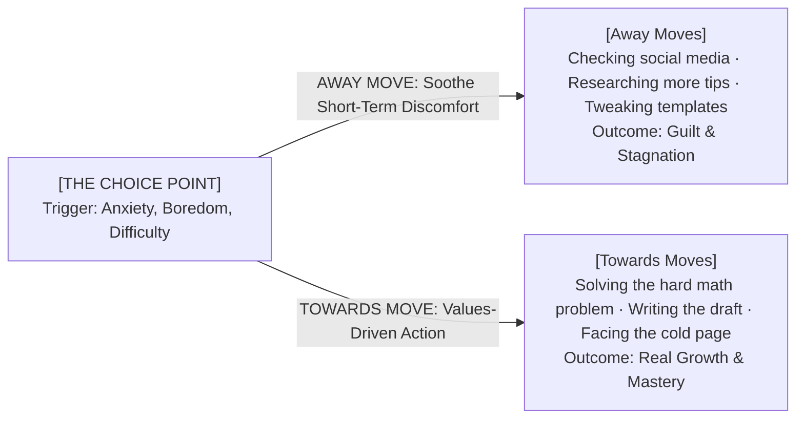
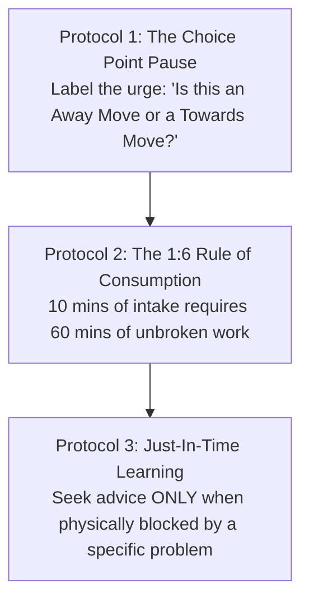
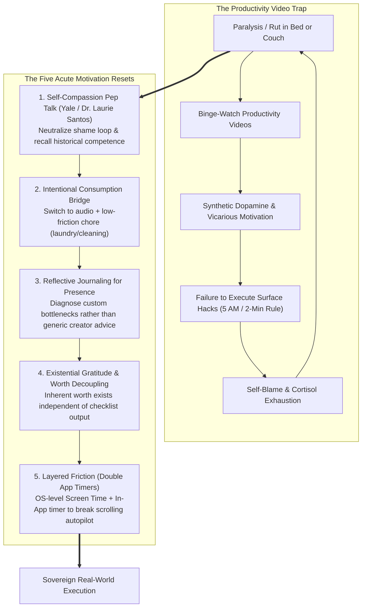

# Volume 3: Dismantling Internal Saboteurs

## Chapter 12: The Action Paradox — The Preparation Trap, The Choice Point & The Four 'Playing-It-Safe' Saboteurs

In the digital era, one of the most insidious forms of procrastination does not disguise itself as video games or television. It disguises itself as **self-improvement and "careful preparation."**

Millions of people spend hours every week consuming productivity videos, researching strategies, organizing templates, and endlessly tweaking plans. While this behavior feels virtuous and responsible, clinical psychology and behavioral science reveal that excessive preparation often functions as a **subconscious anxiety-avoidance mechanism**.

When you over-prepare or ruminate, your brain experiences **Vicarious Accomplishment**—it mistaking the *simulation of growth* for the *reality of execution*.

Understanding the **Action Paradox** and mastering the **Acceptance and Commitment (ACT) Choice Point** allows you to dismantle the four "playing-it-safe" saboteurs and anchor your life in values-driven execution.

---

### The Anatomy of Vicarious Accomplishment



---

### The Four "Playing-It-Safe" Saboteurs

Human beings do not procrastinate because they are lazy; they engage in **"Playing-It-Safe" behaviors** to temporarily soothe unhandled anxiety:



1. **Chronic Rumination (The Simulation Trap)**: Believing that thinking through 50 worst-case scenarios is equivalent to solving a problem. Rumination is passive mental looping that drains glucose without producing a single physical result.
2. **Perfectionistic Over-Preparation (Ego Shield)**: Reading five more books, watching three more courses, or color-coding notes to delay putting your work into the real world where it can be judged.
3. **Reassurance Seeking**: Demanding constant validation from mentors, peers, or checklists before making a decision.
4. **The Short-Term Tradeoff**: Playing-it-safe behaviors work brilliantly in the short term because they lower your immediate anxiety. But they construct a long-term psychological prison, trading acute discomfort for chronic stagnation.

---

### The ACT Choice Point: "Away Moves" vs. "Towards Moves"

Whenever you sit down to work and feel the sting of uncertainty, self-doubt, or difficulty, you arrive at a **Choice Point**:



* **Away Moves**: Any behavior driven by the desire to escape internal discomfort (scrolling, researching, tweaking templates, snacking). It moves you away from your values and latent potential.
* **Towards Moves**: Any action aligned with your core values and mission, executed **in the presence of internal discomfort**.
* **The Principle of Willingness**: You do not need to wait until fear, self-doubt, or resistance vanishes before taking action. You only need the **willingness** to allow the uncomfortable physical sensations to exist while your hands continue to execute your Towards Moves.

---

### Motion vs. Action: The Critical Distinction

```mermaid
graph LR
    subgraph Motion (Low Stakes · Zero Progress)
        M1[Color-coding schedules]
        M2[Organizing Notion templates]
        M3[Watching study method videos]
        M4[Debating study strategies]
    end

    subgraph Action (High Stakes · Asymmetric Progress)
        A1[Solving 20 hard practice questions]
        A2[Writing 1,000 words of synthesis]
        A3[Active blank-page recall drill]
        A4[Submitting your work in public]
    end

    M1 & M2 & M3 & M4 -.->|Can NEVER deliver an outcome alone| ZERO[Zero Result]
    A1 & A2 & A3 & A4 ==>|Directly creates tangible reality| VALUE[Breakthrough Result]
```

* **Motion**: Actions that prepare, plan, or organize for a task. Motion feels productive and carries zero risk of failure, but it will never produce an outcome on its own.
* **Action**: Direct, friction-filled execution that delivers a measurable result. Action exposes you to the possibility of error, which is why the comfort-seeking brain constantly attempts to substitute Motion for Action.

---

### The Protocols for Restoring Action Sovereignty



#### 1. The Choice Point Micro-Pause
When you feel the sudden impulse to switch tabs, read another article, or reorganize your workspace, pause for 3 seconds and ask:
> *"Is this action an Away Move to soothe my temporary anxiety, or a Towards Move that builds my craft?"*

#### 2. The 1:6 Consumption-to-Execution Ratio
For every 10 minutes of educational or tactical advice you consume, you must invest at least **60 minutes of active, distraction-free execution** before consuming another byte.

#### 3. Just-In-Time Learning
Shift from *Just-In-Case Information Hoarding* to *Just-In-Time Learning*: Consume information **only when you are currently sitting at your desk and hit a concrete, technical bottleneck**. Find the specific answer, close the browser, and return to execution.

---

### The Acute Motivational Reset: Escaping the Productivity Consumption Loop

In her synthesis on high-performance execution under chronic physical constraints (managing migraines while achieving a 4.0 in Chemical Engineering at Caltech), **Amy Wang** deconstructs why standard productivity advice utterly fails when an individual is trapped in a low-motivation paralysis state.



#### 1. The Paradox of Productivity Bingeing
Aspirants frequently find themselves immobilized in bed or on a couch, seeking motivation by binge-watching videos on time-blocking, waking up at 5:00 AM, or following the "2-minute rule."
* **Why Surface Advice Fails**: These tactics presuppose an active, functional baseline of emotional energy. When an individual is suffering from cognitive exhaustion, limbic paralysis, or identity shame, surface-level behavioral commands generate insurmountable friction.
* **The Self-Criticism Energy Drain**: Attempting to force motivation through internal hostility (*"Why am I so pathetic? Why can't I just sit down and work?"*) stimulates the sympathetic nervous system and triggers a continuous cortisol drip. This burns scarce prefrontal glucose, paralyzing executive function and reinforcing the craving for passive video escapism.

#### 2. The Five Resets for Acute Inertia

##### 1. The Self-Compassion Pep Talk (Dr. Laurie Santos / Yale)
* **The Clinical Principle**: According to research from Dr. Laurie Santos (Yale University's Science of Well-Being), self-compassion is a biological prerequisite for behavioral activation, not an indulgence.
* **The Execution**: Close your eyes in whatever position you are currently in. Act as your own dedicated cheerleader and best friend. State with calm authority: *"What I am experiencing is completely normal. Struggling is part of the process."*
* **Custom Competence Anchoring**: Actively retrieve specific historical evidence of your resilience: *"Remember how difficult that advanced mathematics paper or mock test felt before you mastered it? You have solved hard problems before. You can do hard things again."*

##### 2. The Intentional Consumption Bridge
* Rather than demanding a violent, shock transition from lying down straight into grueling intellectual work, build a **gradual physical bridge**:
* **Audio Switch + Low-Friction Chores**: Switch from visual video scrolling to long-form audio (an insightful podcast or audio lecture). Stand up and begin a mindless, low-friction domestic chore (doing laundry, washing dishes, or clearing the desk) **while the audio continues playing**.
* **The Kinetic Mechanism**: Somatic movement activates motor cortex circuits and elevates dopamine baselines naturally without the anxiety of opening a difficult textbook. Once the body is physically moving, transitioning to the desk requires a fraction of the original activation energy.
* **Structured Sequential Media**: When consuming instructional content, replace open algorithmic video feeds with structured, progressive curricula where each chapter demands verifiable output.

##### 3. Reflective Journaling for Autonomous Problem-Solving
* **The Creator Bottleneck**: Online productivity creators do not know your unique cognitive profile, your specific syllabus, or your emotional bottlenecks. Consuming more external content keeps you dependent on foreign models.
* **Problem-Solving Through Presence**: Writing in an analog journal forces radical presence (*The 7 Habits: Be Proactive*). It externalizes unformed subconscious dread into concrete linguistic variables, allowing you to identify the *single real obstacle* stopping you today and customize a localized solution.

##### 4. Existential Gratitude & Decoupling Self-Worth from Productivity
* **Contingent vs. Existential Gratitude**: Conventional gratitude is outcome-dependent (*"I am grateful because good things occurred"*). Existential gratitude is unconditional appreciation for things **simply existing**.
* **Worth Decoupling**: Your inherent worth as a human being is foundational; it is not earned by completing a to-do list, nor is it destroyed by an unproductive afternoon. When self-worth is tied to productivity, starting a difficult task carries the existential risk of confirming inadequacy. Decoupling self-worth eliminates the terror of failure, dissolving task avoidance.

##### 5. Layered Digital Friction & Double App Timers
* **The Scarcity Law of Value**: The digital internet offers infinite, boundless content. Because it is infinite, consuming it yields near-zero value. In contrast, human biological existence is strictly bounded and scarce. Losing 5 to 6 hours daily to screen time translates to surrendering entire years of cognitive life.
* **The Double App Timer Protocol**: Single app timers are routinely bypassed through habituated muscle memory. Deploy **Layered Friction**:
  1. *Layer 1 (OS Level)*: Configure an operating-system time limit (iOS Screen Time / Android Digital Wellbeing).
  2. *Layer 2 (In-App Level)*: Set an independent internal timer directly within the application settings (e.g. Instagram Daily Limit).
  * Confronting two consecutive, independent friction screens interrupts dopamine-seeking autopilot, giving prefrontal awareness the crucial 3-second window required to close the app and return to the real world.

---

### The Core Takeaway to Remember
> Stop using preparation as a shield against the vulnerability of action. Recognize the four playing-it-safe saboteurs, pause at the Choice Point, develop the willingness to carry discomfort, and execute your Towards Moves with relentless devotion to your craft.

