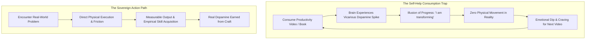
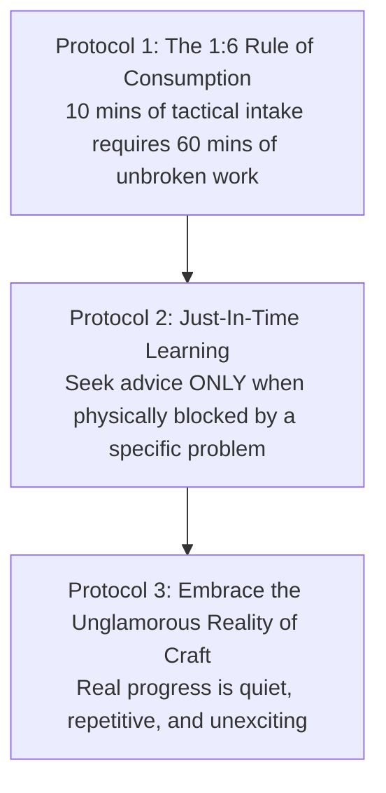

# Volume 3: Philosophy of Action & Metacognition

## Chapter 16: The Action Paradox — The Illusion of Preparation & The Trap of Vicarious Progress

In the digital era, one of the most insidious forms of procrastination does not disguise itself as video games or television. It disguises itself as **self-improvement**.

Millions of people spend hours every week consuming productivity videos, study routine vlogs, habit guides, and motivational speeches. While this behavior feels virtuous and ambitious, cognitive psychology reveals that excessive consumption of self-help often functions as an **action-avoidance mechanism**.

When you watch someone explain how to build discipline or organize a master routine, your brain's reward centers release dopamine as if you had achieved something tangible. This phenomenon is known as **Vicarious Accomplishment**. The brain mistakes the *simulation of growth* for the *reality of execution*, leaving you intellectually stimulated but practically stagnant.

Understanding the **Action Paradox** allows you to break the loop of perpetual preparation and anchor your life in raw execution.

---

### The Anatomy of Vicarious Accomplishment



* **The Action-Simulation Trap**: Your subconscious mind cannot easily distinguish between vivid mental simulation and actual physical experience. Watching someone perform deep work gives you 30% of the neurochemical reward with 0% of the cognitive struggle.
* **The Tolerance Curve**: When you rely on external motivational videos to summon the energy to work, your nervous system develops **motivational tolerance**. Over time, ordinary tasks feel painfully impossible without an external emotional catalyst.

---

### Motion vs. Action: The Critical Distinction

In behavioral science, human effort is divided into two fundamentally different categories:

```mermaid
graph LR
    subgraph Motion (Low Stakes · Zero Progress)
        M1[Color-coding schedules]
        M2[Organizing Notion templates]
        M3[Watching study method videos]
        M4[Debating study strategies]
    end

    subgraph Action (High Stakes · Asymmetric Progress)
        A1[Solving 20 hard practice questions]
        A2[Writing 1,000 words of synthesis]
        A3[Active blank-page recall drill]
        A4[Cold-calling a prospective client]
    end

    M1 & M2 & M3 & M4 -.->|Can NEVER deliver an outcome alone| ZERO[Zero Result]
    A1 & A2 & A3 & A4 ==>|Directly creates tangible reality| VALUE[Breakthrough Result]
```

* **Motion**: Actions that prepare, plan, or organize for a task. Motion feels productive and carries zero risk of failure or judgment, but it will never produce an outcome on its own.
* **Action**: Direct, friction-filled execution that delivers a tangible, measurable result. Action exposes you to the possibility of error, which is why the comfort-seeking brain constantly attempts to substitute Motion for Action.

---

### The Three Pathologies of the Professional Learner

1. **The Fantasy of Total Preparation**: The belief that you must read three more books or watch five more lectures before you are "ready" to start. In complex systems, real competence is only forged through real-time feedback loops. You do not learn to swim by reading books on hydrodynamics on dry land; you learn by entering the water.
2. **Emotional Dependency (The Motivation Crutch)**: Treating motivation as a prerequisite for work. High performers do not wait to feel inspired; they view work as a deterministic contract with their identity, executing regardless of whether their mood is high or low.
3. **Information Hoarding (Passive Consumption)**: Collecting hundreds of bookmarks, articles, and saved videos that are never applied. Information that is not tested through physical execution rapidly decays into cognitive clutter.

---

### The Three Protocols for Restoring Action Sovereignty



---

#### 1. The 1:6 Consumption-to-Execution Ratio
Establish an unbreakable rule: **For every 10 minutes of educational or tactical advice you consume, you must invest at least 60 minutes of active, distraction-free execution before consuming another byte.**

---

#### 2. Just-In-Time Learning (The Closed Diet)
Shift from *Just-In-Case Information Hoarding* (watching random advice about things you might do someday) to *Just-In-Time Learning*:
* Consume information **only when you are currently sitting at your desk and hit a concrete, technical roadblock**.
* Find the specific answer, close the browser immediately, and return to physical execution.

---

#### 3. Embracing the Unglamorous Reality of Craft
Real progress does not look like an epic movie montage with dramatic music.
* True mastery is **quiet, repetitive, boring, and emotionally unremarkable**.
* It is sitting alone in a quiet room, struggling through a confusing chapter, writing simple code, or solving equations on paper. The moment you make peace with the ordinariness of daily execution, the urge to escape into motivational entertainment dissolves.

---

### The Core Takeaway to Remember
> Self-help becomes a trap the moment it replaces the work itself. Stop watching other people build their lives; close the video, step onto the field, embrace the friction of raw execution, and let your results speak for themselves.
