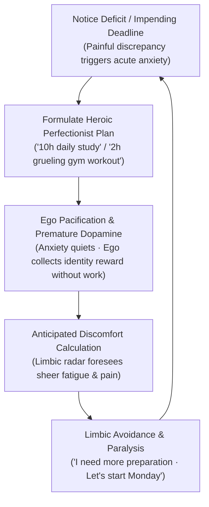
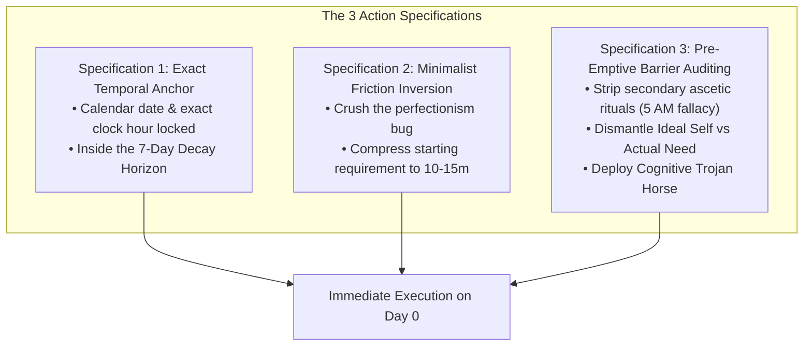
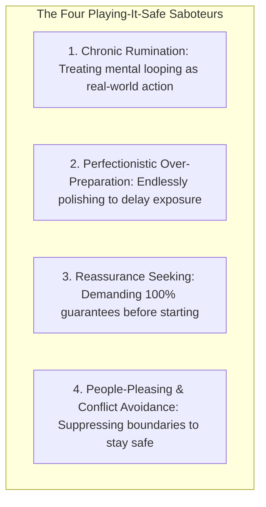
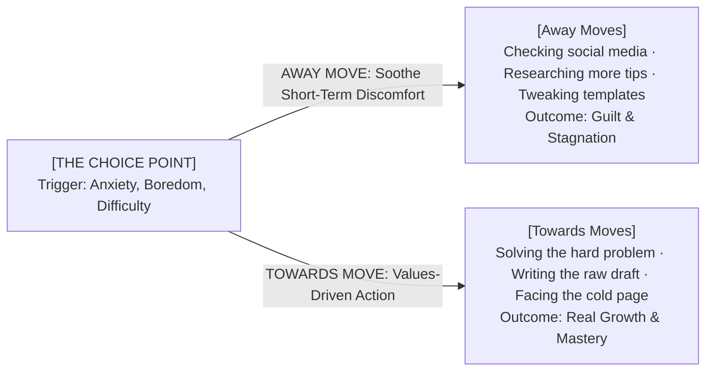
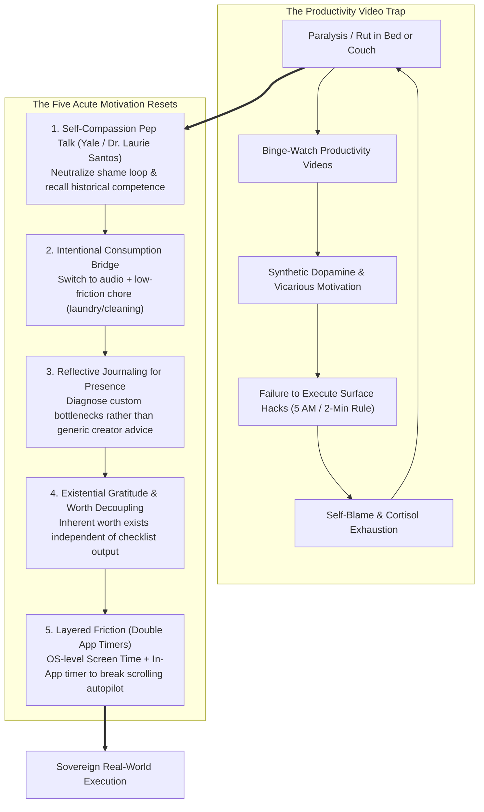
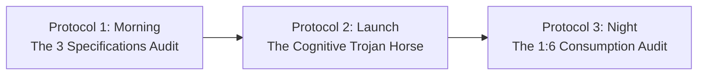

# Volume 3: Dismantling Internal Saboteurs

## Chapter 12: The Action Paradox — The Preparation Trap, The Choice Point & The Architecture of Execution Initiation

---

### 🏛️ Tier 1: The Jargon-Free Reality Bridge

In the digital era, one of the most insidious forms of procrastination does not disguise itself as video games, television, or mindless leisure. It disguises itself as **self-improvement, meticulous planning, and "careful preparation."**

Millions of people spend countless hours consuming productivity videos, researching optimal timetables, downloading Notion templates, and organizing color-coded schedules. While this behavior feels virtuous and responsible, clinical psychology and behavioral economics reveal that excessive preparation functions as a **subconscious anxiety-avoidance mechanism**.

When you over-prepare, plan endlessly, or ruminate, your brain experiences **Vicarious Accomplishment**—it mistakes the *simulation of growth* for the *reality of execution*.

#### The Core Paradox: Knowledge vs. Behavioral Initiation
The primary struggle of modern intellectual workers and students is almost never an information deficit; it is an **execution initiation failure**:
* You already know the textbook you must read, the exam syllabus you must complete, the physical training you must undergo, or the project you must launch.
* Yet, when the clock strikes to begin, you freeze, experience a wave of heavy friction, or drift into passive distraction.
* Why does knowing *what* to do fail to translate into *doing* it?

#### The Ego-Soothing Planning Trap: The Neurological Counter-Intuition
Why do humans formulate massive, heroic plans only to abandon them within 48 hours?
1. **The Emergence of Acute Anxiety**: You notice personal weakness, a looming deadline, or an unfinished syllabus. Your brain registers a painful discrepancy between where you are and where you should be, inducing acute psychological tension.
2. **The Fictitious Resolution (Planning as Ego Pacification)**: To soothe this pain, you decide: *"Starting tomorrow, I will study 10 hours every single day,"* or *"Starting Monday, I will go to the gym for 2 hours daily."*
3. **Premature Dopaminergic Discharge (Symbolic Self-Completion)**: The moment that sweeping, perfectionist plan is locked, your nervous system immediately relaxes. The acute anxiety vanishes. Your ego (*Aham*) feels virtuous because it now views itself as an elite, disciplined practitioner.
4. **The False Sense of Completion**: The brain mistakes the *formulation of the plan* for the *execution of the work*. The ego has already collected its identity reward without having lifted a single weight or solved a single equation.
5. **The Discomfort Penalty**: When the actual hour arrives, the brain calculates the sheer agony, cold mornings, and metabolic exhaustion of the 2-hour workout or 10-hour study block. The limbic system immediately triggers avoidance: *"Let's start fresh next Monday instead."*

```mermaid
graph TD
    A["Notice Deficit / Impending Deadline<br/>(Painful discrepancy triggers acute anxiety)"] 
    --> B["Formulate Heroic Perfectionist Plan<br/>('10h daily study' / '2h grueling gym workout')"]
    B --> C["Ego Pacification & Premature Dopamine<br/>(Anxiety quiets · Ego collects identity reward without work)"]
    C --> D["Anticipated Discomfort Calculation<br/>(Limbic radar foresees sheer fatigue & pain)"]
    D --> E["Limbic Avoidance & Paralysis<br/>('I need more preparation · Let's start Monday')"]
    E --> A
```

---

### 🔬 Tier 2: Cognitive Science, Epistemic Architecture & Mechanistic Depth

#### 1. The Three Mandatory Specifications for Behavioral Initiation
To bypass the ego-soothing planning trap, any task you intend to initiate must satisfy three non-negotiable operational specifications:

```mermaid
flowchart TD
    subgraph The 3 Action Specifications
        S1["Specification 1: Exact Temporal Anchor<br/>• Calendar date & exact clock hour locked<br/>• Inside the 7-Day Decay Horizon"]
        S2["Specification 2: Minimalist Friction Inversion<br/>• Crush the perfectionism bug<br/>• Compress starting requirement to 10-15m"]
        S3["Specification 3: Pre-Emptive Barrier Auditing<br/>• Strip secondary ascetic rituals (5 AM fallacy)<br/>• Dismantle Ideal Self vs Actual Need<br/>• Deploy Cognitive Trojan Horse"]
    end
    S1 & S2 & S3 --> EXEC["Immediate Execution on Day 0"]
```

##### Specification 1: The Exact Temporal Anchor & The 7-Day Decay Horizon
* **The Vulnerability of Vagueness**: Stating *"I need to start studying modern history soon"* is a psychological declaration of surrender. Vagueness guarantees procrastination.
* **The Anchor Formula**: You must lock the **exact calendar date and clock hour** (e.g., *"Tuesday at 16:30"*). This establishes what Dr. Peter Gollwitzer defines as an **Implementation Intention** ($[X \text{ situation}] \to [Y \text{ behavioral response}]$).
* **The 7-Day Decay Law**: The probability of executing any planned task decreases exponentially with every day of delay. If an action is not initiated within 7 days of conception (or ideally on Day 0), execution probability collapses toward zero.

##### Specification 2: Minimalist Friction Inversion (Crushing the Perfectionism Bug)
* **The Perfectionism Bug**: Perfectionism demands starting under idealized conditions—the perfect hour, a clean desk, a 2-hour uninterrupted block.
* **The Discomfort Penalty**: Because a 2-hour workout or a 4-hour study block requires immense metabolic energy and physiological discomfort, the brain's survival machinery flags it as a threat and generates acute task aversion.
* **The Antidote (Radical Volume Minimization)**: Strip away the anticipated agony by reducing the opening requirement to a non-threatening micro-slice: **10 to 15 minutes**.
  * *"I am not working out for 2 hours; I am exercising for 10 minutes."*
  * *"I am not reading for 4 hours; I am reading for 15 minutes."*
* Minimizing the initial volume drops cognitive friction below the activation threshold, allowing momentum to take over.

##### Specification 3: Pre-Emptive Barrier Auditing & Subtractive Problem Solving
Before launching, conduct a pre-mortem on the specific friction points that will sabotage execution:
1. **Dismantling Secondary Ascetic Distractions (The 5 AM Fallacy)**:
   - A common barrier: *"I want to study, but I can't wake up at 5:00 AM."*
   - **The Diagnostic Razor**: Ask yourself: *Is your primary goal waking up early, or is your primary goal studying the material?*
   - Stop attaching unneeded ascetic rituals (cold showers, 5 AM alarms) to the core craft. If waking up at 5 AM creates friction that prevents studying, **discard the 5 AM rule entirely**. Study whenever you wake up. Never allow a secondary ritual to sabotage the primary objective.
2. **The "Ideal Self" Illusion vs. The Actual Functional Need**:
   - Most people fail because they are attempting to inhabit an imaginary mental avatar (**The Ideal Self**)—a romanticized image of who they *ought* to be (Dr. E. Tory Higgins' Self-Discrepancy Theory).
   - The Ideal Self is a mental fabrication. Striving to sustain this grand image creates massive cognitive friction and inevitable burnout.
   - **Shift to the Actual Functional Need**: Strip away the romanticized identity. Why do you actually need this task done? (*"I need to understand this mathematical concept so I can clear the exam."*) When you tether action to cold pragmatic reality rather than ego inflation, resistance evaporates.
3. **The Cognitive Trojan Horse (Deceiving Autobiographical Pain Memory)**:
   - When you tell your brain, *"I must go do a brutal leg workout,"* the brain scans autobiographical memory (Dr. Antonio Damasio's Somatic Marker Hypothesis), recalls the lactic acid burn, dizziness, and exhaustion, and immediately generates an urge to seek pleasurable avoidance (scrolling, snacking).
   - **The Trojan Horse Strategy**: Hide the discomfort by presenting the brain with an innocuous physical movement that registers zero threat:
     - *"I am not working out; I am just putting on my shoes and walking through the gym doors."*
     - *"I am not studying 100 pages; I am just sitting in the chair and opening the book."*
   - The brain cannot detect threat or suffering in simply sitting on a chair. Once your physical body is in the environment, context cues and physical momentum take over.

---

#### 2. The Four "Playing-It-Safe" Saboteurs
Human beings do not procrastinate because they are lazy; they engage in **"Playing-It-Safe" behaviors** to temporarily soothe unhandled anxiety:

```mermaid
graph TD
    subgraph The Four Playing-It-Safe Saboteurs
        S1["1. Chronic Rumination: Treating mental looping as real-world action"]
        S2["2. Perfectionistic Over-Preparation: Endlessly polishing to delay exposure"]
        S3["3. Reassurance Seeking: Demanding 100% guarantees before starting"]
        S4["4. People-Pleasing & Conflict Avoidance: Suppressing boundaries to stay safe"]
    end
```

1. **Chronic Rumination (The Simulation Trap)**: Believing that thinking through 50 worst-case scenarios is equivalent to solving a problem. Rumination is passive mental looping that drains glucose without producing a single physical result.
2. **Perfectionistic Over-Preparation (Ego Shield)**: Reading five more books, watching three more courses, or color-coding notes to delay putting your work into the real world where it can be judged.
3. **Reassurance Seeking**: Demanding constant validation from mentors, peers, or checklists before making a decision.
4. **The Short-Term Tradeoff**: Playing-it-safe behaviors work brilliantly in the short term because they lower your immediate anxiety. But they construct a long-term psychological prison, trading acute discomfort for chronic stagnation.

---

#### 3. The ACT Choice Point: "Away Moves" vs. "Towards Moves"
Whenever you sit down to work and feel the sting of uncertainty, self-doubt, or difficulty, you arrive at a **Choice Point** (Acceptance and Commitment Therapy):

```mermaid
graph LR
    CP["[THE CHOICE POINT]<br/>Trigger: Anxiety, Boredom, Difficulty"]
    -->|AWAY MOVE: Soothe Short-Term Discomfort| AM["[Away Moves]<br/>Checking social media · Researching more tips · Tweaking templates<br/>Outcome: Guilt & Stagnation"]
    
    CP -->|TOWARDS MOVE: Values-Driven Action| TM["[Towards Moves]<br/>Solving the hard problem · Writing the raw draft · Facing the cold page<br/>Outcome: Real Growth & Mastery"]
```

* **Away Moves**: Any behavior driven by the desire to escape internal discomfort (scrolling, researching, tweaking templates, snacking). It moves you away from your values and latent potential.
* **Towards Moves**: Any action aligned with your core values and mission, executed **in the presence of internal discomfort**.
* **The Principle of Willingness**: You do not need to wait until fear, self-doubt, or resistance vanishes before taking action. You only need the **willingness** to allow the uncomfortable physical sensations to exist while your hands continue to execute your Towards Moves.

---

#### 4. Motion vs. Action: The Critical Distinction

```mermaid
graph LR
    subgraph Motion (Low Stakes · Zero Progress)
        M1[Color-coding schedules]
        M2[Organizing Notion templates]
        M3[Watching study method videos]
        M4[Debating study strategies]
    end

    subgraph Action (High Stakes · Asymmetric Progress)
        A1[Solving 20 hard practice questions]
        A2[Writing 1,000 words of synthesis]
        A3[Active blank-page recall drill]
        A4[Submitting your work in public]
    end

    M1 & M2 & M3 & M4 -.->|Can NEVER deliver an outcome alone| ZERO[Zero Result]
    A1 & A2 & A3 & A4 ==>|Directly creates tangible reality| VALUE[Breakthrough Result]
```

* **Motion**: Actions that prepare, plan, or organize for a task. Motion feels productive and carries zero risk of failure, but it will never produce an outcome on its own.
* **Action**: Direct, friction-filled execution that delivers a measurable result. Action exposes you to the possibility of error, which is why the comfort-seeking brain constantly attempts to substitute Motion for Action.

---

#### 5. The Immediate Execution Protocol for Video & Knowledge Ingestion
Consuming high-signal lectures or reading treatises without immediate behavioral translation is merely another disguised form of vicarious accomplishment:
* **The Ingestion Protocol**:
  1. Conclude the lecture or video.
  2. Close all browser tabs and sit with an analog notebook.
  3. Execute an **Active Retrieval Drill**: Extract exactly 2 to 3 high-leverage principles from memory.
  4. Formulate the 3 Specifications: **When?** (exact calendar hour), **How?** (minimalist 10-minute slice), **Barriers?** (pre-emptive fixes).
  5. Begin physical execution on that very day (**Day 0**).

---

#### 6. The Acute Motivational Reset: Escaping the Productivity Consumption Loop
In her synthesis on high-performance execution under chronic physical constraints (managing migraines while achieving a 4.0 in Chemical Engineering at Caltech), **Amy Wang** deconstructs why standard productivity advice fails when an individual is trapped in an acute low-motivation rut:

```mermaid
flowchart TD
    subgraph SG_Consumption_Trap ["The Productivity Video Trap"]
        A["Paralysis / Rut in Bed or Couch"] --> B["Binge-Watch Productivity Videos"]
        B --> C["Synthetic Dopamine & Vicarious Motivation"]
        C --> D["Failure to Execute Surface Hacks (5 AM / 2-Min Rule)"]
        D --> E["Self-Blame & Cortisol Exhaustion"]
        E --> A
    end

    subgraph SG_Amy_Wang_Resets ["The Five Acute Motivation Resets"]
        R1["1. Self-Compassion Pep Talk (Yale / Dr. Laurie Santos)<br/>Neutralize shame loop & recall historical competence"]
        R2["2. Intentional Consumption Bridge<br/>Switch to audio + low-friction chore (laundry/cleaning)"]
        R3["3. Reflective Journaling for Presence<br/>Diagnose custom bottlenecks rather than generic creator advice"]
        R4["4. Existential Gratitude & Worth Decoupling<br/>Inherent worth exists independent of checklist output"]
        R5["5. Layered Friction (Double App Timers)<br/>OS-level Screen Time + In-App timer to break scrolling autopilot"]
    end

    A ==> R1
    R1 --> R2
    R2 --> R3
    R3 --> R4
    R4 --> R5
    R5 ==> F["Sovereign Real-World Execution"]
```

1. **Self-Compassion Pep Talk (Dr. Laurie Santos / Yale)**: Neutralize the shame drip by acknowledging difficulty and retrieving historical proof of competence (*"You have solved hard problems before. You can do hard things again"*).
2. **The Intentional Consumption Bridge**: Switch from visual feeds to audio lectures while executing a low-friction physical domestic chore (dishes, laundry). Somatic movement naturally raises motor dopamine, lowering the activation energy required to sit at the desk.
3. **Reflective Journaling for Presence**: Externalize unformed subconscious dread into concrete linguistic variables on paper, diagnosing the single real bottleneck stopping you today.
4. **Existential Gratitude & Worth Decoupling**: Decouple fundamental human worth from daily checklist output. When self-worth is not on the line, starting carries zero existential dread.
5. **Layered Digital Friction**: Combine OS-level limits with in-app timers to generate the essential 3-second prefrontal interruption window.

---

### 🛡️ Tier 3: The Skeptic's Razor & Failure Mode Guardrails

#### Guardrail 1: The 7-Day Decay Horizon Boundary
* **The Trap**: Assuming that because a 7-day window exists, one can safely procrastinate until Day 6.
* **The Empirical Reality**: Implementation intention fidelity decays rapidly within the first **24 to 48 hours**. Day 7 is the absolute outer decay horizon before total entropy sets in; Day 0 initiation remains the gold standard.

#### Guardrail 2: The Limits of the 3-Second Rule
* **The Trap**: Believing that counting down *"5-4-3-2-1"* or pausing for 3 seconds will resolve deep structural incompetence or severe physiological burnout.
* **The Boundary**: The 3-second pause is strictly an **attentional circuit breaker** for acute motor hesitation (e.g., getting out of bed, closing a browser tab). It cannot substitute for cognitive skill architecture, proper sleep physiology, or project deconstruction.

#### Guardrail 3: Over-Minimization Stagnation
* **The Trap**: Using the 10-minute micro-contract to permanently engage in trivial, low-effort work without ever scaling volume.
* **The Correction**: The 10-minute threshold is strictly a **launch vehicle** to bypass limbic threat detection. Once physical momentum and the Zeigarnik Effect engage, you must allow focus to compound into full 60-to-90 minute deep work blocks.

---

### 📋 Tier 4: The 24-Hour Behavioral Protocol ("The Homework")

```mermaid
graph LR
    P1["Protocol 1: Morning<br/>The 3 Specifications Audit"] --> P2["Protocol 2: Launch<br/>The Cognitive Trojan Horse"]
    P2 --> P3["Protocol 3: Night<br/>The 1:6 Consumption Audit"]
```

#### 1. Protocol 1: The Three Specifications Action Lock
Select the single project or syllabus module you have been avoiding this week. Write down the three specifications on an index card:
* **When?**: Lock the exact date and clock time (e.g., *"Today at 15:00"*).
* **How?**: Contract for a non-threatening 15-minute micro-slice.
* **Barriers?**: Identify the primary friction point (e.g., phone in hand, or belief that you must wake up early) and execute subtractive elimination.

#### 2. Protocol 2: Deploying the Cognitive Trojan Horse
When the scheduled hour arrives and you feel the familiar wave of visceral resistance:
* Explicitly tell your brain: *"I am not executing the whole project; I am only sitting on this chair and opening page 1."*
* Physically position your body in the execution environment. Allow context cues and momentum to take over.

#### 3. Protocol 3: The 1:6 Consumption-to-Execution Ratio
For every 10 minutes of tactical advice or educational media consumed today, mandate **60 minutes of uninterrupted physical output** before opening another video, article, or tutorial.

---

### 🧠 Active Recall Flashcards

**Q1: What is the "Ego-Soothing Planning Trap" (Symbolic Self-Completion), and why does it cause execution paralysis?**
*Answer: Formulating a grandiose, heroic plan (e.g., "I will study 10 hours daily") prematurely discharges dopaminergic anxiety and satisfies the ego's desire to feel disciplined without doing the work. When execution time arrives, the brain calculates the massive discomfort penalty and triggers avoidance.*
<!-- concept: ego-soothing-planning-trap -->

**Q2: What are the Three Mandatory Specifications required for behavioral initiation?**
*Answer: 1) Exact Temporal Anchor (locking calendar date and clock hour within the 7-day decay horizon); 2) Minimalist Friction Inversion (shrinking the starting requirement to a non-threatening 10-15 minute slice); 3) Pre-Emptive Barrier Auditing (eliminating secondary ascetic friction, dismantling the Ideal Self illusion, and deploying the Cognitive Trojan Horse).*
<!-- concept: three-action-specifications -->

**Q3: How does the "Ideal Self" illusion sabotage action initiation according to Self-Discrepancy Theory?**
*Answer: Striving to inhabit an imaginary, romanticized mental avatar ("the disciplined 5 AM superhuman") creates a massive chasm between reality and fiction. The cognitive struggle to maintain that fictional identity generates intense friction. Action must instead be anchored in the cold, pragmatic "Actual Functional Need."*
<!-- concept: ideal-self-vs-actual-need -->

**Q4: What is the "Cognitive Trojan Horse," and how does it bypass Antonio Damasio's somatic marker avoidance?**
*Answer: When the brain contemplates a grueling task, it accesses autobiographical memory and anticipates visceral pain, triggering avoidance. The Trojan Horse presents an innocuous, threat-free micro-movement (e.g., "just sit in the chair and open the book") that the limbic radar cannot detect as painful, allowing physical entry into the work environment where momentum takes over.*
<!-- concept: cognitive-trojan-horse -->

**Q5: What is the difference between Motion and Action, and why does the brain prefer Motion?**
*Answer: Motion involves planning, organizing, and researching—activities that feel productive but carry zero risk of failure and produce zero tangible outcomes alone. Action involves direct, friction-filled execution that produces measurable results and exposes the ego to potential error. The comfort-seeking brain constantly substitutes Motion for Action to avoid vulnerability.*
<!-- concept: motion-vs-action -->

**Q6: What is the 5 AM Fallacy in Pre-Emptive Barrier Auditing?**
*Answer: Conflating secondary ascetic rituals (e.g., waking at 5:00 AM, cold showers) with the primary craft (e.g., studying, writing). If waking up at 5:00 AM creates friction that sabotages the core task, the secondary ritual must be discarded entirely.*
<!-- concept: secondary-ascetic-friction -->

---

### 📚 Primary Provenance & Scientific Sources
1. **ABrainoConscious** — *You Know What to Do, But Why Don't You Do It?* ([YouTube Video `HK7bgXS4XFg`](https://www.youtube.com/watch?v=HK7bgXS4XFg)).
2. **Dr. Peter Gollwitzer** — *Implementation Intentions: Strong Effects of Simple Plans* & *Symbolic Self-Completion Theory (with Robert A. Wicklund)*.
3. **Dr. E. Tory Higgins** — *Self-Discrepancy Theory: A Theory Relating Self and Affect*, Psychological Review.
4. **Dr. Antonio Damasio** — *Descartes' Error: Emotion, Reason, and the Human Brain (The Somatic Marker Hypothesis)*.
5. **Steven C. Hayes** — *Acceptance and Commitment Therapy (ACT): The Choice Point and Willingness*.
6. **Amy Wang** — *The Acute Motivational Reset: Escaping the Productivity Video Consumption Trap (Caltech / Amy Lifestyle)*.
7. **Dr. Laurie Santos** — *The Science of Well-Being & Self-Compassion in Behavioral Activation (Yale University)*.
