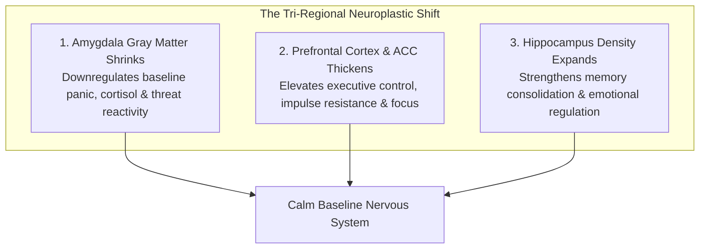
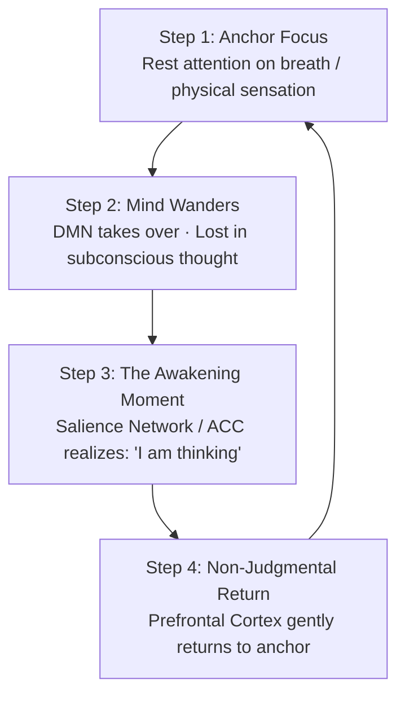
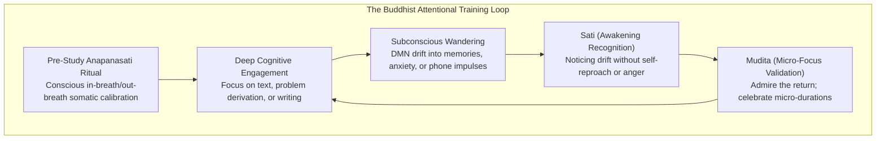

# Volume 1: The Biology of Mind & Energy

## Chapter 4: The Neurobiology of Meditation — Structural Rewiring & The Attention Loop

Meditation is often misunderstood as an esoteric, mystical ritual or a passive attempt to "empty the mind of all thoughts."

In cognitive neuroscience and brain imaging, meditation is an **empirical strength-training regimen for the prefrontal cortex**. It is a structured practice of attentional calibration that produces measurable, permanent changes in brain structure and functional connectivity.

When an untrained individual goes through the day, their brain is dominated by the **Default Mode Network (DMN)**—a circuit responsible for chronic rumination, ego defensiveness, and time-traveling between past regrets and future anxiety. Regular meditation mechanically quiets this network while physically restructuring the brain's emotional and executive centers.

---

### The Neuroplastic Transformation (What Happens to Brain Structure)

MRI brain imaging studies (such as landmark research from Harvard neuroscientist Dr. Sara Lazar) reveal that just **8 weeks of consistent 15-minute daily meditation** alters gray matter density in three distinct brain regions:

1. **The Amygdala (The Threat Center) Shrinks**: The physical size and cellular density of the amygdala decreases. As a result, daily stressors that previously triggered anger, panic, or avoidance no longer hijack the nervous system.
2. **The Prefrontal Cortex (PFC) & Anterior Cingulate Cortex (ACC) Thicken**: Gray matter volume increases in the areas governing working memory, decision-making, and deliberate focus.
3. **The Hippocampus (The Memory Hub) Expands**: Synaptic density increases in the hippocampus, boosting the consolidation of complex concepts and resilience against chronic stress.

---

### The 4-Step Attentional Loop (The "Bicep Curl" of the Mind)

The single greatest misconception beginners have is believing that a successful meditation session requires 15 minutes of perfect, uninterrupted silence.

When your mind inevitably drifts into thoughts about exams, meals, or memories, beginners feel frustrated and conclude: *"I am terrible at meditating."* In cognitive neuroscience, **mind-wandering is not a failure—it is the prerequisite for neuroplastic growth**.

* **The Neural Mechanism**: The entire neuroplastic benefit occurs in the transition between **Step 3 and Step 4**.
* **The Resistance Metaphor**: Just as a muscle fiber grows only when you lift a physical weight against gravity, your attention network strengthens only when you catch the wandering mind and intentionally redirect it back to the anchor.
* If your mind wanders 50 times in a session and you gently bring it back 50 times, you have executed **50 neural bicep curls**.

---

### The SOAR Protocol: Bringing Meditation into Daily Action

The ultimate objective of meditation is not to remain calm in a quiet room on a cushion; it is to maintain **cognitive sovereignty in the middle of high-stakes pressure**.

Whenever an acute distraction, anxiety spike, or procrastination urge strikes during your workday or study block, execute the **SOAR Protocol**:

1. **S — Stop**: The moment you feel emotional agitation or the reflex to check your phone, physically pause for 1 second. Do not move your hands.
2. **O — Observe**: Witness the physiological sensation in your body (tightness in the throat, chest constriction, or restlessness). Name it neutrally: *"My brain is experiencing an urge spike."*
3. **A — Accept**: Allow the uncomfortable sensation to exist in the body without judging yourself or fighting the feeling.
4. **R — Redirect**: Take one slow exhalation and redirect 100% of your prefrontal attention back to the single next sentence, formula, or problem in front of you.

---

### The Contemplative Mechanics of Academic Concentration: The Buddhist Mindful Study Engine

While Western cognitive neuroscience maps the physical architecture of prefrontal cortical thickening and amygdala downregulation, traditional Buddhist cognitive psychology provides the **tactical, experiential mechanics of sustaining attention during intellectual study**.

#### 1. The Passion Invariant: Why Effortless Concentration Precedes Willpower
Students perpetually struggle with distraction because they believe focus is an act of brute-force muscle strain.
* **The Music and Film Paradox**: An individual rarely experiences attentional wandering, boredom, or fatigue while absorbed in their favorite musical piece or cinema. In these contexts, the mind effortlessly coheres into single-pointed stillness.
* **The Mechanism of Affective Alignment (*Chanda*)**: In Buddhist psychology, attention (*Manasikara*) naturally follows wholesome intention, zeal, or intrinsic affinity (*Chanda*). When study is approached as an antagonistic, punitive duty, cognitive friction spikes, inviting immediate distraction. Cultivating focus requires bridging academic material to genuine curiosity, identity evolution, or high-order service.

#### 2. Micro-Focus Validation (*Mudita*) & Dissolving the Perfectionism Trap
The primary obstacle for students is an all-or-nothing cognitive standard: expecting an immediate 2-hour uninterrupted marathon of uninterrupted focus.
* **The Neurochemical Cost of Self-Criticism**: When an untrained mind inevitably wanders after 30 seconds, the student reacts with exasperation and shame (*"I have no discipline"*). This floods the brain with cortisol and conditions the amygdala to associate the desk with emotional failure.
* **Micro-Praise Protocol**: Buddhist practice instructs the practitioner to **admire and be genuinely happy with micro-durations of focus**—whether 10 seconds, 30 seconds, or 1 minute. Validating micro-achievements activates positive dopaminergic reinforcement, teaching the subconscious that staying with the material is inherently rewarding.

#### 3. Environmental Renunciation: Stripping Distraction Friction
Focus cannot survive in an environment saturated with hyper-stimulating discriminative stimuli.
* In monastic training, spiritual focus begins with renunciation (*Nekkhamma*)—physically removing worldly entanglements.
* For the modern student, this requires physical distancing: placing smartphones, notifications, and irrelevant digital tabs in another room. Eliminating competing sensory cues reduces the metabolic load required by executive control.

#### 4. The Practice of the Return: Concentration as a Dynamic Habit
Concentration (*Samadhi*) is not an unyielding, static monolith; it is an **iterative recovery loop**.
* The human mind will naturally wander into memories, future worries, or sensory cravings. That is the biological baseline of the Default Mode Network.
* **The Golden Habit**: The moment awareness awakens (*Sati*), you do not punish yourself. You smile, acknowledge the wandering, and gently, calmly escort the mind back to the book. Performing this cycle hundreds of times over weeks forms the unbreakable **Power of Habit** (*Vasana*).

#### 5. Pre-Study Somatic Priming: The Anapanasati Transition Ritual
Before opening a textbook, starting a timed mock examination, or launching a demanding analytical task, do not immediately force your mind into high-gear problem solving.
* **The Protocol**: Close your eyes for 2 to 3 minutes at your study desk. Anchor awareness strictly to the tactile sensation of breath passing through the nostrils or the rising and falling of the diaphragm (*Anapanasati*).
* **The Neurological Signal**: Conscious, rhythmic breathing downregulates sympathetic autonomic arousal, quieting the fight-or-flight reflex and signaling the prefrontal cortex: *"The transition is complete; enter single-pointed concentration."*

---

### The Core Takeaway to Remember
> Meditation is not about stopping thoughts; it is about changing your relationship to them. Every time you notice your mind has wandered and calmly return to the present moment, you physically rewire your brain—shrinking fear, strengthening focus, and building an unshakeable inner anchor.

