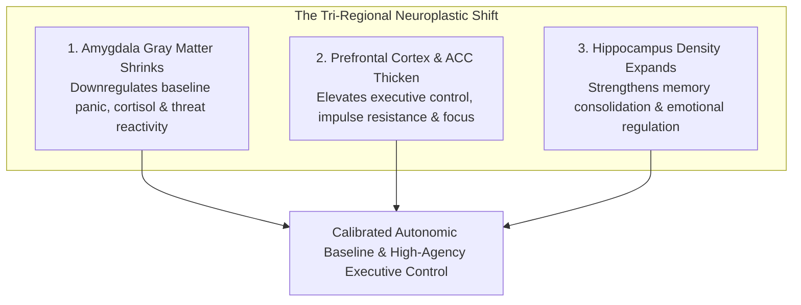
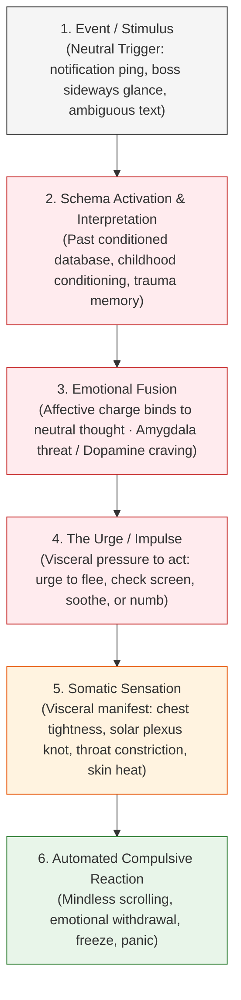
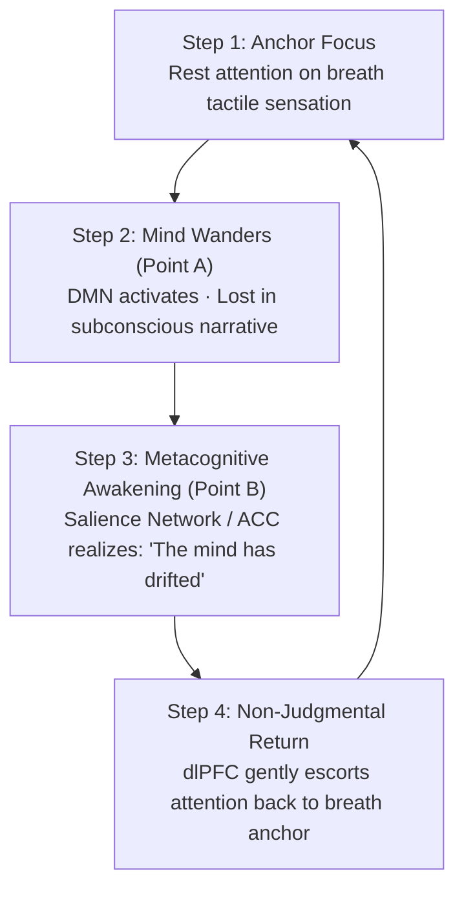
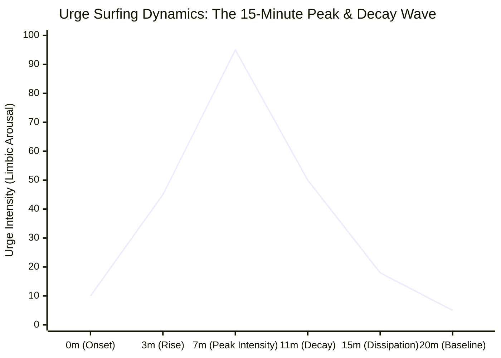
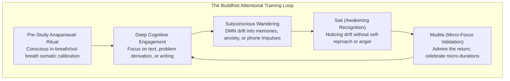
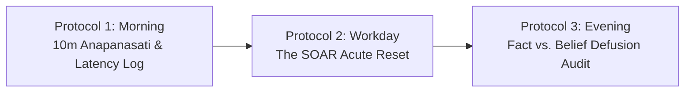

# Volume 1: Biological & Neural Foundations

## Chapter 4: The Neurobiology of Meditation — Structural Rewiring, The 6-Stage Automation Chain & The Metacognitive Gap

---

### 🏛️ Tier 1: The Jargon-Free Reality Bridge

Meditation is routinely misunderstood as an esoteric, mystical retreat from the world or a passive attempt to "empty the mind of all thoughts."

In cognitive neuroscience and brain imaging, **meditation is an empirical strength-training regimen for the prefrontal cortex**. It is a structured practice of attentional calibration that produces measurable, physical changes in neural density and functional connectivity.

#### The Personal Trainer Paradox: Passive Hijacking vs. Active Attentive Muscle
Consider why modern humans can effortlessly binge six hours of Netflix, YouTube Shorts, or algorithmic feeds, yet experience acute restlessness, brain fog, and exhaustion when attempting to read ten pages of a demanding analytical treatise:
* **The Passive Stimulus Illusion**: High-stimulation media delivers high-tempo cuts, novel audio cues, and engineered emotional spikes. The consumer is not exercising focus; rather, external sensory stimulation is forcibly dragging their attention from one dopamine trigger to the next.
* **The Personal Trainer Analogy**: This is the neurological equivalent of walking into a gym, grasping a 20-kilogram dumbbell, and having a personal trainer stand beneath your arm, physically lifting and lowering the weight for you. Your biceps experience zero mechanical tension, zero motor-unit recruitment, and zero cellular hypertrophy. You mistake the passive movement of your limb for personal strength.
* **True Focus as an Active Contraction**: Real concentration is an internally generated, metabolically demanding holding of the prefrontal spotlight against low-stimulation baselines. When external fireworks cease, an untrained mind immediately collapses into restlessness.

```mermaid
graph TD
    subgraph Passive Stimulus Hijacking (Hyper-Stimulation)
        P1["High-Novelty Media (Reels / Cinema)"] --> P2["Exogenous Sensory Hijack"]
        P2 --> P3["Passive Movement of Attention"]
        P3 --> P4["Zero Prefrontal Cortical Hypertrophy"]
    end

    subgraph Active Attentional Holding (Meditation & Deep Work)
        A1["Low-Stimulation Anchor (Breath / Text)"] --> A2["Endogenous Prefrontal Drive"]
        A2 --> A3["Resistance Against Internal Drift"]
        A3 --> A4["Prefrontal Cortex & ACC Structural Thickening"]
    end
```

#### The Four Modern Malaises & The Fallacy of Destination-Only Advice
Every individual experiencing chronic psychological friction presents with one or more of four core symptoms:
1. **Chronic Distractibility**: Inability to sustain continuous awareness. Losing track of work every few minutes to drift into personal daydreaming or phone checks.
2. **Visceral Loneliness**: Physical presence among family, peers, or colleagues accompanied by absolute emotional isolation and inability to form genuine, unarmored connection.
3. **Pervasive Negative Self-Talk (Self-Hate)**: Subconscious generation of defectiveness narratives (*"I am fundamentally flawed," "I am falling behind," "I am unlikable"*), acting as an automatic brake on human agency.
4. **Lack of Grounded Purpose**: Floating aimlessly through life without an internal North Star, or conversely, pursuing hyper-neurotic compensatory goals (obsessive status, wealth accumulation, societal validation) designed solely to soothe unexamined childhood deficits.

**The Conventional Advice Failure**:
Conventional self-help prescribes the *destination* without providing the *micro-mechanisms* of how to get there:
* *"Distracted? Just be mindful and build discipline!"*
* *"Lonely? Just go outside and connect with people!"*
* *"Self-hate? Just cultivate positive affirmations!"*
* *"Aimless? Just discover your passion and purpose!"*

**Why this advice universally fails**: It completely ignores the subconscious micro-level chain of events that triggers panic, avoidance, and emotional freeze *before* the conscious mind even realizes what occurred. Telling a lonely person with active social-threat schemas to "just socialize" triggers an immediate amygdalar defense cascade that forces them to withdraw.

---

### 🔬 Tier 2: Cognitive Science, Epistemic Architecture & Mechanistic Depth

#### 1. The Tri-Regional Neuroplastic Shift
MRI brain imaging studies (such as landmark research by Harvard neuroscientist Dr. Sara Lazar) reveal that just **8 weeks of consistent 15-minute daily meditation** alters gray matter density across three distinct neural hubs:

```mermaid
graph TD
    subgraph The Tri-Regional Neuroplastic Shift
        A["1. Amygdala Gray Matter Shrinks<br/>Downregulates baseline panic, cortisol & threat reactivity"]
        B["2. Prefrontal Cortex & ACC Thicken<br/>Elevates executive control, impulse resistance & focus"]
        C["3. Hippocampus Density Expands<br/>Strengthens memory consolidation & emotional regulation"]
    end

    A --> S["Calibrated Autonomic Baseline & High-Agency Executive Control"]
    B --> S
    C --> S
```

1. **The Amygdala (The Threat Center) Shrinks**: The physical size and cellular density of the basolateral amygdala decreases. Daily stressors that previously triggered immediate fight, flight, or freeze no longer hijack the nervous system.
2. **The Prefrontal Cortex (PFC) & Anterior Cingulate Cortex (ACC) Thicken**: Gray matter volume increases in the areas governing working memory, error detection, decision-making, and deliberate attentional redirection.
3. **The Hippocampus (The Memory Hub) Expands**: Synaptic density increases in the hippocampus, boosting the consolidation of complex concepts and resilience against chronic neurotoxic stress.

---

#### 2. The 6-Stage Subconscious Automation Chain: How Autopilot Controls Action
In an untrained brain, behavior is dictated by an automated cascade that unfolds in fractions of a second below conscious detection:

```mermaid
graph TD
    A["1. Event / Stimulus<br/>(Neutral Trigger: notification ping, boss sideways glance, ambiguous text)"] 
    --> B["2. Schema Activation & Interpretation<br/>(Past conditioned database, childhood conditioning, trauma memory)"]
    B --> C["3. Emotional Fusion<br/>(Affective charge binds to neutral thought · Amygdala threat / Dopamine craving)"]
    C --> D["4. The Urge / Impulse<br/>(Visceral pressure to act: urge to flee, check screen, soothe, or numb)"]
    D --> E["5. Somatic Sensation<br/>(Visceral manifest: chest tightness, solar plexus knot, throat constriction, skin heat)"]
    E --> F["6. Automated Compulsive Reaction<br/>(Mindless scrolling, emotional withdrawal, freeze, panic)"]
    
    style A fill:#f5f5f5,stroke:#333,stroke-width:1px
    style B fill:#ffebee,stroke:#c62828,stroke-width:1px
    style C fill:#ffebee,stroke:#c62828,stroke-width:1px
    style D fill:#ffebee,stroke:#c62828,stroke-width:1px
    style E fill:#fff3e0,stroke:#e65100,stroke-width:1px
    style F fill:#e8f5e9,stroke:#2e7d32,stroke-width:1px
```

1. **The Event (Stimulus)**: A neutral sensory input occurs. A boss looks sideways and leaves the room; a phone vibrates; an intrusive thought appears.
2. **Schema Activation**: The brain instantly cross-references the event against historical memory and cognitive schemas (Beck's Schema Theory). If a teacher in childhood glared before reprimanding, the brain classifies the boss's neutral glance as imminent danger.
3. **Emotional / Cognitive Fusion (ACT Framework)**: An emotional charge instantly binds to the thought. The amygdala registers an existential threat, or the dopaminergic mesolimbic pathway anticipates relief. The subject fuses with the cognition: the thought is perceived not as a mental event, but as literal reality.
4. **The Urge (Impulse Formulation)**: A subconscious pressure to act emerges—the urge to flee uncomfortable ambiguity, the urge to check notifications, the urge to silence anxiety through mindless eating or scrolling.
5. **Somatic Sensation**: Physical visceral sensations register in the body—constriction in the chest, shallow thoracic breathing, facial heat, or a gut knot.
6. **Automated Behavioral Reaction**: The individual grabs the phone, flees the room, freezes, or lashes out.

**The Crucial Diagnostic**: Because stages 2 through 5 unfold unconsciously, the individual lives under the illusion that:
$$\text{Event} \xrightarrow{\quad\text{Autopilot}\quad} \text{Compulsive Reaction}$$
Mindfulness is the mechanical insertion of the **Metacognitive Gap** between Stage 2 and Stage 4.

---

#### 3. The Three Operational Pillars of Mindfulness
Mindfulness is neither relaxation nor trance; it is an active attentional discipline defined by three non-negotiable operational parameters (Jon Kabat-Zinn / ACT framework):
1. **On Purpose (Intentionality)**: Deliberate selection of an attentional target (e.g., breath sensation at the nostril rim, tactile friction of the feet, cardiac pulse).
2. **Present Moment Anchor**: The target must be an unfolding, real-time physical phenomenon occurring *now*, rather than a simulated past memory or forecasted future scenario.
3. **Non-Judgmental Stance (Radical Neutrality)**: Observing phenomena without applying cognitive valences (*"this is good," "this is bad," "I am terrible at this"*). The moment judgment is introduced, the observer collapses back into the stream of identification.

---

#### 4. The 4-Step Attentional Loop & The "Point A to Point B" Metric
The single greatest misconception beginners have is believing that a successful meditation session requires 15 minutes of uninterrupted silence.
When your mind inevitably drifts into thoughts about work, meals, or memories, beginners feel frustrated and conclude: *"I cannot meditate."*

In cognitive neuroscience, **mind-wandering is not a failure—it is the indispensable resistance required for neuroplastic growth**.

```mermaid
flowchart TD
    S1["Step 1: Anchor Focus<br/>Rest attention on breath tactile sensation"] 
    --> S2["Step 2: Mind Wanders (Point A)<br/>DMN activates · Lost in subconscious narrative"]
    S2 --> S3["Step 3: Metacognitive Awakening (Point B)<br/>Salience Network / ACC realizes: 'The mind has drifted'"]
    S3 --> S4["Step 4: Non-Judgmental Return<br/>dlPFC gently escorts attention back to breath anchor"]
    S4 --> S1
```

* **Point A**: The exact millisecond the attentional beam slips from the physical anchor into Default Mode Network (DMN) narrative drift.
* **Point B**: The moment of **metacognitive awakening**—the sudden recognition: *"My attention is no longer on the breath; I am trapped inside a thought."*
* **The Core Metric of Mental Strength ($\Delta T$)**: Mental development is measured directly by the **temporal latency between Point A and Point B**:
  $$\Delta T = T_{\text{Point B}} - T_{\text{Point A}}$$
  In untrained individuals, $\Delta T$ can last 20 minutes, 2 hours, or an entire lifetime. In trained practitioners, $\Delta T$ collapses to single seconds.
* **The Neural Bicep Curl**: The entire neuroplastic hypertrophy occurs in the transition between **Step 3 and Step 4**. If your mind wanders 50 times in a session and you gently escort it back 50 times without self-flagellation, you have performed **50 neural bicep curls**.

---

#### 5. Urge Surfing: Dismantling the Limbic Hijack
When an emotional fusion occurs, it generates an urge (to check the phone, to avoid a difficult paragraph, to seek reassurance).

```mermaid
xychart-beta
    title "Urge Surfing Dynamics: The 15-Minute Peak & Decay Wave"
    x-axis ["0m (Onset)", "3m (Rise)", "7m (Peak Intensity)", "11m (Decay)", "15m (Dissipation)", "20m (Baseline)"]
    y-axis "Urge Intensity (Limbic Arousal)" 0 --> 100
    line [10, 45, 95, 50, 18, 5]
```

* **Dr. Alan Marlatt's Wave Dynamics**: Urges do not expand infinitely; they operate like ocean waves. An urge rises, crests over 5 to 10 minutes, and naturally decays if behavioral fuel is withheld.
* **The Autopilot Error**: Most people capitulate to the urge when it reaches 70% intensity, believing that satisfying the craving is the only way to alleviate discomfort. This capitulation strengthens the neural habit loop.
* **Surfing the Sensation**: By observing the urge with clinical detachment—tracking its somatic signature (chest tightness, throat constriction) as neutral physical data—the prefrontal cortex maintains executive sovereignty. The wave crests and dissolves, breaking the limbic monopoly.

---

#### 6. Mechanistic Resolution of the Four Modern Malaises
By establishing the Metacognitive Gap between the Stimulus and the Urge, the four malaises dissolve mechanistically:

| Malaise | Subconscious Autopilot Path | Metacognitively Defused Path |
| :--- | :--- | :--- |
| **1. Chronic Distractibility** | Low cognitive stimulation $\to$ boredom schema $\to$ dopamine-seeking urge $\to$ unconscious phone pick-up. | Boredom registers as a physical sensation in the solar plexus $\to$ urge observed as a transient wave $\to$ urge peaks and subsides $\to$ attention returned to primary task. |
| **2. Visceral Loneliness** | Social encounter $\to$ childhood rejection schema triggered $\to$ defensive armor / aloofness $\to$ emotional disconnect. | Notice historical defensive narrative forming $\to$ recognize it as past programming $\to$ anchor attention in the living human in front of you without projection. |
| **3. Negative Self-Talk** | Setback occurs $\to$ automatic thought: *"I am a failure"* $\to$ fused emotional collapse $\to$ identity stagnation. | Separation of **Fact vs. Belief**: Setback is an empirical event; *"I am a failure"* is an unverified cognitive hypothesis. The thought is labeled and defused. |
| **4. Lack of Purpose** | Chasing external status/wealth to soothe subconscious deficits and societal scripts $\to$ arrival fallacy and hollow emptiness. | External social conditioning stripped away via via-negativa observation $\to$ purpose discovered in real-time craft alignment and high-agency presence. |

---

#### 7. The Contemplative Mechanics of Academic Concentration: The Buddhist Mindful Study Engine
Complementing Western neuroscience, classical Buddhist cognitive psychology provides tactical mechanics for sustaining focus during high-friction intellectual labor:

```mermaid
flowchart TD
    subgraph SG_Buddhist_Loop ["The Buddhist Attentional Training Loop"]
        A["Pre-Study Anapanasati Ritual<br/>Conscious in-breath/out-breath somatic calibration"] --> B["Deep Cognitive Engagement<br/>Focus on text, problem derivation, or writing"]
        B --> C["Subconscious Wandering<br/>DMN drift into memories, anxiety, or phone impulses"]
        C --> D["Sati (Awakening Recognition)<br/>Noticing drift without self-reproach or anger"]
        D --> E["Mudita (Micro-Focus Validation)<br/>Admire the return; celebrate micro-durations"]
        E --> B
    end
```

* **Affective Alignment (*Chanda*)**: In Buddhist psychology, attention (*Manasikara*) naturally follows wholesome intention, zeal, or intrinsic affinity (*Chanda*). When study is approached as an antagonistic, punitive duty, cognitive friction spikes, inviting immediate distraction. Cultivating focus requires bridging academic material to genuine curiosity or high-order service.
* **Micro-Focus Validation (*Mudita*)**: Expecting an immediate 2-hour marathon of unbroken concentration guarantees shame when the mind wanders at 45 seconds. The student must actively celebrate micro-durations of focus (10 seconds, 1 minute). Validating micro-achievements activates positive dopaminergic reinforcement.
* **Environmental Renunciation (*Nekkhamma*)**: Physical distancing—placing smartphones, notifications, and irrelevant digital tabs in another room. Eliminating competing sensory cues reduces the metabolic load required by executive control.
* **The Practice of the Return (*Vasana*)**: Concentration (*Samadhi*) is not an unyielding monolith; it is an iterative recovery loop. When awareness awakens (*Sati*), you calmly escort the mind back to the book. Performing this cycle hundreds of times forms the unbreakable **Power of Habit** (*Vasana*).
* **Pre-Study Somatic Priming (*Anapanasati*)**: Before opening a textbook or starting a timed mock examination, close your eyes for 2 to 3 minutes at your desk. Anchor awareness strictly to the tactile sensation of breath passing through the nostrils or the rising and falling of the diaphragm. This downregulates sympathetic autonomic arousal and signals the prefrontal cortex: *"The transition is complete; enter single-pointed concentration."*

---

### 🛡️ Tier 3: The Skeptic's Razor & Failure Mode Guardrails

#### Guardrail 1: The Panacea Fallacy & Trauma-Informed Caveats
* **The Trap**: Treating mindfulness meditation as a universal cure-all for clinical disorders, severe unintegrated PTSD, or acute panic attacks.
* **The Clinical Reality (Dr. Willoughby Britton / Cheetah House Research)**: For individuals with high baseline physiological arousal or severe developmental trauma, closing the eyes and focusing intensely on internal somatic sensations (interoception) can trigger panic spikes, depersonalization, or re-traumatization.
* **The Correction**: If internal breath awareness induces hyper-arousal, open your eyes and switch to **exteroceptive grounding** (the 5-4-3-2-1 sensory method, anchoring attention to physical external objects, room temperature, or ambient sounds).

#### Guardrail 2: The Structural Isolation Reality Check
* **The Trap**: Believing that loneliness is *purely* a cognitive distortion that can be resolved on a meditation cushion.
* **The Correction**: While mindfulness dissolves the defensive schemas that sabotage social interactions, real-world connection requires **reciprocal vulnerability, physical presence, and social risk**. Meditation prepares you to be open without armor; you must still go out and build relationships in reality.

#### Guardrail 3: Fact vs. Belief Blurring
* **The Trap**: Treating deeply ingrained beliefs as immutable physical facts because they *feel* true somatically.
* **The Correction**: The emotional intensity of a thought has zero correlation with its empirical veracity. Apply the **Courtroom Standard**: *"If this thought were presented before a judge, what concrete physical evidence exists to substantiate it?"*

---

### 📋 Tier 4: The 24-Hour Behavioral Protocol ("The Homework")

```mermaid
graph LR
    P1["Protocol 1: Morning<br/>10m Anapanasati & Latency Log"] --> P2["Protocol 2: Workday<br/>The SOAR Acute Reset"]
    P2 --> P3["Protocol 3: Evening<br/>Fact vs. Belief Defusion Audit"]
```

#### 1. Protocol 1: The 10-Minute Morning Anapanasati & Latency Audit
* **Posture**: Sit upright in an ergonomic chair with feet flat on the floor, spine straight, shoulders relaxed.
* **Anchor**: Direct 100% of sensory awareness to the cool sensation of air entering the nostril rim on inhalation, and the warm sensation on exhalation.
* **The Latency Log**: Every time you experience Point B (noticing the mind drifted), silently label the distraction (*"planning," "worrying," "memory"*) with zero emotional judgment, and escort attention back to the breath. Track whether your latency gap ($\Delta T$) is shortening.

#### 2. Protocol 2: The SOAR Reset for Acute Workday Friction
Whenever an acute distraction, anxiety spike, or procrastination urge strikes during your study block, execute the 4-step SOAR loop:
1. **S — Stop**: The moment you feel emotional agitation or the reflex to check your phone, physically pause for 1 second. Do not move your hands.
2. **O — Observe**: Witness the physiological sensation in your body (tightness in the throat, chest constriction, or restlessness). Name it neutrally: *"My brain is experiencing an urge spike."*
3. **A — Accept**: Allow the uncomfortable sensation to exist in the body without judging yourself or fighting the feeling.
4. **R — Redirect**: Take one slow exhalation and redirect 100% of your prefrontal attention back to the single next sentence, formula, or problem in front of you.

#### 3. Protocol 3: The Fact vs. Belief Courtroom Audit
At the close of your workday, review the strongest self-critical thought experienced that day (e.g., *"I'm not cut out for this exam"*). Draw two columns on a sheet of paper:
* **Column A (Empirical Facts)**: Only what a video camera could record (e.g., *"I scored 58% on today's practice mock"*).
* **Column B (Subconscious Belief / Narrative)**: The projected schema (e.g., *"I am untalented and doomed to fail"*).
* Recognize that Column B is an automated cognitive defense mechanism, not reality. Consciously discard the narrative and retain only the empirical data.

---

### 🧠 Active Recall Flashcards

**Q1: What are the three distinct brain structural changes identified by Dr. Sara Lazar in consistent meditators?**
*Answer: 1) Basolateral amygdala gray matter shrinks (downregulating baseline fear and threat reactivity); 2) Prefrontal cortex and anterior cingulate cortex thicken (enhancing executive focus, working memory, and impulse control); 3) Hippocampal gray matter density expands (strengthening memory consolidation and emotional regulation).*
<!-- concept: neurobiology-of-meditation -->

**Q2: What is the 6-stage chronological sequence of the subconscious automation chain?**
*Answer: 1) Event / Stimulus $\to$ 2) Automatic Schema Activation & Interpretation $\to$ 3) Emotional / Cognitive Fusion $\to$ 4) The Urge / Impulse Formation $\to$ 5) Somatic Sensation $\to$ 6) Automated Behavioral Reaction.*
<!-- concept: subconscious-automation-chain -->

**Q3: What does the "Point A to Point B" metric ($\Delta T$) measure in attentional training?**
*Answer: $\Delta T = T_{\text{Point B}} - T_{\text{Point A}}$ measures the temporal latency between the millisecond attention drifts into subconscious Default Mode Network wandering (Point A) and the exact moment of metacognitive awakening when the individual realizes they are lost in thought (Point B). The goal of meditation is to collapse this temporal gap.*
<!-- concept: metacognitive-gap -->

**Q4: Why is binging YouTube Shorts or Netflix considered "passive stimulus hijacking" rather than focus?**
*Answer: High-stimulation media delivers rapid edits, loud auditory cues, and novel stimuli that forcibly drag attention exogenously. Like a gym trainer physically lifting a dumbbell for you, the prefrontal cortex exerts zero internal effort, resulting in zero cortical hypertrophy.*
<!-- concept: attentional-muscle-vs-hijack -->

**Q5: What are Dr. Alan Marlatt's Urge Surfing wave dynamics, and how does it prevent compulsive behavior?**
*Answer: Urges operate like ocean waves that crest over 5 to 10 minutes and naturally decay if behavioral fuel is withheld. Instead of fighting or capitulating to the urge, the individual observes the somatic sensations with clinical neutrality, allowing the wave to peak and dissolve without behavioral reaction.*
<!-- concept: urge-surfing-mechanics -->

**Q6: What is the clinical guardrail regarding mindfulness practice for individuals with severe trauma or acute hyper-arousal?**
*Answer: Intense interoceptive meditation (focusing on internal breath/heartbeat with closed eyes) can trigger panic spikes, depersonalization, or re-traumatization in hyper-aroused nervous systems. The correction is exteroceptive grounding: keeping eyes open and anchoring attention to physical external objects and sensory environments.*
<!-- concept: meditation-clinical-guardrails -->

---

### 📚 Primary Provenance & Scientific Sources
1. **ABrainoConscious** — *Distraction, Loneliness, Self-Hate, No Purpose — One Root Cause, One Fix* ([YouTube Video `4WrUrPgmnyk`](https://www.youtube.com/watch?v=4WrUrPgmnyk)).
2. **Dr. Sara Lazar** — *Mindfulness practice leads to increases in regional brain gray matter density*, Psychiatry Research: Neuroimaging (Harvard Medical School / MGH).
3. **Steven C. Hayes** — *Acceptance and Commitment Therapy (ACT): Cognitive Fusion and the Observing Self*.
4. **Aaron T. Beck & Jeffrey Young** — *Cognitive Therapy & Schema Theory: Core Belief Networks and Biased Information Processing*.
5. **Dr. G. Alan Marlatt** — *Relapse Prevention: Maintenance Strategies in the Treatment of Addictive Behaviors (Urge Surfing Dynamics)*.
6. **Jon Kabat-Zinn** — *Full Catastrophe Living: Using the Wisdom of Your Body and Mind to Face Stress, Pain, and Illness (MBSR Framework)*.
7. **Dr. Willoughby Britton** — *The Varieties of Contemplative Experience & Cheetah House Research on Meditation Adverse Effects*.
